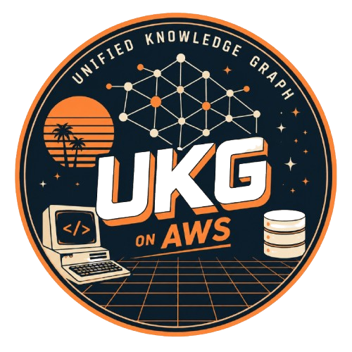
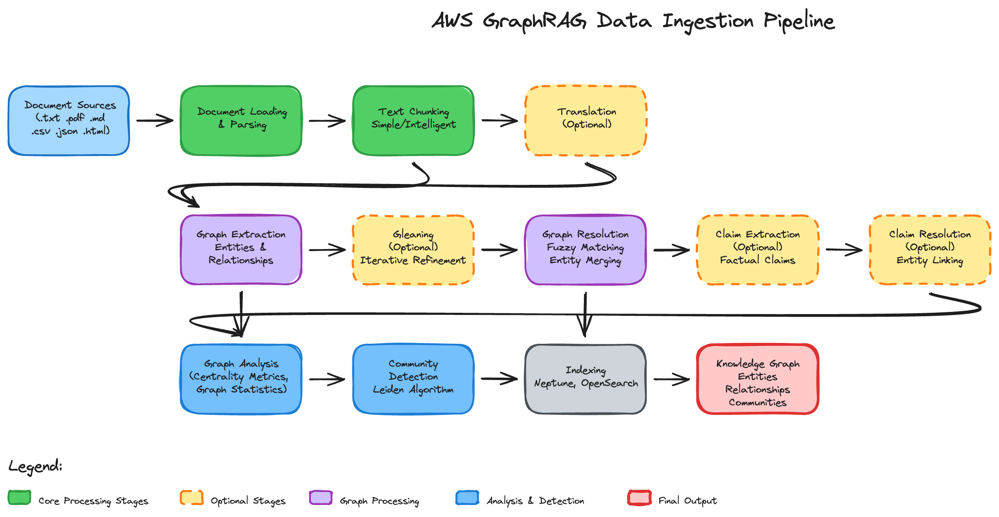
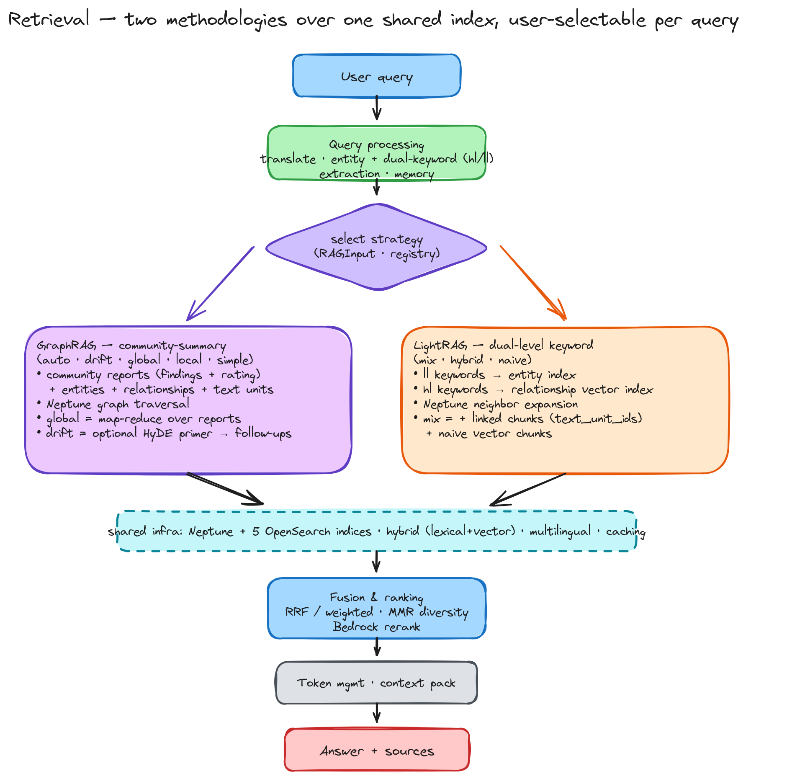

# Unified Knowledge Graph RAG on AWS

[](./LICENSE)
[](https://www.python.org/downloads/)

🇬🇧 **[English README](./README.md)** · 🤝 **[기여 가이드](./CONTRIBUTING.md)**

<p align="center">
  
</p>

대규모 다국어 문서 코퍼스를 Amazon Neptune과 Amazon OpenSearch Service 위의 지식 그래프로 만들고, Amazon Bedrock으로 그 그래프에 대한 질문에 답하는 AWS 네이티브 지식 그래프 RAG(검색 증강 생성) 프레임워크입니다. 멀티홉 그래프 순회로 여러 문서에 걸친 추론을 수행합니다. Microsoft GraphRAG와 LightRAG를 하나의 공통 스택 위에 다시 구현했기 때문에, 검색 방법론을 배포 단위가 아니라 질의 단위로 고를 수 있습니다. 하나의 스택에서 두 방법론 운영, 3중 하이브리드 검색, 증분 인덱싱, 다국어 처리는 원 논문을 의도적으로 확장한 부분입니다.

전체 아키텍처, 두 검색 방법론과 벤치마크 결과는 [AWS Open Source Blog 소개 글](https://aws.amazon.com/ko/blogs/opensource/unified-knowledge-graph-rag-on-aws-graphrag-and-lightrag-on-one-stack/)에서 볼 수 있습니다.

## 이 프레임워크를 쓰는 이유

- **하나의 AWS 스택에서 두 방법론 사용.** GraphRAG(커뮤니티 요약)와 LightRAG(이중 수준 키워드)가 인제스천, 인덱싱, 캐싱, 검색 인프라를 공유하고 검색 알고리즘만 다릅니다. 방법론은 질의마다 선택합니다. 모든 답변에는 실제로 모델 컨텍스트에 들어간 출처가 함께 반환됩니다.
- **3중 하이브리드 검색.** BM25 어휘 검색, 벡터 의미 검색, Neptune 그래프 순회 결과를 RRF(Reciprocal Rank Fusion)로 합치고 Bedrock 재순위 모델로 다시 정렬합니다.
- **증분 인덱싱.** `aws.dynamodb`를 켜면 콘텐츠 해시 레지스트리가 새 문서와 변경된 문서만 다시 인덱싱해 운영 중인 그래프에 병합합니다. 문서를 삭제하면 다른 문서와 공유하지 않는 산출물만 제거합니다.
- **다국어 지원.** 인덱싱과 질의 시점의 선택적 번역, 언어별 OpenSearch 분석기(예: 한국어 `nori`), 다국어 키워드 추출을 두 방법론 모두에 적용합니다.
- **프롬프트 튜닝.** `run-prompt-tuning`이 코퍼스 표본을 분석(도메인, 언어, 페르소나, 엔티티 유형)해 도메인에 맞춘 `custom_prompts`를 생성합니다.
- **그래프 인식 평가와 독립 시각화.** `run-eval`은 LangChain·RAGAS 지표에 결정적인 엔티티·관계 커버리지, 검색 hit@k/recall@k/MRR, 답변 exact match/token F1 지표를 더하고, `run-visualization`은 다시 인제스천하지 않고 내보낸 그래프를 렌더링합니다.
- **교체 가능한 헥사고날 설계.** 스토리지와 모델 백엔드는 포트 뒤에 두고, 검색 전략·렌더러는 데코레이터 레지스트리로 등록하므로 디스패치 코드를 고치지 않고 추가할 수 있습니다. 새 평가기는 하위 클래스를 만들고 `EvaluationManager._resolve_evaluator_class`에 분기 하나를 추가합니다.

## 아키텍처



인제스천은 중단 후 재개할 수 있는 12단계 파이프라인입니다. 파싱, 로딩, 청킹, (선택) 번역, LLM 기반 엔티티·관계 추출, (선택) gleaning, 중복 해소, (선택) claim 추출, 그래프 지표 계산, Leiden 커뮤니티 탐지와 LLM 커뮤니티 리포트 작성을 거쳐 OpenSearch와 Neptune에 인덱싱합니다. 단계별 체크포인트는 로컬에 캐시되며 S3와 동기화할 수 있습니다.



모든 전략은 같은 하이브리드 스코어러와 토큰 예산을 거칩니다. CLI에서는 `--search-strategy`, Python에서는 `RAGInput.search_strategy`로 전략을 고릅니다.

| 전략 | 방법론 | 적합한 경우 |
|---|---|---|
| `auto`(기본값) | GraphRAG | 어떤 전략이 맞을지 모를 때. LLM 라우터가 질의마다 `simple`, `local`, `global`, `drift` 중 하나를 고릅니다 |
| `simple` | GraphRAG | 빠른 사실 조회. 그래프 순회 없이 벡터와 키워드로 검색합니다 |
| `local` | GraphRAG | 특정 엔티티와 그 관계에 대한 질문 |
| `global` | GraphRAG | 넓은 범위나 주제 중심 질문. 커뮤니티 리포트에 map-reduce를 적용해 답합니다 |
| `drift` | GraphRAG | 반복 탐색이 필요한 복잡한 질문 |
| `mix` | LightRAG | 일반적인 LightRAG 사용. 엔티티·관계 키워드 검색에 청크 검색을 더합니다 |
| `hybrid` | LightRAG | 키워드 중심의 그래프 질문. 청크 검색은 더하지 않습니다 |
| `naive` | LightRAG | 빠른 벡터 전용 기준선과 비교 실험 |

전략별 동작은 [사용자 가이드 §4](./docs/user-guide.ko.md#4-질의-run-rag)를, 레이어 구조·알고리즘·데이터 모델은 [설계 문서](./docs/design.ko.md)를 참고하세요.

## 빠른 시작

### 사전 요구사항

- Python 3.10–3.12와 [uv](https://docs.astral.sh/uv/) (`pip`도 사용할 수 있습니다).
- Amazon Bedrock(사용할 모델의 액세스 활성화), Amazon Neptune 클러스터, Amazon OpenSearch Service 도메인, S3 버킷, 그리고 증분 인덱싱을 쓸 경우 DynamoDB에 접근할 수 있는 AWS 자격 증명. 프레임워크는 이미 있는 서비스에 연결만 합니다. 서비스를 새로 만들려면 [AWS에 배포](#aws에-배포선택)를 참고하세요.

### 설치와 설정

```bash
git clone https://github.com/awslabs/unified-kg-rag-on-aws.git
cd unified-kg-rag-on-aws
uv sync                                 # 또는: pip install -e .
cp config-template.yaml config.yaml     # Bedrock 리전과 서비스 엔드포인트 입력
```

OpenSearch가 IAM 대신 사용자 이름/비밀번호 인증을 쓴다면(`aws.opensearch.use_iam: false`) `.env-template`을 `.env`로 복사하고 자격 증명을 입력하세요. Markdown과 HTML을 파싱하려면 선택 extra인 `unstructured`가 필요합니다(Python 3.11 이상: `uv sync --extra unstructured`). PDF, TXT, CSV, JSON은 별도 설치 없이 처리합니다.

### 인덱싱, 질의, 평가

`uv run`은 프로젝트 환경에서 CLI를 실행합니다. `pip`으로 설치했다면 가상 환경을 활성화하고 `uv run` 없이 실행하세요.

```bash
# 코퍼스 인덱싱 (aws.dynamodb를 켜면 증분 인덱싱)
uv run run-ingestion --source-directory ./source --config-path config.yaml

# 두 방법론 중 하나로 질의하거나 대화 메모리를 켜고 대화형으로 실행
uv run run-rag --query "문서의 주요 주제는?" --search-strategy global --config-path config.yaml
uv run run-rag --query "Alice와 Acme는 어떤 관계인가?" --search-strategy mix --config-path config.yaml
uv run run-rag --interactive --use-memory --conversation-id my-session --config-path config.yaml

# 평가 (LangChain + RAGAS + 그래프 인식 커버리지, 검색·답변 일치 지표)
uv run run-eval --eval-data-path eval_data.json --config-path config.yaml

# 선택: 내보낸 그래프 시각화, 도메인 맞춤 프롬프트 튜닝
uv run run-visualization --data-path visualization_data.json --output-dir ./viz --config-path config.yaml
uv run run-prompt-tuning --source-directory ./source --output tuned_prompts.yaml --config-path config.yaml
```

그래프 인식 평가기는 LLM 없이 `expected_entities` / `expected_relationships` 대비 엔티티·관계 커버리지(재현율)를 계산합니다. 띄어쓰기로 단어를 구분하는 문자는 단어 경계로 매칭하고, CJK 텍스트는 부분 문자열 매칭으로 대신합니다. LLM을 쓰지 않는 평가기가 두 가지 더 있어 실행 간 비교가 쉽습니다. `retrieval`은 보고된 출처를 `reference_sources`와 비교해 hit@k, recall@k, MRR을 계산하고, `answer_match`는 `answer`(선택 항목 `metadata.answer_aliases` 포함)와 비교해 exact match와 token F1을 계산합니다. 모든 설정 항목, CLI 플래그, 평가 데이터 형식은 [사용자 가이드](./docs/user-guide.ko.md)에 정리되어 있습니다.

## AWS에 배포(선택)

[`iac/`](./iac/README.md)의 AWS CDK 앱이 스택 전체를 만듭니다. 엔드포인트를 갖춘 VPC, Neptune, OpenSearch, DynamoDB 문서 상태 테이블, S3 캐시 버킷, ECS Fargate 데이터 플레인, Step Functions 인제스천 파이프라인, CloudWatch 대시보드와 경보, 선택적 Bedrock Guardrail이 포함됩니다.

```bash
cd iac && python -m venv .venv && . .venv/bin/activate && pip install -r requirements.txt
cdk synth          # 미리 보기만 수행: AWS 변경과 비용 없음
cdk bootstrap      # 계정·리전마다 한 번
cdk deploy --all   # 과금 리소스 생성
```

스택 출력값에서 Neptune, OpenSearch, S3 값을 `config.yaml`에 옮겨 적으세요.

> **비용과 정리.** Neptune과 OpenSearch는 시간 단위로 과금되며, `public` 네트워크 모드에서는 NAT 게이트웨이 비용이 추가됩니다. 기본 `dev` 환경은 `cdk destroy --all`로 정리되지만, dev가 아닌 환경은 기본적으로 상태 저장소를 보존하고 삭제 방지를 켭니다. 프로덕션에 쓰기 전에 [`iac/README.md`](./iac/README.md)의 강화 옵션(`use_cmk`, `deletion_protection`, 다중 AZ 구성, `vpc_flow_logs`)을 검토하세요.

## 문서 안내

| 문서 | 내용 |
|---|---|
| [사용자 가이드](./docs/user-guide.ko.md) ([English](./docs/user-guide.md)) | 설정, CLI 플래그, 증분 인덱싱, 평가, 운영 |
| [설계 문서](./docs/design.ko.md) ([English](./docs/design.md)) | 헥사고날 아키텍처, 알고리즘, 데이터 모델, 확장 가이드, 참고 자료 |
| [`iac/README.md`](./iac/README.md) | CDK 스택, `-c key=value` 옵션, Guardrail 배포, Step Functions 인제스천 실행 |
| [CONTRIBUTING.md](./CONTRIBUTING.md) | 개발 환경, 테스트, 품질 게이트, 확장 방법 |
| [CHANGELOG.md](./CHANGELOG.md) | 릴리스 노트 |
| [SECURITY.md](./SECURITY.md) | 보안 이슈 신고 |

## 보안 및 면책

이 프로젝트는 **교육과 예시 목적의 참조 프레임워크**입니다. 어떠한 보증도 없이 "있는 그대로(AS IS)" 제공됩니다([LICENSE](./LICENSE) 참고). **별도의 보안 테스트, 위협 모델링, 보안 강화 없이 프로덕션 환경에 배포해서는 안 됩니다.**

- 본인의 AWS 계정에서 본인의 리소스를 대상으로 실행하세요. 배포 환경의 IAM 정책, 네트워크 구성, 데이터 분류, 최종 사용자 인증은 사용자 책임입니다.
- 선택 사항인 CDK 스택(`iac/`)은 안전한 기본값(프라이빗 VPC 격리, AWS 관리형 키 또는 `use_cmk`로 켜는 고객 관리형 KMS 키를 이용한 저장 데이터 암호화, TLS 강제, 최소 권한 IAM, PII·프롬프트 공격 필터링용 선택적 Bedrock Guardrail)을 제공하지만, 배포 책임은 사용자에게 있으므로 환경에 맞게 검토해야 합니다.
- 프로덕션에 쓰기 전에 Bedrock Guardrail(`aws.bedrock.guardrail`)을 켜고, 용도에 맞는 호출 제한과 모니터링을 적용하세요.
- 보안 이슈는 공개 이슈로 올리지 말고 [SECURITY.md](./SECURITY.md)의 절차를 따라 신고하세요.

## 기여

기여를 환영합니다. 개발 환경, 테스트, 확장 방법은 [CONTRIBUTING.md](./CONTRIBUTING.md)를 참고하세요. 대부분의 확장은 레지스트리 등록만으로 끝나며 디스패치 코드를 고칠 필요가 없습니다.

## 라이선스

이 프로젝트는 Apache-2.0 라이선스로 배포됩니다. 자세한 내용은 [LICENSE](./LICENSE) 파일을 참고하세요. AWS가 awslabs 조직에서 유지관리합니다.

## 감사의 말

라이브러리 기능 개발과 검증에 크게 기여해 주신 **강지현**님, 그리고 출시 전 꼼꼼한 리뷰와 실제 코퍼스 테스트를 진행해 주신 **Yusuke Tanimiya**님께 감사드립니다. 두 분 덕분에 프레임워크가 한층 견고해졌습니다.

## 참고문헌

- Microsoft GraphRAG: [From Local to Global: A Graph RAG Approach to Query-Focused Summarization](https://arxiv.org/abs/2404.16130) · [라이브러리](https://github.com/microsoft/graphrag)
- LightRAG: [Simple and Fast Retrieval-Augmented Generation](https://arxiv.org/abs/2410.05779) · [라이브러리](https://github.com/HKUDS/LightRAG)

DRIFT 검색, 동적 커뮤니티 선택, 자동 튜닝, LazyGraphRAG 등 GraphRAG 관련 추가 자료는 [설계 문서](./docs/design.ko.md#16-참고-자료)에 정리되어 있습니다.
