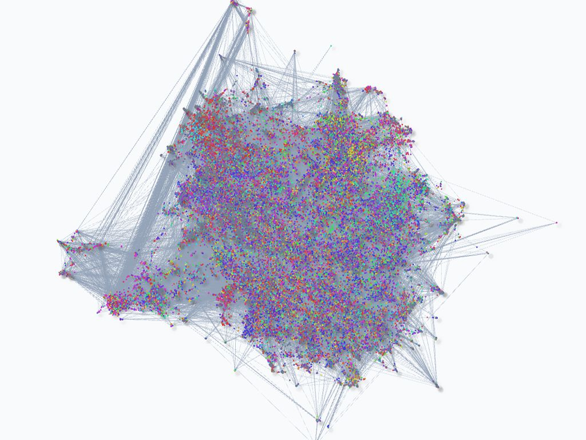

# AWS Native Graph RAG

[](./LICENSE)
[](https://github.com/awslabs/aws-graphrag/actions/workflows/quality.yml)
[](https://www.python.org/downloads/)

📖 **[한국어 README](./README.ko.md)** · 🤝 **[Contributing](./CONTRIBUTING.md)**



An AWS-native knowledge graph RAG (Retrieval-Augmented Generation) framework that turns large multilingual document corpora into knowledge graphs and answers questions over them with multi-hop graph traversal.

It reimplements two retrieval methodologies — Microsoft's GraphRAG ("From Local to Global: A Graph RAG Approach to Query-Focused Summarization") and LightRAG ("Simple and Fast Retrieval-Augmented Generation") — over a single AWS-native stack. The two are selectable per query and share one ingestion, indexing, caching, multilingual, and hybrid (lexical + semantic + graph) search infrastructure; only the retrieval algorithm differs.

> **Highlights**
> - **Two methodologies, one stack.** GraphRAG community-summary (`auto`/`drift`/`global`/`local`/`simple`) and LightRAG dual-level keyword (`mix`/`hybrid`/`naive`), chosen per query via `search_strategy`.
> - **Incremental indexing.** The DynamoDB document-status registry (`aws.dynamodb`) diffs a corpus by content hash and re-indexes only new/changed documents, merging into the live graph (idempotent upserts; deletions remove a document's exclusive artifacts).
> - **Prompt tuning.** `run-prompt-tuning` profiles a corpus (domain/language/persona/entity-types) and emits domain-adapted `custom_prompts`.
> - **Standalone visualization & graph-aware evaluation.** `run-visualization` renders from exported graph data without re-ingesting; the `graph_aware` evaluator scores entity/relationship coverage.
> - **Hexagonal architecture.** Ports & adapters + registries make storage backends, retrieval strategies, evaluators, and renderers pluggable. See `docs/design.en.md`.

## 📋 Table of Contents

- [✨ Features & Advantages](#-features--advantages)
- [🏛️ Architecture Overview](#️-architecture-overview)
- [🚀 Installation](#-installation)
- [📖 Usage](#-usage)
- [🧪 Testing & Quality](#-testing--quality)
- [🤝 Contributing](#-contributing)
- [📄 License](#-license)
- [📚 References](#-references)

## ✨ Features & Advantages

### 🏗️ **AWS-Native Design**
- **AWS service integration**: Bedrock, Neptune, OpenSearch, S3, and DynamoDB
- **Scalable**: parallel, batched processing for large document corpora
- **Caching**: local + S3-synced stage cache with task retry to avoid recomputation
- **Security**: S3 encryption and private-VPC deployment

### 🚀 **Triple Hybrid Search Architecture**
- **Semantic Search**: High-quality vector search based on Amazon Bedrock embedding models
- **Lexical Search**: Precise keyword matching using BM25 algorithm
- **Relationship-based Search**: Connectivity analysis through knowledge graph traversal
- **Result Optimization**: Enhanced search accuracy with RRF algorithm and Amazon Bedrock reranking models

### 🧠 **Advanced Knowledge Graph Processing**
- **Precise Entity Resolution**: Automatic detection and integration of duplicate entities
- **Topic Clustering**: Efficient community detection based on Leiden algorithm
- **Complex Reasoning**: Multi-hop reasoning capabilities across document boundaries
- **Source Transparency**: Verifiable information sources provided for all responses

### 🔍 **Two Selectable Methodologies, One Infrastructure**
Pick per query via `search_strategy`; both share the same ingestion, indexing,
caching, multilingual, and hybrid-scoring stack — only the retrieval algorithm differs.
- **GraphRAG (community-summary)**: `simple` (direct), `local` (entity-focused),
  `global` (community-based), `drift` (progressive exploration), `auto` (LLM router)
- **LightRAG (dual-level keyword)**: `mix`, `hybrid`, `naive` — high/low keyword
  extraction over an entity index + a relationship vector index + graph expansion

### ♻️ **Incremental Indexing**
- **Content-hash delta detection**: a DynamoDB document-status registry re-indexes
  only new/changed documents and merges into the live graph (idempotent upserts)
- **Deletion lineage**: removing a document deletes only its *exclusive* artifacts

### 🎯 **Comprehensive Evaluation Framework**
- **LangChain-based Evaluation**: RAG performance measurement through built-in evaluators
- **RAGAS Metrics**: Answer faithfulness, relevancy, and context accuracy
- **Graph-aware Evaluation**: entity/relationship coverage (recall of expected
  graph artifacts surfaced in the answer) against ground-truth expectations
  (deterministic, LLM-free, word-boundary matching)

### 🔧 **User Support**
- **Domain-specific Prompts**: customizable per-prompt overrides via config
- **Automatic Prompt Tuning**: profile a corpus (domain/language/persona/entity-types)
  and emit domain-adapted prompts (`run-prompt-tuning`)
- **Flexible Configuration**: detailed option adjustment through YAML configuration files
- **Comprehensive Monitoring**: structured logging and performance metrics

### 🌍 **Multilingual Support**
- **Automatic Language Processing**: translation during indexing/search, language-aware
  analyzers, and multilingual keyword extraction — applied to both methodologies

### 📊 **Visualization & Analytics Tools**
- **Interactive Graph**: Node2Vec + UMAP graph visualization
- **Network Analysis**: centrality metrics and graph statistics
- **Standalone CLI**: render from exported graph data without re-ingesting (`run-visualization`)

### 🧱 **Hexagonal Architecture**
- **Ports & adapters**: pluggable storage/retrieval backends and a registry for
  strategies, evaluators, and renderers — extend without editing dispatch code (see `CLAUDE.md`)

## 🏛️ Architecture Overview

The framework implements a sophisticated indexing and retrieval pipeline:

### Data Ingestion Pipeline


#### Core Stages:
- **Document Loading/Parsing**: PDF, TXT, CSV, JSON out of the box (plus MD/HTML when the optional `unstructured` extra is installed)
- **Text Chunking**: Simple/intelligent strategies with context preservation
- **Graph Extraction**: Entity/relationship extraction via LLM
- **Graph Resolution**: Fuzzy matching and deduplication of entities/relationships
- **Graph Analysis**: Centrality metrics (degree, betweenness, PageRank, eigenvector) and graph statistics
- **Community Detection**: Leiden algorithm for topic clustering
- **Indexing**: Storage backend integration (OpenSearch + Neptune)

#### Optional Stages:
- **Translation**: Multi-language support with automatic language detection
- **Gleaning**: Iterative graph refinement for improved accuracy
- **Claim Extraction/Resolution**: Factual assertions extraction and validation
  (opt-in: `processing.claim_extraction.enabled`, off by default — claims are
  indexed but not yet consumed by retrieval)

#### Key Features:
- **Incremental Indexing**: content-hash delta detection + merge (DynamoDB registry)
- **Resumable Pipeline**: Stage checkpointing for interrupted runs
- **Comprehensive Caching**: S3 sync with local cache management
- **Parallel Processing**: Batch optimization and concurrent execution
- **Configurable Strategies**: Flexible processing approaches per stage
- **Error Handling**: Optional continuation on stage failures

### Retrieval Pipeline


#### Multi-Strategy Architecture

The framework offers two retrieval methodologies — GraphRAG community-summary
and LightRAG dual-level keyword — sharing one ingestion/indexing/caching/
hybrid-search infrastructure and selectable per query via
`RAGInput.search_strategy`. The GraphRAG `auto` strategy automatically selects
the optimal approach based on query analysis.

##### GraphRAG strategies

**Simple Strategy**: Direct OpenSearch retrieval for basic queries
- Vector and keyword search without graph traversal
- Fastest response time for straightforward questions
- Ideal for factual lookups and simple information retrieval

**Local Strategy**: Entity-focused search using graph traversal + text retrieval
- Identifies key entities in the query
- Performs graph traversal to find related entities and relationships
- Combines graph context with vector/keyword search results
- Optimal for detailed analysis of specific entities or concepts

**Global Strategy**: Community-based analysis for broad questions
- Leverages community detection results for comprehensive coverage
- Uses map-reduce approach for large-scale information synthesis
- Dynamic community selection based on query relevance
- Best for high-level insights and thematic analysis

**Drift Strategy**: Iterative query evolution with convergence detection
- Starts with initial search and iteratively refines based on results
- Expands context through multiple search rounds
- Convergence detection prevents infinite loops
- Excellent for complex, multi-faceted questions requiring exploration

##### LightRAG strategies (dual-level keyword)

**Mix / Hybrid Strategy**: Extracts high-level and low-level keywords
(`KeywordsExtractionPrompt`), then queries the relationship vector index
(high-level) + entity index (low-level) with Neptune neighbourhood expansion.
`mix` additionally blends naive vector chunk retrieval. Both run through the
same `HybridScorer` (lexical + semantic + graph, RRF + Bedrock rerank).

**Naive Strategy**: Pure vector chunk retrieval — the LightRAG baseline, useful
as a fast lexical/semantic fallback and for comparison evaluation.

#### Component Architecture

**Dual Retriever System**:
- **Neptune Graph DB**: Relationship traversal and entity-centric search
- **OpenSearch**: Vector similarity and keyword matching with BM25

**Query Processing Pipeline**:
- Language detection and translation (if needed)
- Entity extraction using LLM
- Strategy selection based on query characteristics
- Multi-retriever coordination and result fusion

**Fusion and Ranking Mechanisms**:
- **RRF (Reciprocal Rank Fusion)**: Combines scores from different retrievers
- **Diversity Filtering**: Reduces redundancy in search results
- **LLM Reranking**: Context-aware result prioritization using Bedrock models
- **Hybrid Scoring**: Weighted combination of lexical and semantic similarity

**Context Optimization**:
- **Token Management**: Dynamic context sizing within model limits
- **Priority Scoring**: Relevance-based content selection
- **Memory Integration**: Conversational context tracking for multi-turn queries
- **Entity Tracking**: Maintains entity focus across conversation turns

## 🚀 Installation

### Prerequisites
- **Python 3.10–3.12** (`uv` recommended)
- **AWS CLI** configured with appropriate permissions
- **AWS Services** deployed and accessible:
  - Amazon Bedrock (with model access enabled)
  - Amazon Neptune cluster
  - Amazon OpenSearch domain
  - Amazon S3 bucket
  - Amazon DynamoDB (only for incremental indexing)

### Quick Start
```bash
# Clone the repository
git clone <repository-url>
cd aws-graphrag

# Install the framework (uv recommended; or: pip install -e .)
uv sync --extra dev

# Copy and configure settings
cp config-template.yaml config.yaml
# Edit config.yaml with your AWS service endpoints

# Copy and configure environment variables (if using username/password authentication)
cp .env-template .env
# Edit .env file with your OpenSearch credentials if not using IAM authentication
```

### Environment Configuration

If your OpenSearch cluster uses username/password authentication instead of IAM, create a `.env` file:

```bash
cp .env-template .env
```

Then edit the `.env` file with your OpenSearch credentials:

```bash
# OpenSearch Authentication (only required if use_iam is false in config.yaml)
OPENSEARCH_USERNAME=your_opensearch_username
OPENSEARCH_PASSWORD=your_opensearch_password
```

**Note**: The `.env` file is only needed when `use_iam: false` is set in your `config.yaml` OpenSearch configuration. If you're using IAM authentication (`use_iam: true`), you can skip this step.

## 📖 Usage

All behavior is driven by `config.yaml` (schema: `config-template.yaml`). The five
CLIs (pyproject scripts) cover the full workflow:

```bash
# 1) Index a corpus (full 12-stage pipeline; incremental when DynamoDB is enabled)
run-ingestion --source-directory ./source --config-path config.yaml

# 2) Query — GraphRAG (community-summary) or LightRAG (dual-level keyword)
run-rag --query "What are the main themes?" --search-strategy global --config-path config.yaml
run-rag --query "How are Alice and Acme related?" --search-strategy mix --config-path config.yaml
run-rag --interactive --use-memory --conversation-id my-session --config-path config.yaml

# 3) Evaluate (langchain + ragas + graph-aware)
run-eval --eval-data-path eval_data.json --config-path config.yaml

# 4) Visualize an exported graph (no re-ingestion)
run-visualization --data-path visualization_data.json --output-dir ./viz --config-path config.yaml

# 5) Auto-tune prompts to a domain corpus
run-prompt-tuning --source-dir ./source --output tuned_prompts.yaml --config-path config.yaml
```

**Choosing a strategy** — GraphRAG: `simple` (direct vector/lexical), `local`
(entity-centric), `global` (community-summary, map-reduce), `drift` (iterative),
`auto` (LLM router). LightRAG: `mix` / `hybrid` / `naive` (dual-level keyword).

📘 **Full configuration reference, every CLI flag, the Python API, incremental
add/modify/delete, domain adaptation, and troubleshooting are in the
[User Guide](./docs/user-guide.md)** ([한국어](./docs/user-guide.ko.md)).
For architecture, algorithms, and implementation internals see the
[Design Doc](./docs/design.en.md) ([한국어](./docs/design.md)).


## 🧪 Testing & Quality

```bash
uv run pytest -m "not aws"                    # AWS-free tests (unit/integration/property)
uv run pytest -m "not aws" --cov=aws_graphrag # with coverage
uv run ruff check aws_graphrag tests
uv run mypy aws_graphrag
```

- The `aws` marker isolates tests that need real AWS services; they are excluded in CI.
- DynamoDB/S3 are tested with `moto`; Neptune/OpenSearch with port-based in-memory fakes.
- CI (`.github/workflows/`): ruff/black/isort/mypy + pytest+coverage gate, plus a non-blocking ASH security scan.

## 🤝 Contributing

We welcome contributions! Please see our [Contributing Guidelines](CONTRIBUTING.md) for details.

## 📄 License

This project is licensed under the Apache-2.0 License - see the [LICENSE](LICENSE) file for details.

## 📚 References

**GraphRAG (Microsoft)**

- [From Local to Global: A Graph RAG Approach to Query-Focused Summarization](https://arxiv.org/abs/2404.16130)
- [GraphRAG: Unlocking LLM Discovery on Narrative Private Data](https://www.microsoft.com/en-us/research/blog/graphrag-unlocking-llm-discovery-on-narrative-private-data/)
- [GraphRAG: New Tool for Complex Data Discovery Now on GitHub](https://www.microsoft.com/en-us/research/blog/graphrag-new-tool-for-complex-data-discovery-now-on-github/)
- [GraphRAG Auto-Tuning Provides Rapid Adaptation to New Domains](https://www.microsoft.com/en-us/research/blog/graphrag-auto-tuning-provides-rapid-adaptation-to-new-domains/)
- [Introducing DRIFT Search: Combining Global and Local Search Methods to Improve Quality and Efficiency](https://www.microsoft.com/en-us/research/blog/introducing-drift-search-combining-global-and-local-search-methods-to-improve-quality-and-efficiency/)
- [GraphRAG: Improving Global Search via Dynamic Community Selection](https://www.microsoft.com/en-us/research/blog/graphrag-improving-global-search-via-dynamic-community-selection/)
- [LazyGraphRAG: Setting a New Standard for Quality and Cost](https://www.microsoft.com/en-us/research/blog/lazygraphrag-setting-a-new-standard-for-quality-and-cost/)
- [Introducing GraphRAG 1.0](https://www.microsoft.com/en-us/research/blog/moving-to-graphrag-1-0-streamlining-ergonomics-for-developers-and-users/)
- [Microsoft GraphRAG Library](https://github.com/microsoft/graphrag)

**LightRAG (HKUDS)**

- [LightRAG: Simple and Fast Retrieval-Augmented Generation](https://arxiv.org/abs/2410.05779)
- [HKUDS/LightRAG Library](https://github.com/HKUDS/LightRAG)

## 🏢 About

Maintained by AWS under the awslabs organization. Licensed under Apache-2.0.
Contributions welcome — see [CONTRIBUTING.md](CONTRIBUTING.md).
