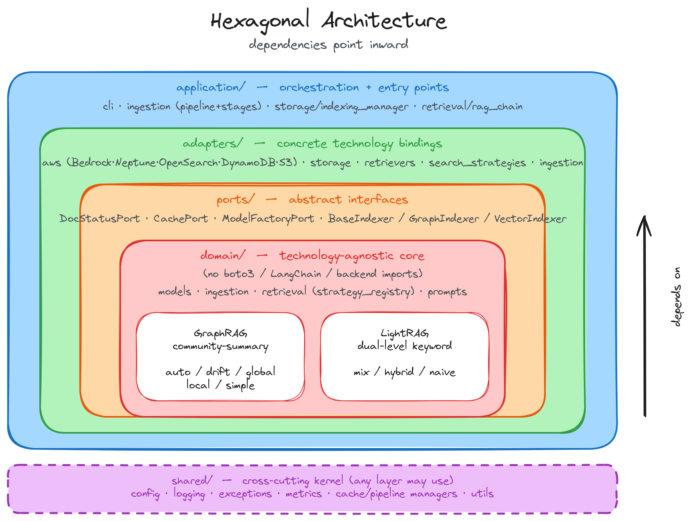
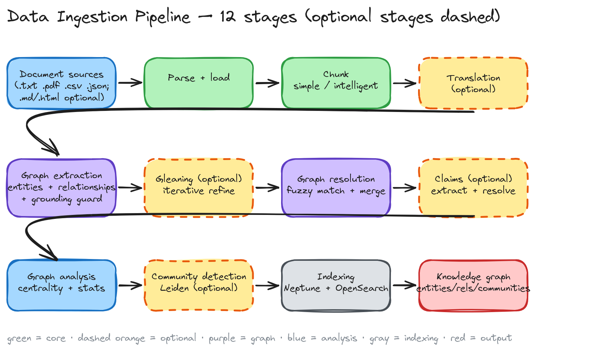
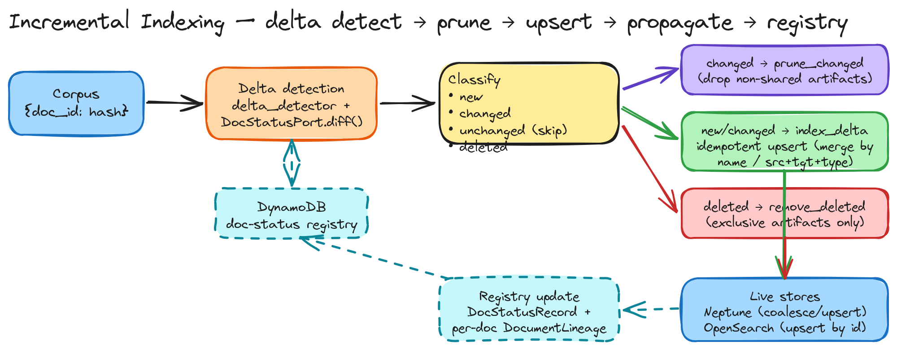
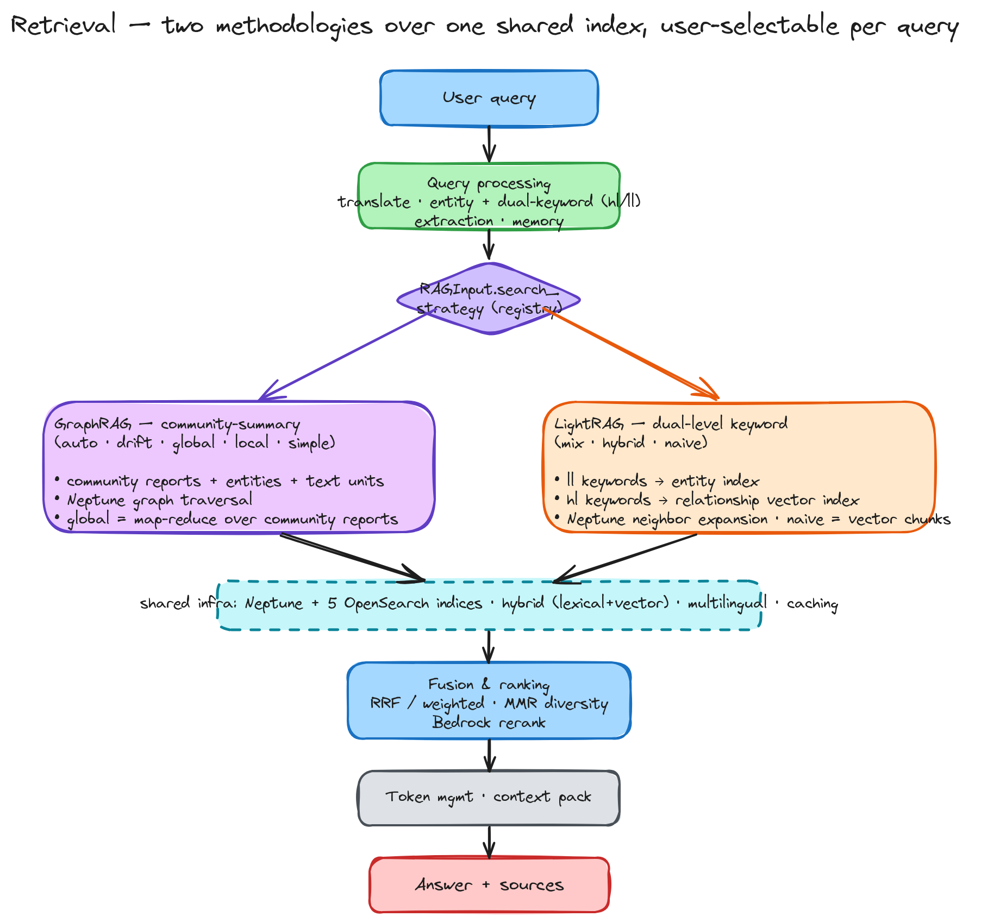

# Unified Knowledge Graph RAG on AWS — 기술 문서

본 문서는 `unified-kg-rag-on-aws` 라이브러리의 아키텍처·알고리즘·데이터 모델·운영 측면을 다루는 **기여자/고급 사용자용 설계 레퍼런스**입니다. "무엇/왜"와 빠른 시작은 [README.ko.md](../README.ko.md)를, "어떻게 쓰는가"는 [docs/user-guide.ko.md](user-guide.ko.md)를, 기여/확장 규약은 [CLAUDE.md](../CLAUDE.md)를 참고하세요. 본 문서의 영문판은 [docs/design.md](design.md)에 있습니다.

## 목차

1. [개요와 설계 철학](#1-개요와-설계-철학)
2. [헥사고날 아키텍처 (포트 & 어댑터)](#2-헥사고날-아키텍처-포트--어댑터)
3. [도메인 모델](#3-도메인-모델)
4. [인제스천 파이프라인](#4-인제스천-파이프라인)
5. [증분 인덱싱](#5-증분-인덱싱)
6. [검색: 두 방법론](#6-검색-두-방법론)
7. [하이브리드 스코어링과 토큰 관리](#7-하이브리드-스코어링과-토큰-관리)
8. [AWS 서비스 통합](#8-aws-서비스-통합)
9. [평가 프레임워크](#9-평가-프레임워크)
10. [시각화 & 분석](#10-시각화--분석)
11. [프롬프트와 프롬프트 튜닝](#11-프롬프트와-프롬프트-튜닝)
12. [설정 시스템](#12-설정-시스템)
13. [테스트 전략](#13-테스트-전략)
14. [CI/CD와 보안](#14-cicd와-보안)
15. [확장 가이드](#15-확장-가이드)

---

## 1. 개요와 설계 철학

`unified-kg-rag-on-aws`는 Microsoft GraphRAG 논문을 AWS 네이티브 스택(Bedrock + Neptune + OpenSearch + S3 + DynamoDB) 위에 재구현한 라이브러리입니다. 핵심 설계 원칙은 다음과 같습니다.

- **두 방법론, 하나의 인프라**: GraphRAG(커뮤니티 요약)와 LightRAG(이중 레벨 키워드)가 동일한 인제스천·인덱싱·캐싱·다국어·하이브리드 검색 인프라를 공유하고, **검색 알고리즘 레이어만 교체**됩니다.
- **일반화 우선**: 하드코딩·정규표현식 휴리스틱·과적합을 지양합니다. 의미 판단은 LLM 또는 권위 데이터에 위임하고, 토큰 카운팅은 Bedrock `count_tokens` API를 사용하며, 임계값/가중치는 설정 기반입니다.
- **헥사고날 경계**: 도메인/알고리즘 코드는 추상 포트에 의존하고, 구체 AWS 어댑터는 그 뒤에 둡니다.
- **레지스트리 기반 확장**: 검색 전략·평가자·렌더러는 데코레이터 레지스트리로 등록되어, 디스패치 코드 수정 없이 확장됩니다.

---

## 2. 헥사고날 아키텍처 (포트 & 어댑터)

### 2.0 의존성 규칙과 레이어 맵

import는 **안쪽을 향합니다**(왼쪽이 오른쪽을 import, 역방향 금지). `shared/`는 어느 레이어나 쓸 수 있는 cross-cutting 커널입니다. 두 RAG 방법론(GraphRAG 커뮤니티 요약, LightRAG dual-level 키워드)은 하나의 인제스천/인덱싱/캐싱/하이브리드 검색 인프라를 공유하고 알고리즘 레이어에서만 갈립니다.



```
application  ──►  adapters  ──►  ports  ──►  domain
        └──────────────┴────────────┴──────────►  shared (cross-cutting kernel)
```

```
unified_kg_rag/
├─ domain/              # 기술 무관 코어 (boto3/LangChain/백엔드 import 없음)
│  ├─ models/           #   Pydantic 도메인 모델
│  ├─ ingestion/        #   순수 알고리즘: delta_detector, graph_analyzer/
│  │  └─ merge/         #   builder/resolver, claim_resolver, merge/merger
│                       #   (IncrementalIndexer는 오케스트레이션이라 application/)
│  ├─ retrieval/        #   strategy_registry, MetricsMixin
│  └─ prompts/          #   버전 관리되는 프롬프트 템플릿
├─ ports/               # 도메인이 의존하는 추상 인터페이스 (DocStatusPort,
│                       #   BaseIndexer/GraphIndexer/VectorIndexer, CachePort,
│                       #   ModelFactoryPort — ports/__init__이 포트 카탈로그)
├─ adapters/            # 구체 기술 바인딩
│  ├─ aws/              #   Bedrock, Neptune, OpenSearch, DynamoDB, S3 클라이언트
│  ├─ storage/          #   Neptune/OpenSearch 인덱서 (쓰기측 포트 구현)
│  ├─ retrievers/       #   Neptune/OpenSearch 리트리버
│  ├─ search_strategies/#   simple/local/global/drift + lightrag(mix/hybrid/naive)
│  ├─ retrieval/        #   추상 리트리버/전략 베이스, hybrid scorer, 토큰/메모리 매니저
│  ├─ ingestion/        #   LLM/IO 결합: chunker, *_extractor, loader, parser,
│  │                    #   translator, gleaner, community_detector
│  ├─ renderers/        #   그래프 시각화 렌더러
│  └─ evaluators/       #   langchain/ragas 평가자 (순수 graph_aware_evaluator는
│                       #   evaluation/ 파사드에 co-locate)
├─ application/         # 오케스트레이션 + 엔트리포인트
│  ├─ cli/              #   run-ingestion/rag/eval/visualization/prompt-tuning
│  ├─ ingestion/        #   DataIngestionPipeline + pipeline_stages
│  ├─ storage/          #   IndexingManager (인덱서 fan-out)
│  ├─ retrieval/        #   rag_chain (GraphRAGChain, RAGInput/Output)
│  └─ prompts/          #   PromptTuner (LLM 기반 코퍼스 프로파일링)
├─ shared/              # cross-cutting 커널 (config, logging, exceptions, metrics,
│                       #   cache/pipeline manager, utils)
├─ evaluation/          # 실제 로직 패키지: evaluation_manager / base / graph_aware
└─ visualization/       # 실제 로직 패키지: 렌더 루프 + embeddings/exporters/renderers
```

> 레이아웃 주석: `evaluation/`·`visualization/`은 **실제 로직 패키지**입니다
> (헥사고날 분리 전부터 존재 — `evaluation/`은 `evaluation_manager`·
> `graph_aware_evaluator`·`base`를, `visualization/`은 렌더 루프 + `embeddings/`·
> `exporters/`·`renderers/` 하위패키지를 보유). 파사드가 아닙니다. 분리 전 import
> 경로를 보존하던 thin re-export shim(`retrieval/`·`storage/`·`ingestion/`)은
> 제거되었으며, 실제 위치(`application.retrieval.rag_chain`,
> `application.storage.indexing_manager`, `application.ingestion.pipeline`,
> `adapters.*`, `domain.*`)에서 import합니다.

### 2.1 포트(추상 인터페이스)

| 포트 | 위치 | 어댑터 | 비고 |
|---|---|---|---|
| `DocStatusPort` | `ports/doc_status.py` | `adapters/aws/dynamodb.py` (`DynamoDBDocStatusStore`), 테스트용 `FakeDocStatusStore` | 증분 인덱싱 문서 상태/계보 영속 |
| `CachePort` | `ports/cache.py` (`Protocol`) | `shared/cache_manager.py`(로컬) + `adapters/aws/s3_cache.py`(S3) | 스테이지 결과 영속 경계 |
| `GraphIndexer` (쓰기측) | `ports/indexer.py` | `adapters/storage/neptune_indexer.py` | full + delta(`upsert_*`/`delete_by_id`) 단일 계약 |
| `VectorIndexer` (쓰기측) | `ports/indexer.py` | `adapters/storage/opensearch_indexer.py` | 동일 |
| `BaseGraphRAGRetriever` (읽기측) | `adapters/retrieval/base.py` | `adapters/retrievers/{neptune,opensearch}_retriever.py` | 검색 어댑터 |
| LLM/Embedding/Rerank 팩토리 | `adapters/aws/bedrock.py` | Bedrock 구현 | `ModelFactoryPort` conform; 임베딩/리랭크 생성 지점에 주입(기본 Bedrock) |

> 설계 노트: 순수 포트(`DocStatusPort`, 쓰기측 indexer ABC)는 `ports/`에 모읍니다. 읽기측 추상 베이스(`BaseGraphRAGRetriever`/`BaseSearchStrategy`)는 `__init__`에서 인프라(HybridScorer/TokenManager)를 생성하는 "어댑터 베이스"라 `adapters/retrieval/base.py`에 두고 `ports/__init__`에서 발견용으로 re-export합니다(중복 Protocol 정의를 두지 않음).

### 2.2 역할 기반 검색 주입

검색 전략은 **구체 백엔드 이름이 아니라 추상 역할**로 리트리버를 주입받습니다.

- `RetrieverRole.GRAPH` → 그래프 순회/확장 (현재 Neptune)
- `RetrieverRole.DOCUMENT` → 벡터/렉시컬 조회 (현재 OpenSearch)

전략은 `self.graph_retriever` / `self.document_retriever`(베이스 클래스 프로퍼티)로만 접근하고, `rag_chain`의 역할→어댑터 빌더 맵이 실제 구현을 바인딩합니다. 따라서 그래프 백엔드를 교체해도 전략 코드는 수정하지 않습니다.

```python
# domain/retrieval/strategy_registry.py
@register_strategy(SearchStrategy.LOCAL, required_roles=(RetrieverRole.DOCUMENT, RetrieverRole.GRAPH))
class LocalSearchStrategy(BaseSearchStrategy): ...
```

### 2.3 레지스트리

- **검색 전략**: `domain/retrieval/strategy_registry.py` — `@register_strategy(...)`로 `SearchStrategy` enum에 클래스와 필요한 역할을 등록.
- **평가자**: `EvaluationManager.EVALUATOR_MAPPING` — `EvaluatorType` → 평가자 클래스.
- **렌더러**: `adapters/renderers/base.py` — `@register_renderer("name")`.

이 패턴은 기존의 `ParserFactory._loader_configs`(선언적 파서 등록)와 동일한 철학입니다.

> 쓰기(인덱싱) 경로 주석: 레지스트리는 **읽기/평가/렌더/파싱** 경로에 적용됩니다.
> 쓰기 경로의 `IndexingManager`는 의도적으로 **Neptune + OpenSearch 두 백엔드를
> 고정**으로 구성합니다(레지스트리 순회가 아님) — 이 두 스토어(그래프 DB + 벡터/
> 렉시컬 검색)는 프레임워크의 본질적 구성이라 런타임 교체 대상이 아니기 때문입니다.
> 따라서 새 검색 전략·평가자·렌더러는 레지스트리 등록만으로 추가되지만, 쓰기측
> 스토어 백엔드 교체는 `GraphIndexer`/`VectorIndexer` 포트 구현 + `IndexingManager`
> 수정을 수반합니다. (읽기 경로는 `RetrieverRole`→builder 맵으로 이미 일반화됨.)

### 2.4 의존성 규칙 검증 상태

grep으로 검증: `domain/`은 런타임에 `adapters`/`application`을 import하지 않고, `ports/`도 그렇습니다. 컴파일 타임 한정 예외 하나가 남아 있습니다 — `domain/retrieval/strategy_registry.py`가 `TYPE_CHECKING` 하에서 `adapters.retrieval.base.BaseSearchStrategy`를 참조합니다(레지스트리가 전략 서브클래스를 저장하므로). 순수 전략/리트리버 포트를 추출하면 이 타입 수준 참조도 제거되며, 의도적 경계로 남겨둡니다(문서 말미 "의도적 설계 경계" 참조).

레이어 분리가 남긴 thin 파사드 shim(`retrieval/`·`storage/`·`ingestion/` — re-export 전용 `__init__`)은 제거되었으며, 코드는 실제 위치(`application.retrieval.rag_chain`, `application.storage.indexing_manager`, `application.ingestion.pipeline`, `adapters.*`/`domain.*`)에서 import합니다. `evaluation/`·`visualization/`은 §2 주석대로 분리 전부터 존재한 실제 로직 패키지로 그대로 유지됩니다.

---

## 3. 도메인 모델

`domain/models/` 패키지는 인프라 의존이 없는 순수 Pydantic 모델입니다.

- `Entity`(`name`, `description`, `type`, `text_unit_ids`, `community_ids`, `rank`, `frequency`, `confidence`, 임베딩 필드)
- `Relationship`(`source_id`/`target_id`, `description`, `weight`, `text_unit_ids`, `description_embedding`)
- `Community` / `CommunityReport`, `TextUnit`, `Covariate`(claim)
- `DocStatus`(상태 머신: PENDING→PARSING→PROCESSING→PROCESSED|FAILED), `DocStatusRecord`(콘텐츠 해시 + 아티팩트 계보 + suffix), `DocumentDelta`(new/changed/unchanged/deleted), `DocumentLineage`(문서별 아티팩트 귀속)
- `SearchQuery`/`SearchResult`/`RetrievalResult`, `SearchStrategy`/`SearchType`/`RetrieverRole`

**계보(lineage)가 핵심 데이터**입니다. 엔티티/관계는 추출 시 자신이 등장한 `text_unit_ids`를 기록하며, 이 권위 데이터가 (구) 토큰 중첩 휴리스틱을 대체하여 "이 엔티티가 이 텍스트 단위와 관련 있는가?"를 정확하고 언어 무관하게 판정합니다.

**엔티티 ID와 다국어**: 엔티티/관계 ID는 정규화된 이름의 해시입니다. `normalize_name`(`shared/utils/common.py`)은 NFKC + casefold 후 **모든 스크립트의 문자/숫자를 보존**(`\w`, `re.UNICODE`)하고 구두점만 제거합니다. 따라서 한국어·CJK·악센트 이름도 고유 ID를 가집니다(ASCII 전용 정규화는 비라틴 이름을 빈 문자열로 만들어 그래프를 붕괴시킵니다). 비어 있지 않은 입력은 절대 빈 ID로 collapse되지 않습니다.

---

## 4. 인제스천 파이프라인

`application/ingestion/pipeline.py`의 `DataIngestionPipeline`이 12개 스테이지를 순서대로 실행합니다(`application/ingestion/pipeline_stages.py`).



| # | 스테이지 | 모듈 | 비고 |
|---|---|---|---|
| 1 | 문서 파싱 | `parser.py` (`ParserFactory`) | PDF/TXT/CSV/JSON 기본 (+MD/HTML은 옵션 `unstructured` extra) |
| 2 | 문서 로딩 | `loader.py` (`DirectoryLoader`) | MinHash 중복 제거 |
| 3 | 청킹 | `chunker.py` (`ChunkerFactory`) | simple / intelligent(LLM 시맨틱) |
| 4 | 번역 (선택) | `translator.py` | 다국어 → 대상 언어 |
| 5 | 그래프 추출 | `graph_extractor.py` | LLM 엔티티/관계 추출 |
| 6 | Gleaning (선택) | `gleaner.py` | 반복 정제(수렴/품질 임계값은 설정) |
| 7 | 그래프 해석 | `graph_resolver.py` + `description_summarizer.py` | 퍼지 매칭 병합, `text_unit_ids` union, **병합 설명 LLM 재요약** |
| 8 | Claim 추출 (선택) | `claim_extractor.py` | 사실 주장(covariate) |
| 9 | Claim 해석 (선택) | `claim_resolver.py` | |
| 10 | 그래프 분석 | `graph_analyzer.py` | 중심성(degree/betweenness/PageRank/eigenvector), 통계 |
| 11 | 커뮤니티 탐지 | `community_detector.py` | 계층적 Leiden, 커뮤니티 리포트 생성(degree-sort + 토큰 예산 팩) |
| 12 | 인덱싱 | `application/storage/indexing_manager.py` | OpenSearch + Neptune |

> 스테이지 순서는 `DataIngestionPipeline.STAGE_CLASSES`(`pipeline.py:62`)가 단일 진실 소스입니다. Bedrock가 필요한 스테이지는 `BOTO_REQUIRED_STAGES`로 선언되며, 설명 재요약이 추가되면서 **그래프 해석(7)도 이 집합에 포함**됩니다.

**병합 설명 재요약(stage 7)**: 그래프 해석은 동일 엔티티/관계의 설명을 단순 연결(concatenation)로 병합하므로, 많은 청크에 등장하는 인기 엔티티의 설명이 무한정 길어집니다. `DescriptionSummarizer`(`GraphResolutionStage`에서 실행)는 토큰 예산을 초과한 설명만 저렴한 LLM으로 하나의 일관된 설명으로 재요약합니다(MS GraphRAG `summarize_descriptions` / LightRAG `_handle_entity_relation_summary` 패리티, `DescriptionSummarizationConfig`로 제어). 임베딩/프롬프트 비대화를 막는 것이 목적입니다.

**커뮤니티 리포트 컨텍스트 팩(stage 11)**: 리포트 생성 입력은 커뮤니티 내 엔티티를 **그래프 degree 내림차순으로 정렬**(동점은 안정적 id 정렬)한 뒤 `max_entities_per_report`로 캡하고, `max_report_context_tokens` 토큰 예산에 맞춰 팩합니다(관계는 양 끝점 degree 합·가중치 tiebreak로 동일하게 정렬·팩). 최상위 degree 엔티티는 단독으로 예산을 초과해도 항상 1개는 포함되어 리포트가 빈 컨텍스트로 남지 않습니다(`community_detector.py:681-720`).

**파이프라인 인프라**: 스테이지 체크포인트 기반 재개(`shared/pipeline_manager.py`), S3 캐시 동기화(`adapters/aws/s3_cache.py`), `continue_on_error` 토글, 스테이지별 캐시(`shared/cache_manager.py`). 번역 스테이지는 `TranslationConfig.is_noop`(source==target & 추가 언어 없음)이면 비용 없이 스킵합니다. LLM 출력 파싱은 `FixingConfig` 기반 output-fixing 파서를 일관되게 사용합니다. 파이프라인은 `close()`로 인덱서/클라이언트 자원을 해제하며, `run-ingestion` CLI가 `finally`에서 호출합니다(§8.6).

**일반화 적용 사례**:
- 관련성 게이트(claim/gleaning에서 어떤 엔티티를 프롬프트에 넣을지)는 토큰-Jaccard 정규표현식 휴리스틱이 아니라 `text_unit_ids` 계보 멤버십으로 판정 → 정확·언어 무관.
- gleaning 품질/수렴 공식의 스케일 상수(엔티티 50, 관계 100, completeness 가중치 0.6, 변화 스케일 20)는 모두 `GleaningConfig`로 노출.

---

## 5. 증분 인덱싱

문서 추가/변경/삭제 시 전체 재인덱싱 대신 델타만 처리합니다.



1. **델타 감지** (`domain/ingestion/delta_detector.py`): 경로 정규화 기반 안정적 `doc_id` + 콘텐츠 SHA-256 해시로 `{doc_id: content_hash}`를 만들고, `DocStatusPort.diff()`가 new/changed/unchanged/deleted로 분류.
2. **stale 정리** (`IncrementalIndexer.prune_changed`): 변경 문서의 기존 아티팩트 중 *공유되지 않은* 것을 먼저 제거(재추출 후 사라진 엔티티가 그래프에 잔존하지 않도록).
3. **델타 upsert** (`IndexingManager.index_delta`): Neptune은 Gremlin `coalesce(unfold, addV)` 멱등 upsert, OpenSearch는 live alias 인덱스에 id 기준 upsert. 관계 벡터 인덱스도 동일하게 갱신.
4. **삭제 전파** (`remove_deleted`): 삭제 문서의 *독점* 아티팩트만 `delete_by_id`로 제거(공유 엔티티 보존). 텍스트 단위·엔티티·관계 인덱스 모두 대상.
5. **레지스트리 갱신**: 처리한 문서를 `DocumentLineage`(문서별 아티팩트 id + suffix)로 `DocStatusRecord`에 기록.

**병합 의미론**(`domain/ingestion/merge/merger.py`, MS GraphRAG `update/*` 이식): 엔티티는 정규화된 이름 기준 병합(설명 결합, `text_unit_ids` union, `frequency` 재계산, 기존 id 보존+remap), 관계는 (source,target) 기준 병합(weight 평균), 커뮤니티는 id-offset append.

활성화: `config.aws.dynamodb.enabled = true`.

---

## 6. 검색: 두 방법론

`application/retrieval/rag_chain.py`의 `GraphRAGChain`(LCEL Runnable)이 전략 해석 → 질의 처리(번역·엔티티/키워드 추출) → 메모리 → 검색 → (RAG) 컨텍스트 빌드+답변 생성을 수행합니다. `RAGInput.search_strategy`로 방법론을 선택합니다.



### 6.1 GraphRAG 방법론 (`adapters/search_strategies/`)

- **simple**: OpenSearch 전용 벡터/렉시컬, 그래프 없음. claim 추출이 켜져 있으면 claims 인덱스도 자동 sweep 대상이고, 꺼져 있으면 `_apply_claim_gate`가 claims 인덱스를 명시적으로 제외해 claims-off 실행이 그 인덱스를 절대 조회하지 않습니다.
- **local**: 엔티티 중심 — 후보 엔티티 → Neptune 그래프 확장 → 빈도 필터 → 텍스트 단위 결합. claim 추출이 켜져 있으면 MS GraphRAG처럼 **claims(covariate)를 컨텍스트에 주입**합니다(`_retrieve_claims`가 claims 인덱스를 별도 조회해 `all_results["claims"]`로 추가, `SectionType.CLAIM` 우선순위로 토큰 예산에 편입). claims-off 기본 경로는 추가 조회를 일절 하지 않습니다.
- **global**: 커뮤니티 리포트 검색 → 커뮤니티 노드 확장 → LLM 동적 관련성 선택 → **map-reduce 합성**(아래 §6.1.1).
- **drift**: 반복적 질의 진화(커뮤니티 시드 → LLM 질의 재정의/키워드 확장 → 수렴 판정).
- **auto**: `StrategySelectionPrompt`로 위 전략 중 LLM 라우팅.

#### 6.1.1 Global search map-reduce (`global_search.py`)

`enable_map_reduce`이고 결과가 `map_reduce_min_results` 이상일 때, MS GraphRAG의 정식 map-reduce를 따릅니다(이전의 단순 concat-reduce를 대체).

1. **MAP** — 커뮤니티 리포트를 `map_batch_size`개씩 배치로 묶어, 각 배치마다 `GlobalMapPrompt`로 LLM에게 핵심 포인트(key point)를 추출하고 질의 관련성을 **0-100**으로 채점시킵니다. 배치는 `BatchProcessor`로 동시 실행되며 항목별 graceful fallback이 있습니다.
2. **FILTER+RANK** — `map_relevance_threshold` 이하 포인트를 버리고 점수 내림차순 정렬(`_filter_and_rank_points`).
3. **PACK** — `max_map_reduce_tokens` 토큰 예산까지 상위 포인트를 팩(`token_manager.count_tokens` 기준, `_pack_points_within_budget`).
4. **REDUCE** — 팩된 포인트(relevance 주석 포함)를 `MapReduceSummaryPrompt`로 최종 답변 합성(`_reduce_from_points`). 결과는 `synthesized_summary` `RetrievalResult`로 결과 앞에 추가.

견고성: map 응답이 코드펜스/산문에 싸여 와도 `_parse_map_points`가 JSON을 추출하고, 단일 배치 파싱 실패는 무시합니다. map 단계가 유용한 포인트를 전혀 못 내거나 임계값에 전부 걸러지면 레거시 `_concat_reduce`로 graceful degrade해 global search가 hard-fail하지 않습니다.

### 6.2 LightRAG 방법론 (`lightrag_search.py`)

이중 레벨 키워드(`KeywordsExtractionPrompt`로 hl/ll 추출)를 공유 하이브리드 인프라 위에서 실행합니다.

모드(`RAGInput.search_strategy`):
- **naive** — 그래프 없이 벡터 청크 검색만.
- **hybrid** — ll→엔티티 인덱스 + hl→관계 인덱스 + Neptune 그래프 확장.
- **mix** — hybrid 그래프 검색에 naive 청크 검색을 추가 블렌딩.

소스별 동작:
- **저수준 키워드(ll)** → 엔티티 인덱스(렉시컬+시맨틱, `entities_index_prefix`)
- **고수준 키워드(hl)** → **관계 인덱스**(LightRAG의 `relationships_vdb`에 해당. `relationships_index_prefix`, `Relationship.description` 임베딩)
- 엔티티 히트는 Neptune(=GRAPH 역할)으로 확장
- 키워드 추출 결과가 비면 짧은 질의는 원 질의를 ll 키워드로 폴백(설정 `search.lightrag_search.raw_query_fallback_max_len`)
- 모든 소스는 공유 `HybridScorer`로 융합

> 두 방법론은 동일 인제스천 산출물(엔티티/관계/커뮤니티/청크 + 임베딩)을 공유하고 검색 레이어에서만 분기합니다 — 즉 한 번 인덱싱한 코퍼스로 재인덱싱 없이 GraphRAG·LightRAG 질의를 모두 처리합니다. 이는 원 논문 대비 의도적 확장입니다: 원본 MS GraphRAG는 관계 벡터 인덱스를 만들지 않고, 원본 LightRAG는 커뮤니티 탐지/리포트를 하지 않습니다. 여기서는 인제스천이 두 산출물의 *합집합*을 빌드해 어느 방법론이든 돌 수 있게 합니다.
>
> 트레이드오프: 풀 인제스천은 LightRAG로만 질의하더라도 GraphRAG의 커뮤니티 탐지 + 리포트 생성 비용을 치릅니다. LightRAG 전용 배포라면 `graph.community_detection.enabled: false`로 Leiden 패스와 커뮤니티 리포트 LLM 호출을 건너뛸 수 있습니다 — `mix`/`hybrid`/`naive`는 엔티티·관계·관계 벡터 인덱스만 필요합니다. (`global`/`drift`를 쓰려면 켜 두세요.)

---

## 7. 하이브리드 스코어링과 토큰 관리

- **HybridScorer** (`adapters/retrieval/hybrid_scorer.py`): 소스별 결과를 RRF(`rrf_k`) 또는 가중 융합, 다양성 필터링(`diversity_lambda`), Bedrock 리랭킹으로 결합. 가중치·방법은 `config.search.fusion`/`hybrid`. 리랭킹은 `search.reranking.enabled`일 때만 활성화되며, `compress_documents`로 `top_n`을 문서 수에 맞춰 일시 조정 후 복원합니다. 초기화 실패 시 리랭커는 비활성(`None`)으로 degrade.
  - **IAM 주의**: Bedrock Rerank는 `bedrock:Rerank` 권한을 **`Resource:*`**로 요구합니다(실 AWS E2E에서 발견 — 모델 ARN로 좁히면 AccessDenied). IaC에 전용 statement로 분리합니다.
- **TokenManager** (`adapters/retrieval/token_manager.py`): 모델 한도 내 컨텍스트 최적화. 섹션 타입별 우선순위 배수로 가중(`PRIORITY_MULTIPLIERS`: TEXT 1.3 / ENTITY 1.2 / RELATIONSHIP 1.1 / CLAIM 1.1 / COMMUNITY 1.0 / GENERAL 0.8), 우선순위 내림차순으로 예산 내 섹션을 선택. `SectionType.CLAIM`은 query-time claims 주입(§6.1)을 토큰 예산에 편입하기 위한 타입입니다.
- **토큰 카운팅** (`adapters/aws/token_counter.py`): Bedrock `count_tokens` API가 단일 진실 소스. 실패 시에만 공백 단어 수로 degrade(서드파티 토크나이저 미사용). 절단은 char 비율로 후보를 잡고 API로 검증하는 수렴 루프.

---

## 8. AWS 서비스 통합

| 서비스 | 모듈 | 용도 |
|---|---|---|
| **Bedrock** | `adapters/aws/bedrock.py` | LLM/임베딩/리랭킹. cross-region inference profile 자동 해석, thinking 모드, 1M 컨텍스트, prompt 캐싱, capability 테이블 |
| **Neptune** | `adapters/aws/neptune.py` | Gremlin over `wss://`, SigV4 IAM, 배치 upsert/삭제. 쓰기 배치는 `indexing.neptune.index_concurrency`>1이면 스레드 풀로 동시 제출(배치별 독립 `IndexingStats` → 메인 스레드 병합, 공유 변경 없음), `aws.neptune.pool_size`로 Gremlin 커넥션 풀 다중화. 기본 1=순차 |
| **OpenSearch** | `adapters/aws/opensearch.py` | 벡터(kNN/HNSW, 기본 엔진 **faiss** — nmslib는 deprecated) + BM25, async SigV4, sync/async 클라이언트, hybrid search pipeline, alias 관리, bulk upsert/delete, 언어별 분석기(en→english, ko→nori 등) |
| **S3** | `adapters/aws/s3_cache.py` | 파이프라인 캐시 동기화(AES256/KMS 암호화) |
| **DynamoDB** | `adapters/aws/dynamodb.py` | 증분 인덱싱 문서-상태 레지스트리 |

모든 어댑터는 `boto_session`을 주입받을 수 있어(기본은 `config.aws.profile_name`으로 생성) 테스트 시 fake/moto 세션을 주입할 수 있습니다.

### 8.5 검색 오류 가시성

리트리버(`opensearch_retriever`/`neptune_retriever`)는 인증/설정/연결 실패를 더 이상 조용히 "결과 없음"으로 둔갑시키지 않습니다. `is_fatal_retrieval_error()`(`adapters/retrieval/base.py:50`)가 치명적 오류는 `exc_info`와 함께 재발생시키고, 일시적(transient) 오류일 때만 `[]`로 degrade합니다. 따라서 잘못된 IAM 권한이나 엔드포인트 오타가 "0건 검색"으로 묻히지 않습니다.

### 8.6 클라이언트 수명주기 / 자원 해제

각 리트리버 빌드는 Neptune 웹소켓 + 스레드 풀, OpenSearch (a)sync HTTP 풀을 엽니다. 이 자원들은 명시적으로 닫지 않으면 GC까지 누수됩니다. 그래서 전 계층이 best-effort `close()`/`aclose()`를 노출합니다(절대 raise하지 않음):

- **OpenSearchClient**: `close()`/`aclose()` + sync/async 컨텍스트 매니저(NeptuneClient 미러링). 이벤트 루프가 바뀌면 이전 `AsyncOpenSearch`를 즉시 폐기(best-effort connector close)해 루프당 aiohttp 풀이 누수되지 않게 합니다. `aclose()`는 transport close를 await해 "Unclosed client session" 경고를 방지.
- **NeptuneClient**: Gremlin 커넥션 풀 종료.
- **체인 배선**: 리트리버/인덱서 → `IndexingManager.close()` / `GraphRAGChain.close()`·`aclose()`(캐시된 리트리버 순회)로 위임. `run-rag` CLI는 `finally`에서 `await rag_chain.aclose()`, `run-ingestion` CLI는 `finally`에서 `pipeline.close()`를 호출해 프로세스 종료 시 소켓을 해제합니다.

### 8.7 다국어 처리

- **OpenSearch 분석기**: 언어→분석기 매핑은 설정(`indexing.opensearch.language_analyzers`, 기본 `{"en": "english", "ko": "nori"}`)으로 노출되어 코드 변경 없이 확장합니다. nori(한국어 형태소 분석기)는 OpenSearch Service에 내장. 매핑이 없는 언어는 `default_analyzer`로 폴백.
- **엔티티 ID 정규화**: `normalize_name`(`shared/utils/common.py`)은 NFKC + casefold 후 모든 스크립트의 문자/숫자를 보존(`\w`, `re.UNICODE`)하고 구두점만 제거 → 한국어·CJK·악센트 이름도 고유 ID(§3). 비어 있지 않은 입력이 빈 ID로 collapse되지 않습니다.
- **번역 스킵**: `TranslationConfig.is_noop`(source_language == target_language이고 추가 대상 언어 없음)이면 번역 스테이지가 비용 없이 통째로 스킵됩니다(`pipeline_stages.py:541`).
- **인코딩 자동 감지**: 텍스트 파서는 비-UTF-8 파일에서 `UnicodeDecodeError`를 만나면 `charset-normalizer`로 인코딩을 감지해 명시적 `encoding=`으로 재시도(`parser.py:89`). LangChain의 `autodetect_encoding=True`(추가 의존성 `chardet`을 끌어옴)는 의도적으로 사용하지 않습니다.

---

## 9. 평가 프레임워크

`evaluation/` — `EvaluationManager`가 `EVALUATOR_MAPPING`으로 평가자를 디스패치합니다.

- **LangChain 평가자**: correctness / partial_correctness (LLM 기반 루브릭)
- **RAGAS 평가자**: answer_correctness/relevancy, context_precision/recall, faithfulness
- **그래프 인식 평가자** (`graph_aware_evaluator.py`): 정답의 `expected_entities`/`expected_relationships`가 생성 답변에 등장하는 비율(= coverage = recall)을 `ENTITY_COVERAGE`/`RELATIONSHIP_COVERAGE`로 계산. 결정적·LLM 불필요. precision/F1은 답변 내 엔티티를 열거해야 하므로(자유 텍스트에서 불가) 산출하지 않습니다 — recall의 복제로 신호를 과장하지 않기 위함. 라틴 문자는 단어 경계 기준 연속 토큰 매칭("AI"가 "airport" 안에서 매칭되지 않음), 공백이 없는 CJK는 부분 문자열 매칭으로 폴백. 매니저가 기대치를 `result.metadata`로 주입하므로 추상 시그니처 변경이 없습니다.

CLI: `run-eval --eval-data-path <json> [--search-strategy ...]`.

---

## 10. 시각화 & 분석

`visualization/` — `BaseRenderer` ABC + `@register_renderer` 레지스트리 + `RenderContext`.

- `InteractiveRenderer`(pyvis 네트워크 + 커뮤니티 계층), `StaticRenderer`(Bokeh degree/centrality/community-size)
- 레이아웃: Bedrock Node2Vec 임베딩 + UMAP 차원 축소(실패 시 spring layout)
- **독립 실행** (`application/cli/run_visualization.py`): 인제스천 없이 내보낸 그래프 JSON(`export_visualization_data` 출력 포맷: `nodes`/`edges`/`layout`/`communities.hierarchy`)을 읽어 타입 객체로 rehydrate 후 등록된 렌더러로 렌더.

---

## 11. 프롬프트와 프롬프트 튜닝

- **프롬프트**(`prompts/`): `BasePrompt`(frozen dataclass) 기반 클래스. 시스템/휴먼 템플릿을 `.py`로 버전 관리. `CustomPromptConfig`로 모든 프롬프트를 설정에서 오버라이드(의료/법률/금융 도메인 등).
- **프롬프트 튜닝**(`application/prompts/tuner.py`, MS `prompt_tune` 이식): 코퍼스 샘플 → Bedrock LLM으로 도메인/언어/persona/entity-types 프로파일(`CorpusProfilePrompt`) → 도메인 적응 `custom_prompts` YAML 조각 생성. CLI `run-prompt-tuning`. 런타임 자동 적용이 아니라 사용자가 검토 후 config에 반영하는 명시적 단계.

---

## 12. 설정 시스템

`domain/models/config.py`의 중첩 Pydantic 트리(루트 `Config`), 로딩은 `shared/config.py`(`get_config`), 스키마 예시는 `config-template.yaml`.

- 섹션: `aws`(bedrock/neptune/opensearch/s3/dynamodb), `fixing`, `processing`(chunking/translation/graph_extraction/gleaning/claim_extraction), `graph`(analysis/community_detection/visualization), `indexing`(opensearch/neptune), `search`(hybrid/fusion/reranking/global_search/drift_search/lightrag_search/token_manager), `memory`, `cache`, `logging`, `evaluation`, `custom_prompts`.
- **설정 기반 일반화**: 언어→분석기 매핑(`language_analyzers`), OpenSearch clause budget(`max_total_clauses` 등), LightRAG 폴백 길이, gleaning 스케일 상수, eigenvector 수렴 파라미터 모두 설정 노출.
- 새 설정 섹션 추가: Pydantic `BaseModel` 정의 → 부모에 `Field(default_factory=...)` 연결 → `config-template.yaml` 문서화.

---

## 13. 테스트 전략

`tests/{unit,integration,property,fixtures/fakes}/` — 기본적으로 **AWS 불필요**.

- **포트 기반 fake 어댑터**(`fixtures/fakes/`): GraphStore/VectorStore/DocStatus의 in-memory 구현으로 도메인 로직을 실 AWS 없이 검증(헥사고날의 테스트 측 이득).
- **moto**: DynamoDB/S3 어댑터를 boto3 표면에 대해 검증.
- 계층: 단위(모델/레지스트리/머지/dual-keyword/평가/토큰카운터/clause budget/계보 관련성), 프로퍼티(hypothesis: 해시 결정성, diff 분할 완전성, 머지 법칙), 통합(증분 add/change/delete 사이클), 회귀.
- 마커: `unit`, `integration`, `property`, `aws`(실 AWS, CI 제외), `slow`. `asyncio_mode = "auto"`.

실행: `uv run pytest -m "not aws" --cov=unified_kg_rag`.

---

## 14. CI/CD와 보안

- **CI** (`.github/workflows/`): `quality` 워크플로(ruff/black/isort/mypy + pytest+coverage 게이트, PR/기본 브랜치 트리거), `security` 워크플로(ASH 스캔 비차단, 리포트 전용).
- **pre-commit** (`.pre-commit-config.yaml`): CI 게이트 미러링. `pre-commit install`.
- **보안 하드닝**: 콘텐츠 해시는 SHA-256 전용(MD5 제거, CWE-327 해소). 의존성은 `uv lock --upgrade`로 정기 갱신해 의존성 스캔 CVE 대응. 토큰은 환경/설정으로 주입(코드 하드코딩 없음).

---

## 15. 확장 가이드

대부분의 확장은 레지스트리 등록만으로 가능하며 디스패치 코드를 수정하지 않습니다(자세한 내용 `CONTRIBUTING.md`/`CLAUDE.md`).

- **새 검색 전략**: `BaseSearchStrategy` 상속 + `@register_strategy(SearchStrategy.X, required_roles=(...))` + `adapters/search_strategies/__init__.py` export.
- **새 스토리지/LLM 백엔드**: 해당 포트 구현 후 주입(아래 "커스텀 백엔드" 참조). 매니저 `__init__`에 하드코딩 금지.
- **새 평가자**: `BaseGraphRAGEvaluator` 상속 + `EVALUATOR_MAPPING` + `EvaluatorType` enum 추가.
- **새 렌더러**: `BaseRenderer` 상속 + `@register_renderer("name")`.

### 커스텀 백엔드 (AWS 없이 실행)

모든 외부 서비스 의존성은 포트 뒤에 있고, 오케스트레이터가 그 포트를 **생성자
주입**으로 받습니다 — 따라서 non-AWS/커스텀 백엔드를 서브클래싱이나 디스패치 코드
수정 없이 끼울 수 있습니다.

| 포트 | 기본 어댑터 | 주입 방법 |
|---|---|---|
| `LLMFactoryPort` / `EmbeddingFactoryPort` (`Protocol`) | Bedrock 팩토리 | `GraphRAGChain(model_factory=...)`; `OpenSearchIndexer(embedding_factory=...)`; `OpenSearchRetriever(embedding_factory=...)` |
| `VectorIndexer` / `GraphIndexer` (ABC) | OpenSearch / Neptune | `IndexingManager(vector_indexer=..., graph_indexer=...)` |
| 리트리버(role-keyed builder) | OpenSearch / Neptune 리트리버 | `GraphRAGChain(retriever_builders={RetrieverRole.GRAPH: lambda: MyRetriever(...)})` |
| `DocStatusPort` / `CachePort` (`Protocol`) | DynamoDB / 파일시스템 | 구조적 적합(structural) — 메서드 형태만 맞추면 됨 |

model-factory·doc-status·cache 포트는 `runtime_checkable Protocol`이라, 커스텀
클래스는 **메서드 형태만** 맞으면 되고 상속할 베이스 클래스가 없습니다. `tests/
fixtures/fakes/`의 인메모리 fake(`FakeGraphStore`/`FakeVectorStore`)가 인덱서
포트의 동작하는 참조 구현이며 — 전체 인제스천+인덱싱 파이프라인이 AWS 없이 이들로
돌아갑니다. 커스텀 스토어의 출발점으로 권장합니다. 이 프레임워크는 AWS 어댑터만
제공하고, 커뮤니티/로컬 어댑터(NetworkX 그래프, 로컬 벡터DB, Ollama 등)는 이
포트를 구현하는 애드온 패키지로 두는 것을 의도합니다.

### 의도적 설계 경계

코드베이스가 명시적으로 밝혀두는 경계 결정이 하나 있습니다 — 누락이 아니라
의도된 결정으로 읽히도록:

- **`SearchQuery`는 어댑터 어휘(label/index prefix)를 의도적으로 보유합니다.**
  도메인 질의 모델이 인덱스/라벨 prefix를 노출하고 검색 전략·두 리트리버가 이를
  읽고 씁니다(~120개 참조). 스토리지 백엔드 페어링이 (Neptune + OpenSearch) 하나뿐인
  현 시점에 이를 완전한 백엔드 중립 추상화 뒤로 옮기는 것은 큰 churn + 동작 동등성
  리스크만 발생시키고 얻는 게 없습니다. 정작 중요한 헥사고날 경계 — 쓰기측 인덱서
  포트와 모델 팩토리 포트 — 는 추상화·DI 되어 있습니다(§2.1, `IndexingManager` /
  `ModelFactoryPort` DI seam 참조). 질의 모델 어휘는 멈추기에 합리적인 지점이며,
  두 번째 백엔드 페어링이 실재하면 그때 리팩터가 비용을 회수합니다.

- **증분 `diff()`는 매 실행마다 DynamoDB 테이블 full scan을 합니다.**
  `DynamoDBDocStatusStore.diff()`는 new/changed/unchanged 분류와 `deleted` 계산을
  위해 doc-status 테이블 전체를 스캔합니다(삭제 감지는 저장된 전체 id 집합이
  필요). 비용은 delta가 아니라 O(전체 문서 수)입니다. 단일 코퍼스 배포에는
  무방하나, 한 테이블에 수만 개의 `suffix`(테넌트/프로젝트) 파티션이 있으면 실
  실행 비용이 됩니다. 줄이려면 `suffix` 기반 GSI(실행이 자기 파티션만 스캔/쿼리)
  또는 코퍼스 매니페스트가 필요 — 둘 다 스키마/재배포 변경이라 그 규모가 실재할
  때로 미룹니다. 아래 OpenSearch 인덱스 증식과 같은 맥락.

- **`suffix`×아티팩트 타입마다 물리 OpenSearch 인덱스 1개.**
  멀티테넌트/버전 격리를 `suffix`별 실제 인덱스(`{prefix}-{suffix}`)로 합니다.
  테넌트가 소수면 무방하나 수만 개면 클러스터 인덱스/샤드 수와 cluster-state
  오버헤드가 급증합니다. 확장 해법은 아티팩트 타입당 단일 인덱스 + `tenant` 필터
  필드 + routing(인덱스 drop 대신 delete-by-query)이며 — 인덱스/검색/삭제 경로를
  모두 건드리는 동작 변경이라 별도 마이그레이션으로 분리합니다.
