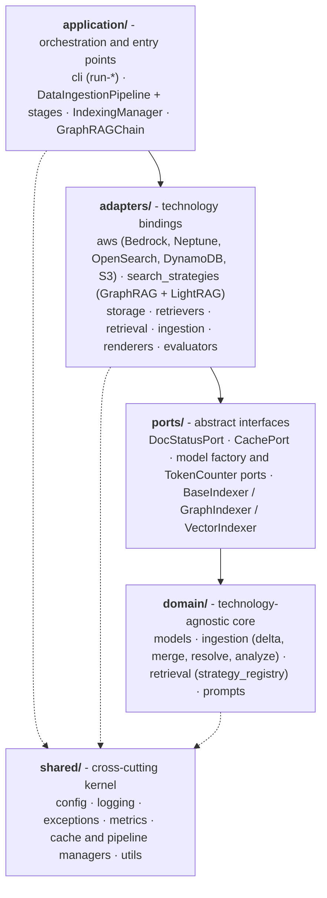
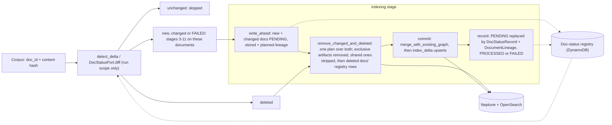
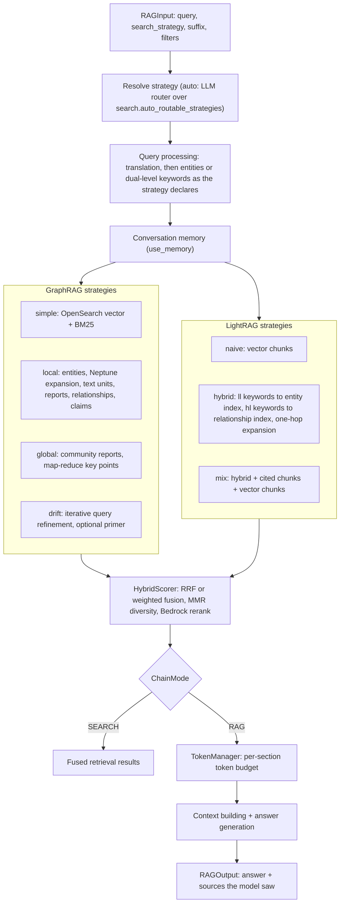

# Unified Knowledge Graph RAG on AWS — 기술 문서

> 🇬🇧 English version: [docs/design.md](./design.md)

용어는 [용어집](./glossary.ko.md)을 따릅니다.

이 문서는 `unified-kg-rag-on-aws` 라이브러리의 아키텍처, 알고리즘, 데이터 모델, 운영 측면을 다루는 **기여자와 고급 사용자용 설계 레퍼런스**입니다. "무엇을, 왜"와 빠른 시작은 [README.ko.md](../README.ko.md), "어떻게 쓰는가"는 [사용자 가이드](./user-guide.ko.md), 기여 절차는 [CONTRIBUTING.md](../CONTRIBUTING.md)를 참고하세요. 확장 방법은 [§15](#15-확장-가이드)에 있습니다.

## 목차

1. [개요와 설계 철학](#1-개요와-설계-철학)
2. [헥사고날 아키텍처 (포트와 어댑터)](#2-헥사고날-아키텍처-포트와-어댑터)
3. [도메인 모델](#3-도메인-모델)
4. [수집 파이프라인](#4-수집-파이프라인)
5. [증분 인덱싱](#5-증분-인덱싱)
6. [검색: 두 방법론](#6-검색-두-방법론)
7. [하이브리드 스코어링과 토큰 관리](#7-하이브리드-스코어링과-토큰-관리)
8. [AWS 서비스 통합](#8-aws-서비스-통합)
9. [평가 프레임워크](#9-평가-프레임워크)
10. [시각화와 분석](#10-시각화와-분석)
11. [프롬프트와 프롬프트 튜닝](#11-프롬프트와-프롬프트-튜닝)
12. [설정 시스템](#12-설정-시스템)
13. [테스트 전략](#13-테스트-전략)
14. [CI/CD와 보안](#14-cicd와-보안)
15. [확장 가이드](#15-확장-가이드)
16. [참고 자료](#16-참고-자료)

---

## 1. 개요와 설계 철학

`unified-kg-rag-on-aws`는 Microsoft GraphRAG와 LightRAG 방법론을 AWS 네이티브 스택(Bedrock + Neptune + OpenSearch + S3 + DynamoDB) 위에 다시 구현한 라이브러리입니다. 핵심 설계 원칙은 다음과 같습니다.

- **두 방법론, 하나의 인프라**: GraphRAG(커뮤니티 요약)와 LightRAG(이중 레벨 키워드)는 수집, 인덱싱, 캐싱, 다국어, 하이브리드 검색 인프라를 함께 쓰고 **검색 알고리즘 레이어만 바꿉니다**.
- **일반화 우선**: 하드코딩, 정규 표현식 휴리스틱, 과적합을 피합니다. 의미 판단은 LLM이나 권위 있는 데이터에 맡기고, 토큰 수는 Bedrock `count_tokens` API로 세며, 임계값과 가중치는 설정으로 정합니다.
- **헥사고날 경계**: 도메인과 알고리즘 코드는 추상 포트에 의존하고, 구체적인 AWS 어댑터는 그 뒤에 둡니다.
- **레지스트리 기반 확장**: 검색 전략과 렌더러는 데코레이터 레지스트리로 등록하므로 디스패치 코드를 고치지 않고 확장할 수 있습니다. 평가기는 메서드 하나(`EvaluationManager._resolve_evaluator_class`)에서 `EvaluatorType`별 클래스로 연결하므로, 새 평가기는 그곳에 분기 하나를 추가합니다.

---

## 2. 헥사고날 아키텍처 (포트와 어댑터)

### 2.0 의존성 규칙과 레이어 맵

import는 **안쪽을 향합니다**(왼쪽이 오른쪽을 import하며 반대 방향은 허용하지 않습니다). `shared/`는 어느 레이어든 쓸 수 있는 공통 커널이므로, 이 패키지 루트가 import하는 대상은 가볍게 유지합니다. `domain/` 모듈을 import할 때 LangChain, LangSmith, boto3/botocore, lxml, opensearch-py, gremlin-python이 간접적으로도 로드되면 안 됩니다. LangChain에 묶인 도우미는 각 하위 모듈(`shared.utils.langchain`, `shared.utils.document_converter`, rich 콘솔 도우미는 `shared.utils.display`)에서 import하며 `shared.utils`에서 다시 내보내지 않습니다. `tests/unit/test_domain_purity.py`가 새 인터프리터에서 이를 검사합니다. 두 RAG 방법론(GraphRAG 커뮤니티 요약, LightRAG 이중 레벨 키워드)은 수집, 인덱싱, 캐싱, 하이브리드 검색 인프라 하나를 함께 쓰고 알고리즘 레이어에서만 갈라집니다.


```mermaid
flowchart TB
    application["<b>application/</b> - orchestration and entry points<br/>cli (run-*) · DataIngestionPipeline + stages · IndexingManager · GraphRAGChain"]
    adapters["<b>adapters/</b> - technology bindings<br/>aws (Bedrock, Neptune, OpenSearch, DynamoDB, S3) · search_strategies (GraphRAG + LightRAG)<br/>storage · retrievers · retrieval · ingestion · renderers · evaluators"]
    ports["<b>ports/</b> - abstract interfaces<br/>DocStatusPort · CachePort · model factory and TokenCounter ports · BaseIndexer / GraphIndexer / VectorIndexer"]
    domain["<b>domain/</b> - technology-agnostic core<br/>models · ingestion (delta, merge, resolve, analyze) · retrieval (strategy_registry) · prompts"]
    shared["<b>shared/</b> - cross-cutting kernel<br/>config · logging · exceptions · metrics · cache and pipeline managers · utils"]
    application --> adapters --> ports --> domain
    application -.-> shared
    adapters -.-> shared
    domain -.-> shared
```

실선 화살표는 의존성 규칙입니다(각 레이어는 화살표가 가리키는 레이어만 import합니다). 점선 화살표는 어느 레이어든 `shared/`를 import할 수 있다는 뜻입니다. 검색 전략은 어댑터이고 도메인에는 그 레지스트리만 있으므로, 두 방법론이 같은 포트에 연결됩니다.

```
unified_kg_rag/
├─ domain/              # 기술 중립 코어 (boto3/LangChain/백엔드 import 없음)
│  ├─ models/           #   Pydantic 도메인 모델
│  ├─ ingestion/        #   순수 알고리즘: delta_detector, graph_analyzer/
│  │  └─ merge/         #   builder/resolver, claim_resolver, merge/merger
│                       #   (IncrementalIndexer는 오케스트레이션이므로 application/에 있음)
│  ├─ retrieval/        #   strategy_registry, MetricsMixin
│  └─ prompts/          #   버전 관리되는 프롬프트 템플릿
├─ ports/               # 도메인이 의존하는 추상 인터페이스 (DocStatusPort,
│                       #   BaseIndexer/GraphIndexer/VectorIndexer, CachePort,
│                       #   ModelFactoryPort — ports/__init__이 포트 카탈로그)
├─ adapters/            # 구체적인 기술 바인딩
│  ├─ aws/              #   Bedrock, Neptune, OpenSearch, DynamoDB, S3 클라이언트
│  ├─ storage/          #   Neptune/OpenSearch 인덱서 (쓰기 측 포트 구현)
│  ├─ retrievers/       #   Neptune/OpenSearch 리트리버
│  ├─ search_strategies/#   simple/local/global/drift + lightrag(mix/hybrid/naive)
│  ├─ retrieval/        #   추상 리트리버/전략 베이스, hybrid scorer, 토큰/메모리 매니저
│  ├─ ingestion/        #   LLM/IO 결합: chunker, *_extractor, loader, parser,
│  │                    #   translator, gleaner, community_detector
│  ├─ renderers/        #   그래프 시각화 렌더러
│  └─ evaluators/       #   langchain/ragas 평가기 (LLM을 쓰지 않는 graph_aware,
│                       #   retrieval, answer_match 평가기는 evaluation/에 있음)
├─ application/         # 오케스트레이션 + 진입점
│  ├─ cli/              #   run-ingestion/rag/eval/visualization/prompt-tuning
│  ├─ ingestion/        #   DataIngestionPipeline + pipeline_stages
│  ├─ storage/          #   IndexingManager (인덱서 fan-out)
│  ├─ retrieval/        #   rag_chain (GraphRAGChain, RAGInput/Output)
│  └─ prompts/          #   PromptTuner (LLM 기반 코퍼스 프로파일링)
├─ shared/              # 공통 커널 (config, logging, exceptions, metrics,
│                       #   cache/pipeline manager, utils)
├─ evaluation/          # 실제 로직 패키지: evaluation_manager / base / graph_aware /
│                       #   retrieval / answer_match
└─ visualization/       # 실제 로직 패키지: 렌더 루프 + embeddings/exporters/renderers
```

> 레이아웃 참고: `evaluation/`과 `visualization/`은 **실제 로직 패키지**입니다.
> `evaluation/`에는 `evaluation_manager`, `base`와 LLM을 쓰지 않는
> `graph_aware_evaluator`, `retrieval_evaluator`, `answer_match_evaluator`가 있고,
> `visualization/`에는 렌더 루프와 `embeddings/`, `exporters/`, `renderers/`
> 하위 패키지가 있습니다. 그 밖의 모듈은 모두 실제 위치
> (`application.retrieval.rag_chain`, `application.storage.indexing_manager`,
> `application.ingestion.pipeline`, `adapters.*`, `domain.*`)에서 import합니다.

### 2.1 포트(추상 인터페이스)

| 포트 | 위치 | 어댑터 | 비고 |
|---|---|---|---|
| `DocStatusPort` | `ports/doc_status.py` | `adapters/aws/dynamodb.py` (`DynamoDBDocStatusStore`), 테스트용 `FakeDocStatusStore` | 증분 인덱싱의 문서 상태와 계보 저장 |
| `CachePort` | `ports/cache.py` (`Protocol`) | `shared/cache_manager.py`(로컬) + `adapters/aws/s3_cache.py`(S3) | 단계 결과 저장 경계 |
| `GraphIndexer` (쓰기 측) | `ports/indexer.py` | `adapters/storage/neptune_indexer.py` | 전체 인덱싱과 델타(`upsert_*`/`delete_by_id`)를 하나의 계약으로 처리 |
| `VectorIndexer` (쓰기 측) | `ports/indexer.py` | `adapters/storage/opensearch_indexer.py` | 위와 같음 |
| `BaseGraphRAGRetriever` (읽기 측) | `adapters/retrieval/base.py` | `adapters/retrievers/{neptune,opensearch}_retriever.py` | 검색 어댑터 |
| LLM/임베딩/재순위화 팩토리, 토큰 카운터 | `ports/model_factory.py` (`ModelFactoryPort`, `TokenCounterPort`) | `adapters/aws/bedrock.py`, `adapters/aws/bedrock_models.py`, `adapters/aws/token_counter.py` | 오케스트레이터마다 한 번 만드는 `Providers` 묶음(`adapters/providers.py`)에 담아 모든 구성 요소에 전달(기본값 Bedrock) |

> 설계 참고: 순수 포트(`DocStatusPort`, 쓰기 측 인덱서 ABC)는 `ports/`에 모았습니다. 읽기 측 추상 베이스(`BaseGraphRAGRetriever`/`BaseSearchStrategy`)는 `__init__`에서 인프라(HybridScorer/TokenManager)를 생성하는 "어댑터 베이스"이므로 `adapters/retrieval/base.py`에 두고 그곳에서 import합니다. `ports/__init__`은 이들을 export하지 않고 카탈로그 docstring에 이름만 적습니다(중복 Protocol 정의는 두지 않습니다). `BaseGraphRAGEvaluator`(`evaluation/base.py`)도 같은 종류의 어댑터 베이스입니다.

### 2.2 역할 기반 리트리버 주입

검색 전략은 **구체적인 백엔드 이름이 아니라 추상 역할**로 리트리버를 주입받습니다.

- `RetrieverRole.GRAPH` → 그래프 순회와 확장(현재 Neptune)
- `RetrieverRole.DOCUMENT` → 벡터와 어휘 조회(현재 OpenSearch)

전략은 `self.graph_retriever` / `self.document_retriever`(베이스 클래스 프로퍼티)로만 리트리버에 접근하고, `rag_chain`의 역할→어댑터 빌더 맵이 실제 구현을 연결합니다. 그래서 그래프 백엔드를 바꿔도 전략 코드는 고치지 않습니다.

```python
# domain/retrieval/strategy_registry.py
@register_strategy(SearchStrategy.LOCAL, required_roles=(RetrieverRole.DOCUMENT, RetrieverRole.GRAPH))
class LocalSearchStrategy(BaseSearchStrategy): ...
```

### 2.3 레지스트리

- **검색 전략**: `domain/retrieval/strategy_registry.py` — `@register_strategy(...)`가 클래스, 필요한 역할, 질의 입력을 `SearchStrategy` enum에 등록합니다.
- **평가기**: `EvaluationManager._resolve_evaluator_class` — `EvaluatorType`마다 명시적 분기 하나로 평가기 클래스를 반환합니다(지연 로딩, 사용할 때 import). 데코레이터 레지스트리가 아니므로 새 평가기는 enum 멤버와 분기를 추가합니다.
- **렌더러**: `adapters/renderers/base.py` — `@register_renderer("name")`.

이 패턴은 기존 `ParserFactory._loader_configs`(선언적 파서 등록)와 같은 생각에서 나왔습니다.

> 쓰기 경로 참고: 레지스트리는 **읽기, 평가, 렌더링, 파싱** 경로에 적용됩니다.
> 쓰기 경로의 `IndexingManager`는 레지스트리를 순회하지 않고 의도적으로 **고정된
> 두 백엔드**(Neptune + OpenSearch)를 조합합니다. 이 두 저장소(그래프 DB + 벡터/어휘
> 검색)는 런타임에 바꾸는 선택지가 아니라 프레임워크를 구성하는 요소이고, 백엔드별
> fan-out(엔티티를 두 저장소에 모두 쓰기, 엣지보다 엔티티를 먼저 쓰는 단계 구분,
> 고아 엣지 연쇄 삭제)은 임의의 디스패치가 아니라 의도된 도메인 지식이기 때문입니다.
> 그래서 새 검색 전략이나 렌더러는 등록만으로(평가기는
> `_resolve_evaluator_class`의 분기 하나로) 추가하지만, 쓰기 측 저장소를 바꾸려면
> `GraphIndexer` / `VectorIndexer` 포트를 구현해 주입합니다
> (`IndexingManager(vector_indexer=…, graph_indexer=…)`). 읽기 경로는 이미
> `RetrieverRole` → 빌더 맵으로 일반화되어 있습니다.

### 2.4 의존성 규칙 검증 상태

`domain/`은 런타임에 `adapters`/`application`을 import하지 않으며 `ports/`도 마찬가지입니다. 컴파일 타임에만 해당하는 예외가 하나 있습니다. `domain/retrieval/strategy_registry.py`는 레지스트리가 전략 하위 클래스를 저장하므로 `TYPE_CHECKING` 아래에서 `adapters.retrieval.base.BaseSearchStrategy`를 참조합니다. 순수한 전략·리트리버 포트를 분리하면 이 타입 수준 참조도 없어지지만, 의도적인 경계로 남겨 둡니다(이 문서 끝의 "의도적 설계 경계" 참고).

코드는 실제 레이어 위치(`application.retrieval.rag_chain`, `application.storage.indexing_manager`, `application.ingestion.pipeline`, `adapters.*` / `domain.*` 모듈)에서 import합니다. `evaluation/`과 `visualization/`은 실제 로직 패키지입니다(§2의 레이아웃 참고).

---

## 3. 도메인 모델

`domain/models/` 패키지에는 인프라 의존성이 없는 순수 Pydantic 모델이 있습니다.

- `Entity`(`name`, `description`, `type`, `text_unit_ids`, `community_ids`, `rank`, `frequency`, `confidence`, 임베딩 필드)
- `Relationship`(`source_id`/`target_id`, `description`, `weight`, `text_unit_ids`, `description_embedding`)
- `Community` / `CommunityReport`, `TextUnit`, `Covariate`(주장)
- `DocStatus`(상태 머신: PENDING→PARSING→PROCESSING→PROCESSED|FAILED), `DocStatusRecord`(콘텐츠 해시 + 산출물 계보 + 접미사), `DocumentDelta`(new/changed/unchanged/deleted), `DocumentLineage`(문서별 산출물 귀속)
- `SearchQuery`/`SearchResult`/`RetrievalResult`, `SearchStrategy`/`SearchType`/`RetrieverRole`

**계보가 핵심 데이터입니다.** 엔티티와 관계는 추출할 때 자신이 나온 `text_unit_ids`를 기록합니다. "이 엔티티가 이 텍스트 단위와 관련 있는가?"는 토큰 중첩 휴리스틱이 아니라 이 계보로 판단하므로 정확하고 언어에 상관없이 동작합니다.

**인덱스 접미사**: 모든 OpenSearch 인덱스와 Neptune 레이블 이름은 `<prefix>-<suffix>[-<additional_suffix>]` 형식입니다. 접미사는 수집할 때 `processing.document_parsing.index_value`에서 기록하고, 질의할 때 `RAGInput.suffix`(`run-rag`/`run-eval`의 `--suffix`)로 고릅니다. 두 값의 기본값은 모두 `default`이며, `indexing.additional_suffix`는 양쪽에 같은 두 번째 구간을 덧붙입니다. 이 문서는 그 결과 값을 *인덱스 접미사*라고 부릅니다. 테넌트나 코퍼스 버전마다 하나씩 쓰는 것이 의도된 사용법입니다.

**엔티티 이름, ID, 다국어**: `Entity.name`(관계의 `source_name`/`target_name` 포함)은 원문이 쓴 *표시 형태*를 앞뒤 공백 제거와 공백 축약만 거쳐 그대로 둡니다(`clean_display_name`). 그래서 검색 컨텍스트와 커뮤니티 리포트가 "$1,000 penalty", "Section 4.2", "C++"를 그대로 인용할 수 있습니다. 식별에는 별도의 키를 씁니다. 엔티티와 관계 ID는 `entity_key(name)`(`shared/utils/common.py`)의 해시입니다. 이 키는 NFKC + casefold를 적용하고, `_`/`-`를 공백으로 바꾸고, 따옴표와 쉼표를 지우고, 공백을 축약하고, 끝의 문장 부호를 떼지만 **그 밖의 기호와 모든 문자 체계의 문자·숫자는 남깁니다**. 그래서 대소문자, 공백, 따옴표만 다른 이름("ACME  Corp." / "Acme Corp")은 같은 ID를 갖고, "C++"와 "C#"은 서로 다른 ID를 가지며, 한국어·CJK·악센트가 있는 이름도 고유한 ID를 얻습니다. 비어 있지 않은 이름에서 빈 키가 나오는 일은 없습니다. 이름 정확 일치(추출 시 관계 끝점 조회, gleaner 병합, 주장 해석, 증분 `merge_entities`)와 퍼지 매처의 shingle도 같은 키를 쓰고, 구두점을 지우는 `normalize_name`은 토큰 단위 유사도에만 씁니다. **키를 바꾸면 모든 ID가 바뀌므로, 다른 키로 인덱싱한 그래프는 전체를 다시 인덱싱해야 합니다**(증분 인덱싱만 하면 기존 엔티티 옆에 새 ID의 중복이 생깁니다).

---

## 4. 수집 파이프라인

`application/ingestion/pipeline.py`의 `DataIngestionPipeline`이 12개 단계를 차례로 실행합니다(`application/ingestion/pipeline_stages.py`).


| # | 단계 | 모듈 | 비고 |
|---|---|---|---|
| 1 | 문서 파싱 | `parser.py` (`ParserFactory`) | PDF/TXT/CSV/JSON 기본 지원(+MD/HTML은 선택 extra `unstructured`) |
| 2 | 문서 로딩 | `loader.py` (`DirectoryLoader`) | MinHash 중복 제거 |
| 3 | 청킹 | `chunker.py` (`ChunkerFactory`) | simple / intelligent(LLM 의미 단위) |
| 4 | 번역(선택) | `translator.py` | 다국어 → 대상 언어 |
| 5 | 그래프 추출 | `graph_extractor.py` | LLM 엔티티·관계 추출 |
| 6 | 추가 추출(gleaning, 선택) | `gleaner.py` | 반복 보완: 텍스트 단위마다 최대 `max_rounds`회, 직전 응답이 새 항목을 더한 단위만 다시 처리 |
| 7 | 그래프 해석 | `graph_resolver.py` + `description_summarizer.py` | 퍼지 매칭 병합, `text_unit_ids` 합집합, **병합된 설명의 LLM 재요약** |
| 8 | 주장 추출(선택) | `claim_extractor.py` | 사실 진술(covariate) |
| 9 | 주장 해석(선택) | `claim_resolver.py` | |
| 10 | 그래프 분석 | `graph_analyzer.py` | 중심성(degree/betweenness/PageRank/eigenvector), 통계 |
| 11 | 커뮤니티 탐지 | `community_detector.py` | 계층적 Leiden, 커뮤니티 리포트 생성(degree 정렬 + 토큰 예산 내 채우기) |
| 12 | 인덱싱 | `application/storage/indexing_manager.py` | OpenSearch + Neptune |

> 단계 순서는 `DataIngestionPipeline.STAGE_CLASSES`(`application/ingestion/pipeline.py`) 한 곳에서 정합니다. Bedrock이 필요한 단계는 `DataIngestionPipeline.BOTO_REQUIRED_STAGES`에 선언합니다. **그래프 해석(7)도 이 집합에 속하는데**, 병합된 설명을 LLM으로 다시 요약하기 때문입니다.

**병합된 설명의 재요약(7단계)**: 그래프 해석은 같은 엔티티·관계의 설명을 단순히 이어 붙여 병합하므로, 여러 청크에 등장하는 엔티티의 설명은 끝없이 길어집니다. `DescriptionSummarizer`(`GraphResolutionStage`에서 실행)는 토큰 예산을 넘은 설명만 저렴한 LLM으로 하나의 일관된 설명으로 다시 요약합니다(MS GraphRAG `summarize_descriptions` / LightRAG `_handle_entity_relation_summary`와 동등, `DescriptionSummarizationConfig`로 제어). 임베딩과 프롬프트가 비대해지는 것을 막기 위한 장치입니다.

**퍼지 병합 가드(7단계와 증분 병합)**: 문자 shingle 유사도로는 앞부분이 길게 같은 식별자를 구분할 수 없습니다(MinHash에서 "purchase order 1001"과 "purchase order 1002"는 약 0.96, "vendor a"와 "vendor b"는 약 0.73). 그래서 두 이름은 *구분 토큰*(`base_resolver.discriminator_tokens`: 숫자를 포함한 토큰, 한 글자 ASCII 문자·숫자, 두 글자 이상의 로마 숫자)이 완전히 같고 엔티티 유형이 호환될 때(정규화한 유형이 같거나 한쪽이 비어 있거나 `unknown`)만 퍼지 연결합니다. 한자, 한글, 가나로 끝나는 이름은 마지막 글자가 대개 중심 명사이므로 마지막 글자가 같을 때만 연결합니다(`base_resolver.head_character`). "가나다연구원"과 "가나다연구소"는 중심 명사만 다르고 shingle은 모두 같습니다. 반대로 `compact_name_key`가 같은 이름은 점수 1.0으로 연결합니다. 이 키는 이름 앞이나 끝에 붙은 짧은 고정 목록의 법인 형태 표기(`(주)`, `주식회사`, `(유)`, `유한회사`, `(株)`, `株式会社`, `(有)`, `有限会社`, `有限公司`, 끝에 붙은 `Inc`/`Ltd`/`LLC`/`Co`/`Corp`)를 떼고 한자, 한글, 가나 옆의 공백을 없앤 값이므로 "(주)가나다", "가나다 상사"/"가나다상사", "Acme Inc"/"Acme"가 병합됩니다. 구분 토큰도 법인 형태 표기를 뗀 뒤 계산하므로 "(주)"의 "주"를 식별자로 보지 않습니다. 이 규칙은 매칭에만 쓰이며, 엔티티 id는 여전히 `entity_key`의 해시입니다. 가드는 `FuzzyMatcher.find_all_matches`가 적용하므로 전체 빌드 resolver와 증분 `merge_entities` 경로가 같은 가드를 씁니다. 전체 빌드 resolver는 유형을 고려하는 union-find(강한 연결부터, 결정적 tie-break)로 그룹을 만들고, 유형이 다른 두 이름을 한 그룹에 넣게 되는 union은 거부합니다. 그래서 유형이 없는 이름이 `organization`과 `person`을 이어 주는 다리가 되지 못합니다. 표면 이름이 정확히 같은 엔티티는 항상 한 그룹에 둡니다. 관계 해석은 엔티티 remap 뒤 `(source_id, target_id, type)` 정확 일치로 묶으므로 별도의 가드가 필요 없습니다.

**커뮤니티 리포트 컨텍스트 채우기(11단계)**: 리포트 생성 입력은 **커뮤니티 안의 엔티티를 그래프 degree 내림차순으로 정렬**하고(동점은 안정적인 id 정렬), `max_entities_per_report`개로 자른 뒤 `max_report_context_tokens` 토큰 예산에 맞춰 채웁니다(관계는 양 끝점 degree의 합으로, 동점이면 가중치로 같은 방식으로 정렬하고 채웁니다). degree가 가장 큰 엔티티는 혼자서 예산을 넘더라도 항상 넣으므로(최소 하나) 리포트의 컨텍스트가 비는 일은 없습니다(`community_detector._prepare_report_input`).

**하위 커뮤니티 roll-up(MS GraphRAG와 동등)**: 상위 커뮤니티의 원본 엔티티·관계 컨텍스트가 `max_report_context_tokens`를 넘으면, 리포트 생성기는 단순히 잘라 내지 않고 이미 생성한 하위 커뮤니티 리포트의 요약으로 우선순위가 가장 낮은 원본 컨텍스트를 대체합니다. 이를 위해 레벨별로 아래에서 위로 생성해야 합니다. `generate_reports`는 커뮤니티를 `level`별로 묶어 가장 세밀한 레벨부터(level 0 = 리프) 처리하고, 레벨마다 리포트를 쌓아 두어 상위 커뮤니티(`enable_sub_community_rollup`, 기본값 켜짐)가 하위 요약을 넣을 수 있게 합니다(`_generate_reports_with_rollup` / `_build_sub_community_context`, 같은 예산 안에서 큰 하위 커뮤니티부터 채움). 이 플래그를 false로 두면 단순히 넘치는 부분을 잘라 내는 평면 경로(`_generate_reports_flat`)로 돌아갑니다. roll-up 경로에서 하위 커뮤니티가 하나뿐이고 엔티티와 관계가 그것과 같은 상위 커뮤니티는, 같은 컨텍스트로 LLM을 한 번 더 호출하지 않고 하위 커뮤니티의 리포트를 상위 커뮤니티 키로 바꿔 재사용합니다(`attributes.reused_from_community_id`, `_reuse_single_child_report`). 평면 경로는 모든 리포트를 생성합니다.

**구조화된 커뮤니티 리포트(MS GraphRAG와 동등)**: 리포트 프롬프트는 구조화된 결과를 냅니다. 핵심 요약 `summary`, 한 문장 근거 `rating_explanation`이 붙은 중요도 `rating`(0-10), 그리고 `findings` 목록(항목마다 한 줄 `summary`와 여러 문장의 `explanation`)입니다(`CommunityReport.findings`/`rating`, `CommunityFinding`). 임베딩, global search map-reduce, 화면 표시에 쓰는 자유 텍스트 `full_content`는 이 구조화 필드에서 **결정적으로 렌더링**하므로(`CommunityReport.render_full_content`), 구조화 때문에 LLM 호출이 늘지 않고 임베딩·검색 경로도 그대로입니다. `rating`은 중요도를 반영한 순위 매기기를 위해 커뮤니티 리포트 OpenSearch 문서에도 색인합니다.

**커뮤니티 리포트 계보(11단계)**: 리포트마다 `text_unit_ids`와 `document_ids`가 있으며, 커뮤니티 리포트 문서에 keyword 필드로 색인합니다(`CommunityDetector._attach_report_lineage`). 이 값은 **커뮤니티 구성원의 출처**입니다. 구성원 엔티티의 `text_unit_ids` 합집합과, 그 텍스트 단위가 나온 문서입니다. 리포트 입력의 출처는 아닙니다. `max_entities_per_report`와 토큰 예산 때문에 프롬프트에서 빠진 구성원의 출처도 계보에는 남습니다. 또한 문장 단위 인용 근거도 아닙니다. 소스 문서로 리포트를 걸러 내거나 독자에 맞춰 커뮤니티를 다시 요약할 수 있게 하려고 둔 필드입니다.

**파이프라인 인프라**: 단계 체크포인트 기반 재개(`shared/pipeline_manager.py`), S3 캐시 동기화(`adapters/aws/s3_cache.py`), `continue_on_error` 토글, 단계별 캐시(`shared/cache_manager.py`). `TranslationConfig.is_noop`(원본 언어 == 대상 언어이고 추가 언어 없음)이면 번역 단계를 비용 없이 건너뜁니다. LLM 출력 파싱에는 `FixingConfig` 기반 output-fixing 파서를 일관되게 씁니다. 파이프라인은 `close()`로 인덱서와 클라이언트 자원을 해제하며, `run-ingestion` CLI가 `finally`에서 이를 호출합니다(§8.6).

**일반화 적용 사례**:
- 관련성 게이트(주장 추출과 추가 추출에서 어떤 엔티티를 프롬프트에 넣을지)는 토큰 Jaccard 정규 표현식 휴리스틱이 아니라 `text_unit_ids` 계보 소속 여부로 판단합니다. 그래서 정확하고 언어에 상관없이 동작합니다.
- 추가 추출은 점수가 아니라 실제 출력을 보고 텍스트 단위마다 멈춥니다. 직전 응답이 그래프에 없던 엔티티나 관계를 더한 단위만 `max_rounds`까지 다시 보냅니다. 빈 응답은 더 빠진 것이 없다는 모델의 답이며, MS GraphRAG가 별도의 Y/N 루프 프롬프트로 묻는 신호와 같으므로 이를 위한 호출을 따로 하지 않습니다.

---

## 5. 증분 인덱싱

문서를 추가, 변경, 삭제하면 전체를 다시 인덱싱하지 않고 델타만 처리합니다.


```mermaid
flowchart LR
    corpus["Corpus: doc_id + content hash"] --> diff["detect_delta / DocStatusPort.diff (run scope only)"]
    registry[("Doc-status registry (DynamoDB)")] -.-> diff
    diff --> unchanged["unchanged: skipped"]
    diff --> work["new, changed or FAILED: stages 3-11 on these documents"]
    diff --> deleted["deleted"]
    subgraph indexing["indexing stage"]
        wal["write_ahead: new + changed docs PENDING, stored + planned lineage"]
        remove["remove_changed_and_deleted: one plan over both; exclusive artifacts removed, shared ones stripped, then deleted docs' registry rows"]
        commit["commit: merge_with_existing_graph, then index_delta upserts"]
        record["record: PENDING replaced by DocStatusRecord + DocumentLineage, PROCESSED or FAILED"]
        wal --> remove --> commit --> record
    end
    work --> wal
    deleted --> remove
    wal -.-> registry
    remove --> stores[("Neptune + OpenSearch")]
    commit --> stores
    record -.-> registry
```

따로 표시하지 않은 이름은 `IncrementalIndexer` 메서드(`application/ingestion/incremental.py`)입니다. `FAILED`로 기록된 문서는 `indexing.max_document_failures`에 이를 때까지 다음 실행에서 changed로 분류됩니다. 최종 레지스트리 레코드는 델타 쓰기가 인덱싱 실패 기준을 통과할 때만 기록하며, 그 전까지 델타의 문서는 `PENDING` 선기록 레코드(2단계)를 유지합니다.

1. **델타 감지**(`domain/ingestion/delta_detector.py`): 안정적인 `doc_id`와 콘텐츠 SHA-256 해시로 `{doc_id: content_hash}`를 만들고, `DocStatusPort.diff(incoming, scope)`가 new/changed/unchanged/deleted로 분류합니다. `doc_id`는 문서의 인덱스 접미사(`index_value` + `indexing.additional_suffix`), 코퍼스 소스 범위, 코퍼스 루트 기준 상대 경로를 해시하므로, 두 테넌트의 같은 이름 파일을 한 디렉터리에 두거나 한 접미사를 쓰는 두 코퍼스에 같은 상대 경로가 있어도 서로 구분됩니다. 이전 방식(접미사 + 경로)으로 키가 만들어진 레코드는 그 범위의 첫 실행이 새 키로 옮기고, diff를 다시 하지 않고 델타를 메모리에서 고칩니다(옮긴 문서는 옮긴 레코드의 해시와 상태에 따라 new에서 unchanged나 changed로 바뀝니다). 두 번째 diff의 스캔은 최종 일관성이라 이전 키를 아직 돌려줄 수 있고, 그러면 그 키를 삭제된 문서로 읽기 때문입니다. 범위가 바뀐 코퍼스(옮긴 로컬 디렉터리)의 레코드는 넘겨받지 않습니다. 레지스트리로는 이동과 같은 경로를 쓰는 다른 호스트의 코퍼스를 구분할 수 없으므로, 이전 범위의 레코드는 어떤 실행이 그 범위를 `indexing.retire_source_scopes`(`--retire-source-scope`)에 지정할 때까지 남습니다. 지정하면 그 실행은 자기 접미사에서 그 범위의 레코드를 모두 삭제된 문서로 분류합니다(지정한 범위마다 프로젝션 스캔이 한 번 더 들고, 실행 자신의 범위는 거부합니다). 범위가 기본값인 로컬 실행에 새 문서가 있으면 diff 스캔이 이미 돌려준 범위(`DocumentDelta.stored_scopes`)에서 같은 접미사의 다른 로컬 소스 디렉터리를 찾아 경고합니다. 삭제는 **범위를 한정**합니다. 실행 범위(인덱스 접미사 + 코퍼스 소스, 즉 `document_parsing.source_scope` 또는 해석된 소스 디렉터리)에 속한 레지스트리 레코드만 삭제 후보가 되며, 범위 개념이 생기기 전에 기록된 레코드는 삭제 후보가 되지 않습니다. 이번 실행에서 파싱이나 로딩에 실패한 파일은 `failed`로 보고하고 `deleted`에서 뺍니다.
2. **선기록**(`IncrementalIndexer.write_ahead`): 저장소에 무엇이든 쓰기 전에 새 문서와 변경된 문서를 현재 키와 실행 범위로 `PENDING` 기록합니다. 콘텐츠 해시는 어떤 문서의 해시와도 같을 수 없는 `"pending"`(`PENDING_CONTENT_HASH`)이고, 계보는 저장된 계보와 이번 실행이 쓸 계보의 합집합입니다. 저장된 레코드를 한 번에 일괄로 읽고(`get_many`, 커밋이 실패 횟수 계산에 재사용) 선기록 레코드를 한 번에 일괄로 씁니다(`DocStatusPort.put_many`, DynamoDB `BatchWriteItem`). 이전 계보와 새 계보가 각각은 들어가지만 합치면 레지스트리 항목 한도(`DocStatusPort.record_fits`, DynamoDB 400 KB)를 넘는 큰 문서는 레코드에 저장된 계보를 두고, 나머지 계획 id를 계보 초과분(`add_lineage_overflow`)에 둡니다. DynamoDB에서는 같은 테이블의 `<doc_id>#pending#<n>` 항목이며 `record_kind`가 `lineage_overflow`이고, `get`, `get_many`, `list_all`, `diff`는 이 항목을 돌려주지 않습니다. 자기 계보만으로도 레코드 하나에 들어가지 않는 문서는 아무것도 쓰기 전에 여기서 실행을 실패시킵니다. 아래 *중단 복구*를 참고하세요.
3. **오래된 산출물 정리**(`IncrementalIndexer.remove_changed_and_deleted`): 델타를 쓰기 전에 변경된 문서(다시 추출한 뒤 사라진 엔티티가 그래프에 남지 않도록)와 삭제된 문서(5단계)의 기존 산출물 중 *남는* 문서가 참조하지 않는 것을 지웁니다. 제거 계획은 변경 문서와 삭제 문서를 합쳐 한 번에 세우므로, 변경된 문서와 삭제된 문서만 참조하는 산출물도 지워집니다. 두 집합을 따로 계획하면 서로를 남는 문서로 보아 그런 산출물이 텍스트 단위 없이 남습니다.
4. **델타 upsert**(`IncrementalIndexer.commit`): `indexing.cross_run_merge`(기본값 켜짐)이면 먼저 `IndexingManager.merge_with_existing_graph`가 델타가 건드리는 기존 엔티티와 관계를 인덱스 접미사별로 읽어 와서 델타를 병합합니다(아래 병합 규칙 참고). 그래서 변경되지 않은 문서와 공유하는 엔티티도 그 문서들의 설명과 `text_unit_ids`를 유지합니다. 델타 항목이 다른 id의 저장된 항목에 병합되면(퍼지 엔티티 매칭, 또는 끝점이 remap된 엣지) 계보에는 저장된 id를 기록하고, 쓰기 전에 `PENDING` 레코드에도 추가합니다. 이어서 `IndexingManager.index_delta`가 결과를 그대로 씁니다. Neptune은 Gremlin `coalesce(unfold, addV)` 멱등 upsert를 쓰고, OpenSearch는 운영 중인 alias 인덱스에 id 기준으로 upsert합니다. 관계 벡터 인덱스도 같은 방식으로 갱신합니다.
5. **삭제 전파**(3단계의 제거에 포함): 삭제된 문서의 *독점* 산출물만 `delete_by_id`로 지우고(공유 엔티티는 보존) 그 레지스트리 레코드를 지웁니다. 텍스트 단위, 엔티티, 관계 인덱스가 모두 대상입니다. 남은 문서(같은 접미사)와 공유하는 엔티티와 관계는 남기되, 제거되는 문서의 텍스트 단위를 빼고 `frequency`와 weight를 다시 계산해 Neptune과 OpenSearch에 똑같이 반영합니다(`IndexingManager.remove_text_units_from_shared`). 이때 Neptune에서 읽어 온 공유 항목을 변경 여부와 관계없이 모두 다시 쓰므로, 중단되거나 실패한 정리가 OpenSearch에 반영하지 못한 부분도 재시도에서 복구됩니다. 변경된 문서도 재추출 결과를 병합하기 전에 같은 처리를 합니다. 제거가 하나라도 실패하면 재시도할 수 있도록 삭제된 문서의 레지스트리 레코드를 남기고, 인덱싱 단계를 실패 처리해 실행 결과와 `IndexingFailures` 알람에 드러나게 합니다. 델타에 변경된 문서가 있으면 커밋 전에 실패 처리하고(커밋하면 그 문서들의 계보가 바뀌어 오래된 산출물이 고아로 남습니다), 없으면 커밋한 뒤 실패 처리합니다.

   **한계**: 공유 산출물의 설명에는 변경되거나 삭제된 문서가 기여한 문장이 남습니다. 이를 지우려면 남은 출처로 설명을 다시 요약해야 하고, 영향받는 산출물마다 LLM을 호출해야 하므로 전체 재구축(`indexing.reset`) 전까지 그대로 둡니다. 공유 커뮤니티와 그 리포트도 마찬가지입니다(아래 참고).
6. **레지스트리 갱신**(커밋): `PENDING` 레코드를 한 번의 일괄 쓰기로 `DocStatusRecord`로 바꿉니다. 각 레코드에는 문서의 `DocumentLineage`(문서별 산출물 id + 접미사), 실행 범위, 상대 경로가 들어갑니다. 번역, 그래프 추출, 추가 추출, 주장 추출 중 어느 것이든 텍스트 단위 하나에서라도 실패한 문서는 (기록된 산출물의 계보와 함께) `FAILED`로 기록합니다. `diff`는 해시가 같아도 `FAILED` 레코드를 changed로 분류하므로, 다음 실행이 그 문서를 정리하고 다시 추출합니다. 레코드는 같은 내용의 연속 실패 횟수(`failure_count`)를 세며, `indexing.max_document_failures`에 이르면 `detect_delta`가 그 문서를 unchanged로 분류합니다. 그래서 매번 같은 이유로 실패하는 문서를 실행마다 다시 추출하지 않습니다.

`indexing.reset`이면 diff를 건너뜁니다. 저장소와 실행 네임스페이스의 레지스트리 레코드를 비우고(테이블을 공유하는 다른 네임스페이스의 레코드는 남김. 범위가 생기기 전에 기록된 범위 없는 레코드는 키가 `file_path`에 대한 비우는 네임스페이스의 이전 방식 키이면 지우므로 같은 접미사의 다른 네임스페이스 레코드는 남음. `file_path`가 없어 네임스페이스를 알 수 없는 초기 릴리스의 레코드는 `suffix`가 비우는 접미사 중 하나이면 지움. 남겨 두면 그 접미사의 모든 네임스페이스에서 생존 문서로 취급되어 해당 엔티티가 다시는 삭제되지 않음) 모든 문서를 `PENDING`으로 선기록(2단계)한 뒤 전체 인덱싱 경로로 코퍼스 전체를 다시 구축하고, 모든 문서를 다시 기록합니다(재구축의 쓰기가 델타 커밋과 같은 실패 기준을 통과할 때만).

**중단 복구(선기록 프로토콜)**: 레지스트리는 저장소와 원자적으로 갱신되지 않으므로, 실행은 두 쓰기 사이 어디에서든 멈출 수 있습니다(태스크 강제 종료, 저장소 장애, 실패 기준 미달). 프로토콜이 지키는 불변식은 하나입니다. 레지스트리가 설명할 수 없는 것이 저장소에 생기기 전에, 레지스트리가 먼저 그것을 기록합니다. 선기록 레코드(2단계)는 제거와 upsert보다 먼저 쓰고, 삭제된 문서의 행은 산출물을 지운 뒤에만 지우며, 커밋은 문서의 쓰기가 끝난 뒤에만 `PENDING` 레코드를 바꿉니다. 2단계 이후 어디에서 멈추든 끝나지 않은 문서는 `PENDING`으로 남고, 다음 실행이 이를 복구합니다.

- `PENDING_CONTENT_HASH`는 어떤 콘텐츠 해시와도 같지 않으므로, 아직 있는 문서는 changed로 분류됩니다. 중단된 실행 전에 인덱싱한 내용으로 되돌아가도 마찬가지입니다(선기록 레코드가 없으면 레지스트리에 그 버전의 해시가 남아 있어, 산출물은 이미 정리됐는데 문서는 unchanged로 읽혔습니다).
- 사라진 `PENDING` 문서는 deleted로 분류되고(레코드가 범위를 유지합니다), 그 계보가 중단된 실행이 썼을 수 있는 모든 것을 포함하므로 그 실행이 추가한 것이 레코드 없이 남지 않습니다.
- 제거 계획은 이번 실행의 문서에 대해 자기 `PENDING` 레코드 이전에 저장돼 있던 레코드(중단 뒤라면 중단된 실행의 `PENDING` 레코드)를 씁니다. 그래서 정상 실행은 이전과 똑같이 정리하고, 복구 실행은 다시 쓰기 전에 중단된 실행이 일부 쓴 것을 지웁니다. 새 문서의 `PENDING` 레코드는 제거 중에 아무것도 남기지 않습니다.
- `PENDING` 레코드는 `failure_count`가 0이고 `FAILED`가 아니므로 중단은 `indexing.max_document_failures`의 실패로 세지 않지만, 횟수를 초기화합니다. 같은 실행의 커밋은 실제 실패를 선기록 이전에 저장된 레코드를 기준으로 세고, 다음 실행은 `PENDING` 레코드를 기준으로 셉니다. 그래서 이전에 실패한 문서는 다시 `indexing.max_document_failures`번 실패할 때까지 재시도됩니다. (이미 한도에 이른 문서는 다시 추출하지 않으므로 `PENDING` 레코드를 받지 않습니다.)
- 계보 초과분은 `PENDING` 레코드에 속합니다. 이후 실행은 레코드와 함께 이를 읽고(자기 문서는 선기록 읽기에서, 다른 실행의 `PENDING` 레코드는 제거 계획에서), 새 id는 기존 항목을 고치지 않고 새 항목으로 덧붙입니다. 커밋은 레코드를 바꾼 뒤에, 삭제된 문서의 제거는 레코드를 지우기 전에 초과분을 지웁니다. 그래서 중단되더라도 최악의 경우 커밋된 레코드 옆에 초과분이 남을 뿐입니다. diff의 스캔이 이런 초과분(`PENDING`이 아닌 레코드 옆이나 레코드가 없는 초과분, `DocumentDelta.orphan_overflow`)을 알려 주고, 다음 실행의 선기록은 다시 읽은 소유 레코드가 실행 네임스페이스의 것이고 여전히 `PENDING`이 아니면(또는 소유 문서가 이번 실행의 문서이면) 문서가 바뀌지 않았어도 이를 지웁니다.
- 계보가 만들어지지 않은 델타 문서는 `PENDING`으로 남고(로그 기록), 다음 실행이 다시 추출합니다.

비용은 실행마다 일괄 레지스트리 쓰기 한 번(실행 간 병합이 id를 remap하면 두 번)이 늘고, 커밋 때 문서마다 하던 `GetItem`이 일괄 읽기 한 번으로 바뀌며, 계보 초과분을 확인하려고 저장된 레코드가 `PENDING`인 델타 문서(와 삭제된 문서)마다 `BatchGetItem` 키 하나를 읽는 정도입니다. `tests/unit/test_incremental_write_ahead.py`와 `tests/property/test_incremental_interruption_properties.py`는 모든 쓰기 단계에서 실행을 중단하고, 다음 실행이 같은 코퍼스, 변경 문서를 되돌린 코퍼스, 추가 문서를 뺀 코퍼스 각각의 새 전체 구축 결과로 수렴하는지 확인합니다.

**문서 식별**(`shared/utils/document_identity.py`): 문서 버전의 `document_id`(텍스트 단위 id가 여기서 파생됩니다)는 코퍼스 루트 기준 상대 경로와 전체 텍스트를 해시한 값입니다. 파싱과 로딩 단계가 루트를 기준으로 이 값을 다시 계산하므로(`delta_detector.assign_document_identity`), 같은 코퍼스는 어디에 체크아웃하거나 동기화해도 같은 id를 얻고, 다른 폴더의 같은 이름 파일은 충돌하지 않습니다. 레지스트리 `doc_id`(1단계)도 같은 상대 경로 규칙을 따릅니다. 어느 규칙이든 바꾸면 id가 바뀌므로 다시 인덱싱해야 합니다.

**병합 규칙**(`domain/ingestion/merge/merger.py`, MS GraphRAG `update/*`에서 이식): 엔티티는 id로 병합하고, id가 다르면 식별 키(`entity_key`)로 병합합니다. 설명은 줄 단위로 중복 없이 합치고, `text_unit_ids`와 `community_ids`는 합집합, `frequency`는 텍스트 단위 수, confidence와 rank는 최댓값, 속성은 합집합(같은 키는 델타 값 우선)이며, 기존 id를 보존하고 remap을 남깁니다. 관계는 id로 병합하고, id가 다르면 (source, target, type)으로 병합합니다(설명과 속성 규칙은 같고, weight는 근거가 되는 고유 텍스트 단위 수). 커뮤니티는 id offset을 두고 덧붙입니다. id를 먼저 비교하므로, 추가 추출의 보정으로 이름·유형·방향이 바뀐 저장 항목(id는 여전히 옛 형태에서 파생됨)이 나중에 옛 형태로 들어오는 델타를 받아들이는 단일 항목으로 유지됩니다. 모든 규칙은 멱등이므로 같은 델타를 다시 적용해도 아무것도 바뀌지 않습니다. 실행 간 병합은 인덱스 접미사별로 실행하며, 저장된 항목은 Neptune 쓰기 인코딩의 정확한 역변환인 `neptune_codec`으로 읽어 옵니다.

**델타 실행의 커뮤니티**: 델타 실행은 델타 서브그래프만 클러스터링합니다(MS GraphRAG의 업데이트 경로도 다시 클러스터링하지 않고 덧붙입니다). 그래서 커뮤니티 id는 **콘텐츠에서 파생**합니다. 레벨과 정렬된 구성원 엔티티 id의 해시이며(`community_detector.community_content_id`), 위치 기반 `L{level}_C{i}` 레이블은 `short_id`/`name`으로만 남습니다. 델타 커뮤니티는 구성원이 완전히 같지 않은 한 코퍼스의 어떤 커뮤니티와도 다른 id를 얻습니다(완전히 같으면 upsert가 같은 커뮤니티를 다시 씁니다). 그래서 델타의 커뮤니티와 리포트(id가 커뮤니티 id의 해시)는 전체 코퍼스의 `L0_C0…`를 덮어쓰지 않고 기존 것 옆에 추가됩니다. 따라서 upsert 경로에서는 다시 읽어 오거나 id offset으로 병합할 필요가 없습니다(`merge_communities`는 두 집합을 모두 메모리에 가진 호출자를 위해 남겨 둡니다). 변경되거나 삭제된 문서의 엔티티를 포함하던 코퍼스 커뮤니티는 그 문서에만 속할 때만 계보를 따라 지웁니다. 공유 커뮤니티는 전체 재구축 전까지 변경 전 리포트를 유지하며, 그래프 전체를 다시 분할하는 경로도 전체 재구축뿐입니다. Leiden 분할은 시드를 고정해도 노드와 엣지의 삽입 순서에 따라 달라지므로, 탐지기는 분할 전에 노드와 엣지를 정렬합니다(`_canonical_graph`). 그래서 같은 그래프에서는 항상 같은 커뮤니티와 id가 나옵니다. 델타 실행마다 전체 그래프에서 다시 탐지하는 방식은 채택하지 않았습니다. 델타 실행마다 모든 커뮤니티 리포트를 다시 생성해야 하고(리포트마다 LLM 호출), 그러면 증분 인덱싱을 하는 의미가 없어지기 때문입니다.

**동시 실행**: 동시 실행은 지원하지 않으며, 접미사나 레지스트리 네임스페이스를 잠그는 장치도 없습니다. 같은 인덱스 접미사에서 두 실행이 돌면 OpenSearch 별칭과 Neptune 레이블에서 경합합니다. 전체 재색인은 타임스탬프가 붙은 새 인덱스에 쓰고 별칭을 그 인덱스로 옮긴 뒤 별칭의 이전 인덱스를 지우므로(`_reap_stale_indices`) 한 실행이 다른 실행이 쓰는 인덱스를 지울 수 있고, 재구축(reset)은 다른 실행이 쓰는 도중에 그 접미사의 저장소를 비웁니다. 같은 문서 상태 테이블 네임스페이스에서 두 실행이 돌면 레지스트리에서 경합합니다. 제거 계획(`_plan_removal`)은 레지스트리를 한 번만 읽으므로, 그 뒤에 다른 실행이 쓴 레코드는 계획에 없어 정리되거나 그 산출물이 지워질 수 있습니다. 접미사가 다르고 문서 상태 테이블도 따로 쓰는 실행은 어느 쪽도 공유하지 않습니다. CDK 상태 머신은 겹치는 실행을 막지 않으며, 스택에는 일정이나 트리거가 없어 스스로 실행을 시작하지 않습니다. [운영 런북: 동시 실행](./operations.ko.md#동시-실행)을 참고하세요.

켜는 방법: `config.aws.dynamodb.enabled = true`.

---

## 6. 검색: 두 방법론

`application/retrieval/rag_chain.py`의 `GraphRAGChain`(LCEL Runnable)이 전략 결정 → 질의 처리(번역, 엔티티·키워드 추출) → 메모리 → 검색 → (RAG) 컨텍스트 구성과 답변 생성을 수행합니다. 방법론은 `RAGInput.search_strategy`로 고릅니다.


```mermaid
flowchart TD
    input["RAGInput: query, search_strategy, suffix, filters"] --> resolve["Resolve strategy (auto: LLM router over search.auto_routable_strategies)"]
    resolve --> qp["Query processing: translation, then entities or dual-level keywords as the strategy declares"]
    qp --> memory["Conversation memory (use_memory)"]
    memory --> graphrag
    memory --> lightrag
    subgraph graphrag["GraphRAG strategies"]
        simple["simple: OpenSearch vector + BM25"]
        local["local: entities, Neptune expansion, text units, reports, relationships, claims"]
        global["global: community reports, map-reduce key points"]
        drift["drift: iterative query refinement, optional primer"]
    end
    subgraph lightrag["LightRAG strategies"]
        naive["naive: vector chunks"]
        hybrid["hybrid: ll keywords to entity index, hl keywords to relationship index, one-hop expansion"]
        mix["mix: hybrid + cited chunks + vector chunks"]
    end
    graphrag --> fuse["HybridScorer: RRF or weighted fusion, MMR diversity, Bedrock rerank"]
    lightrag --> fuse
    fuse --> mode{"ChainMode"}
    mode -- SEARCH --> results["Fused retrieval results"]
    mode -- RAG --> budget["TokenManager: per-section token budget"]
    budget --> answer["Context building + answer generation"]
    answer --> output["RAGOutput: answer + sources the model saw"]
```

Neptune 그래프 확장은 `local`과 `drift`에 포함되어 있고, `mix`/`hybrid`에서는 선택 사항입니다(`search.lightrag_search.enable_graph_expansion`).

### 6.1 GraphRAG 방법론 (`adapters/search_strategies/`)

- **simple**: 그래프 없이 OpenSearch만 쓰는 벡터·어휘 검색입니다. 주장 추출을 켜면 주장 인덱스도 자동으로 검색 대상에 들어가고, 끄면 `_apply_claim_gate`가 주장 인덱스를 명시적으로 빼므로 주장을 끈 실행은 그 인덱스를 조회하지 않습니다.
- **local**: 엔티티 중심입니다. 후보 엔티티 → Neptune 그래프 확장 → 빈도 필터 → 텍스트 단위 결합에 **커뮤니티 리포트 섹션**과 **관계 섹션**을 더합니다(엔티티 + 그 커뮤니티 리포트 + 네트워크 안의 관계 + 텍스트 단위를 조립하는 MS GraphRAG local search와 같은 구성). `_retrieve_community_reports`와 `_retrieve_relationships`는 엔티티 포커스로(없으면 원본 질의로) 해당 인덱스를 조회합니다. 관계 섹션은 `build_relationship_vector_index`가 켜져 있을 때만 동작하므로, 관계 벡터 인덱스를 만들지 않는 GraphRAG 전용 배포에서는 관계를 조회하지 않습니다. 주장 추출을 켜면 MS GraphRAG처럼 **주장(covariate)을 컨텍스트에 넣습니다**(`_retrieve_claims`가 주장 인덱스를 따로 조회해 `all_results["claims"]`로 추가하고, `SectionType.CLAIM` 우선순위로 토큰 예산에 포함). 주장을 끈 기본 경로는 추가 조회를 전혀 하지 않습니다. 커뮤니티 리포트, 관계, 주장 조회는 엔티티 → 확장 → 텍스트 단위 체인과 동시에 실행합니다. `search.local_search.include_bridge_relationships`(기본값 켜짐, 관계 인덱스 필요)를 켜면 확장된 엔티티에 연결된 관계도 가져오며(`_fetch_incident_relationships`, LightRAG의 연결 관계 확장과 공용), 양 끝점이 모두 검색된 엣지를 앞에 둡니다. MS GraphRAG local의 네트워크 안 관계에 해당하며, 관계 벡터 질의로는 잘 잡히지 않는 다중 홉 연결 고리를 담습니다.
- **global**: 커뮤니티 리포트 검색 → 색인된 rank/rating 기준 선택(리포트별 LLM 관련성 채점은 `use_dynamic_selection`으로 켜는 선택 사항이며, map 단계가 이미 질의 기준으로 리포트를 평가하므로 기본값은 꺼짐) → 선택된 커뮤니티의 텍스트 단위와 융합(리포트에 `max_communities`개, 청크에 `text_unit_slots`개(기본값 `top_k`) 자리를 예약, `reserve_report_slots`) → **map-reduce 합성**(아래 §6.1.1 참고).
- **drift**: 반복적으로 질의를 발전시킵니다(커뮤니티 시드 → 0번째 반복은 원본 질의로 검색 → 이후 반복은 찾은 결과로 질의를 다듬거나 키워드를 확장 → 새로 얻는 고유 결과가 적거나 `max_iterations`에 이르면 종료. LLM 수렴 판정은 `search.drift_search.enable_llm_convergence`로 켜는 선택 사항). 누적 결과는 local search와 같은 섹션 유형별 할당량(`search.local_search.type_quota`)으로 융합하고, 텍스트 청크만 재순위화합니다. 선택적으로(`search.drift_search.enable_primer`, 기본값 꺼짐) MS GraphRAG의 **primer → follow-up** 흐름으로 실행할 수 있습니다. HyDE primer가 시드 커뮤니티 리포트로 가상의 답변을 쓰고 질의를 `primer_follow_ups`개의 구체적인 하위 질의로 나누며, 질의 하나를 계속 바꿔 가는 대신 하위 질의마다 검색 반복을 한 번씩 실행합니다(`_primer_search` / `_run_primer`). primer가 follow-up을 만들지 못하면 반복 루프로 돌아가고, 후보 커뮤니티를 찾지 못하면 근거로 삼을 것이 없으므로 primer를 아예 건너뜁니다. 가상 답변은 follow-up 질의를 이끄는 데만 쓰고, 검색된 근거가 아니라 LLM의 추측이므로 답변 컨텍스트나 보고하는 출처에는 넣지 않습니다.
- **auto**: `StrategySelectionPrompt`로 `search.auto_routable_strategies`(기본값 local, mix, global, drift이며 simple은 제외) 중에서 LLM이 고릅니다. 프롬프트의 전략 설명도 이 목록으로 만들므로, 라우터가 고를 수 있는 전략만 정확히 설명합니다. 응답은 단어 토큰 단위로 파싱해 처음 나온 라우팅 가능 이름을 쓰고, 알아볼 수 없는 출력이면 local로 대체합니다.

#### 6.1.1 Global search map-reduce (`global_search.py`)

`enable_map_reduce`가 켜져 있고 결과가 `map_reduce_min_results`개 이상이면 MS GraphRAG의 표준 map-reduce를 따릅니다. 결과가 `map_reduce_min_results`개보다 적으면 검색 결과를 **그대로 통과**시키고 합성 단계를 전혀 실행하지 않습니다. 커뮤니티 리포트 몇 개를 요약하는 데 map-reduce까지 필요하지 않기 때문입니다.

1. **MAP** — 커뮤니티 리포트를 `map_batch_size`개씩(기본값 5, MS GraphRAG의 12K 토큰 map 컨텍스트와 비슷한 규모) 묶고, 배치마다 `GlobalMapPrompt`로 LLM에 핵심 포인트를 뽑고 질의 관련성을 **0-100**으로 채점하게 합니다. 배치는 `BatchProcessor`로 동시에 실행하며, 항목별로 실패해도 나머지는 계속 처리합니다.
2. **FILTER+RANK** — `map_relevance_threshold` 이하인 포인트를 버리고 점수 내림차순으로 정렬합니다(`_filter_and_rank_points`).
3. **PACK** — 상위 포인트를 `max_map_reduce_tokens` 토큰 예산까지 채웁니다(`token_manager.count_tokens` 기준, `_pack_points_within_budget`).
4. **REDUCE** — 기본값(`reduce_with_llm: false`)에서는 채운 포인트를 관련성 표기와 함께 `synthesized_key_points` `RetrievalResult` 하나로 결과 앞에 붙이고, 합성은 답변 모델이 직접 합니다. 별도의 reduce LLM은 호출을 하나 늘릴 뿐 아니라, 두 번째 재작성 과정에서 사실을 빠뜨리거나 요약에 그 사실이 없다고 단정할 수 있었습니다. `reduce_with_llm: true`이면 `MapReduceSummaryPrompt`가 채운 포인트로 먼저 요약을 합성해(`_reduce_from_points`) `synthesized_summary`로 앞에 붙입니다. 두 경우 모두 `metadata.synthesized` 표시가 붙습니다. 답변 모델은 이를 컨텍스트로 읽지만, 검색된 근거가 아니라 LLM 출력이므로 `RAGOutput.sources`에는 넣지 않습니다.

견고성: map 응답이 코드 펜스나 설명 문장에 감싸여 와도 `_parse_map_points`가 JSON을 뽑아내며, map 호출이 실패했거나 파싱할 수 없는 출력을 낸 배치는 *미평가*로 추적합니다. 임계값을 넘는 포인트는 없지만 평가되지 않은 리포트가 있으면 `_concat_reduce`가 대체 경로로 동작합니다. 대상은 미평가 리포트뿐이며(모든 배치가 실패했으면 전체), `reduce_with_llm`이 요약하지 않는 한 그대로 통과합니다. 그래서 global search는 완전히 실패하거나, 아무도 판단하지 않은 리포트를 두고 데이터가 없다고 답하지 않고 답변을 냅니다. map 단계가 *모든* 배치를 평가했지만 모든 포인트가 `map_relevance_threshold` 이하라면, 리포트가 질의와 관련 없다고 판단된 것입니다. 이때 global search는 결과를 반환하지 않고(검색 메타데이터에 `map_reduce_no_relevant_points`로 표시) MS GraphRAG의 no-data 응답과 같이 동작하며, 체인의 빈 컨텍스트 가드가 걸러진 리포트로 답을 합성하지 않고 "답할 수 없음"을 반환합니다. `MapReduceSummaryPrompt`도 reduce 단계가 주어진 포인트만 쓰고, 그것으로 질의에 답할 수 없으면 그렇다고 밝히도록 지시합니다.

### 6.2 LightRAG 방법론 (`lightrag_search.py`)

공유 하이브리드 인프라 위에서 이중 레벨 키워드 검색(`KeywordsExtractionPrompt`로 hl/ll 추출)을 실행합니다.

모드(`RAGInput.search_strategy`):
- **naive** — 그래프 없이 벡터 청크 검색만 합니다.
- **hybrid** — ll → 엔티티 인덱스 + hl → 관계 인덱스 + 1홉 교차 유형 확장(엔티티 결과 → 연결된 관계, 관계 결과 → 끝점 엔티티) + 이 항목들이 인용한 청크.
- **mix** — hybrid 그래프 검색에 **매칭된 엔티티·관계가 인용한 소스 청크**(`text_unit_ids` 계보)와 naive 벡터 청크 검색을 함께 섞습니다.

소스별 동작:
- **저수준 키워드(ll)** → 엔티티 인덱스(어휘 + 의미, `entities_index_prefix`)
- **고수준 키워드(hl)** → **관계 인덱스**(LightRAG의 `relationships_vdb`에 해당. `relationships_index_prefix`, `Relationship.description` 임베딩)
- **검색 라운드** — 서로 독립적인 엔티티, 관계, (mix의) 벡터 청크 질의를 동시에 실행하고, 이어서 연결 관계 확장과 끝점 엔티티 확장을 동시에 실행한 뒤, 둘 모두에 의존하는 인용 청크를 마지막에 가져옵니다. 원본 LightRAG에는 다중 홉 탐색이 없으므로 Neptune 이웃 확장(= GRAPH 역할, `indexing.neptune.max_hops`)은 `search.lightrag_search.enable_graph_expansion`(기본값 `false`)으로 켜는 선택 사항입니다.
- **mix 연결 청크** — 엔티티와 관계는 `text_unit_ids` 청크 계보와 함께 색인되므로, `mix`는 매칭된 엔티티·관계에서 이를 뒷받침하는 청크로 거슬러 올라갑니다(`_collect_linked_chunk_ids`가 매칭된 항목 중 몇 개가 각 청크를 인용하는지로 청크 id 순위를 정하며, LightRAG의 `_find_related_text_unit_from_entities` / `_from_relationships`와 같은 방식). 이 청크를 id로 가져와 naive 벡터 청크와 함께 섞습니다. 계보 필드가 생기기 전에 만든 인덱스에서는 naive 결과만 섞는 방식으로 동작합니다.
- 키워드 추출 결과가 비어 있으면, 짧은 질의는 원본 질의를 ll 키워드로 대신 씁니다(설정 `search.lightrag_search.raw_query_fallback_max_len`).
- 모든 소스는 공유 `HybridScorer`로 융합합니다.

> 두 방법론은 같은 수집 산출물(엔티티, 관계, 커뮤니티, 청크 + 임베딩)을 함께 쓰고 검색 레이어에서만 갈라집니다. 그래서 한 번 인덱싱한 코퍼스로 다시 인덱싱하지 않고 GraphRAG와 LightRAG 질의에 모두 답할 수 있습니다. 이는 원 논문을 의도적으로 확장한 부분입니다. 원래의 MS GraphRAG는 관계 벡터 인덱스를 만들지 않고, 원래의 LightRAG는 커뮤니티 탐지와 리포트를 하지 않습니다. 이 프레임워크의 수집은 두 산출물의 *합집합*을 만들어 어느 방법론이든 실행할 수 있게 합니다.
>
> 대신 비용이 따릅니다. 전체 수집은 LightRAG로만 질의하더라도 GraphRAG의 커뮤니티 탐지와 리포트 생성 비용을 치릅니다. LightRAG 전용 배포라면 `graph.community_detection.enabled: false`로 Leiden 실행과 커뮤니티 리포트 LLM 호출을 모두 건너뛰세요. `mix`/`hybrid`/`naive`에는 엔티티, 관계, 관계 벡터 인덱스만 있으면 됩니다. (`global`/`drift`를 쓰려면 켜 두세요.)

---

## 7. 하이브리드 스코어링과 토큰 관리

- **HybridScorer**(`adapters/retrieval/hybrid_scorer.py`): 소스별 결과를 RRF(`rrf_k`)나 가중 융합으로 합치고, 다양성 필터링(`diversity_lambda`)과 Bedrock 재순위화를 적용합니다. 가중치와 방식은 `config.search.fusion`/`hybrid`에서 정합니다. 재순위화는 `search.reranking.enabled`일 때만 동작하며, `compress_documents`는 `top_n`을 문서 수에 맞게 잠시 바꿨다가 되돌립니다. 초기화에 실패하면 재순위화 모델을 끈 상태(`None`)로 동작합니다.
  - **IAM 주의 사항**: Rerank API는 `bedrock:Rerank` 권한을 `InvokeModel`과 다른 형태의 리소스에 대해 검사하므로, foundation model이나 inference profile ARN으로 범위를 좁힌 statement로는 거부됩니다. IaC 태스크 역할은 별도 statement에서 `bedrock:Rerank`를 `Resource: "*"`로 허용합니다(`iac/stacks/compute_stack.py`의 `ComputeStack._build_task_role`). 이 권한이 없으면 스코어러는 ERROR 수준으로 `Reranking failed: ...`를 기록하고 재순위화하지 않은 융합 결과를 반환합니다.
- **TokenManager**(`adapters/retrieval/token_manager.py`): 모델 한도 안에서 컨텍스트를 최적화합니다. 섹션 유형별 우선순위 배수(`PRIORITY_MULTIPLIERS`: TEXT 1.3 / ENTITY 1.2 / RELATIONSHIP 1.1 / CLAIM 1.1 / COMMUNITY 1.0 / GENERAL 0.8)로 가중치를 주고, 우선순위가 높은 순서대로 예산 안에 드는 섹션을 고릅니다. `SectionType.CLAIM`은 질의 시점의 주장 주입(§6.1)을 토큰 예산에 포함하는 데 쓰는 유형입니다. 체인은 이 선택 결과(`OptimizedContext`)를 상태로 유지하고 이것으로 `RAGOutput.sources`를 만듭니다. 그래서 sources에는 답변 모델이 실제로 본 섹션만 검색 순위 순서로 들어갑니다. 예산 때문에 빠진 섹션은 보고하지 않고, 예산에 맞춰 잘린 섹션은 잘린 텍스트와 `metadata.truncated: true`를 함께 보고합니다. 각 출처의 메타데이터는 `truncated` / `source_id` / `document_ids` / `chunk_id` / `section_type` / `score`를 유지하고 `*_embedding` 벡터는 뺍니다. 컨텍스트가 비어 답변 단계를 바로 끝내면 `sources`도 비어 있습니다.
- **토큰 계산**(`adapters/aws/token_counter.py`): Bedrock `count_tokens` API를 유일한 기준으로 씁니다. 실패했을 때만 문자 체계를 고려한 추정치로 대신합니다(서드파티 토크나이저는 쓰지 않습니다). 일시적이지 않은 실패(예: `AccessDeniedException`, 또는 메시지가 모델이 이 작업을 지원하지 않는다고 말하는 `ValidationException`)가 나면 그 모델을 프로세스 전체에서 미지원으로 표시해 이후 계산에서 API를 건너뜁니다. 스로틀링, 타임아웃, 입력 문제로 생긴 `ValidationException`은 표시하지 않습니다. 비어 있거나 공백뿐인 텍스트는 API를 호출하지 않습니다. 임베딩 모델과 재순위화 모델용 카운터는 클라이언트 없이 만들어 API를 호출하지 않으며(API가 이 모델을 받지 않음), CountTokens가 거부하는 언어 모델(Claude 4.7+/5.x, OpenAI GPT)은 기능 플래그(`supports_count_tokens`)로 API를 건너뜁니다. 잘라 내기는 문자 비율로 후보 길이를 추정하고 API로 검증하는 수렴 루프를 씁니다.

---

## 8. AWS 서비스 통합

| 서비스 | 모듈 | 용도 |
|---|---|---|
| **Bedrock** | `adapters/aws/bedrock.py`, `adapters/aws/bedrock_models.py`(기능 카탈로그) | LLM, 임베딩, 재순위화. 교차 리전 inference profile 자동 결정, 공급자에 맞춘 요청 구성(Claude 4.6+는 Anthropic adaptive thinking + `effort`, 이전 Claude는 `budget_tokens`, OpenAI GPT는 Converse의 `reasoning.effort`), 1M 컨텍스트, 명시적 캐시 지점을 지원하는 모델의 프롬프트 캐싱, 기능 테이블(검증된 항목 → id 접두사별 공급자 계열 기본값 → 보수적인 기본값 순으로 결정하고 그 위에 `aws.bedrock.model_overrides` 적용)로 어떤 Bedrock 모델 id든 받습니다 |
| **Neptune** | `adapters/aws/neptune.py` | `wss://` 위의 Gremlin(`aws.neptune.use_ssl: false`이면 로컬 Gremlin Server에 `ws://`), SigV4 IAM, 배치 upsert/삭제. `indexing.neptune.index_concurrency`가 1보다 크면 쓰기 배치를 스레드 풀로 동시에 제출하며(배치마다 독립된 `IndexingStats` → 메인 스레드에서 병합, 공유 상태 변경 없음), Gremlin 커넥션 풀(`aws.neptune.pool_size`, 최소 `index_concurrency`까지 늘림)로 다중화합니다. 기본값 1은 순차 실행 |
| **OpenSearch** | `adapters/aws/opensearch.py` | 벡터(kNN/HNSW, 기본 엔진은 **lucene**이며 `iac/`가 배포하는 OpenSearch 2.13에서 `cosinesimil`을 지원합니다. faiss는 2.19 이전에는 `cosinesimil`을 거부하므로 1024차원을 넘는 모델에서 `innerproduct`와 함께만 쓰세요. `config-template.yaml`의 엔진 설명 참고) + BM25, 비동기 SigV4, 동기/비동기 클라이언트, 하이브리드 검색 파이프라인, alias 관리, 대량 upsert/삭제, 언어별 분석기(en→english, ko→nori 등) |
| **S3** | `adapters/aws/s3_cache.py` | 파이프라인 캐시 동기화(암호화 기본값 `BUCKET_DEFAULT`는 버킷의 기본 암호화(예: CMK)를 따르고, `AES256`/`aws:kms`는 객체별 SSE를 강제) |
| **DynamoDB** | `adapters/aws/dynamodb.py` | 증분 인덱싱용 문서 상태 레지스트리 |

모든 어댑터는 `boto_session`을 주입받을 수 있으므로(기본값은 `config.aws.profile_name`으로 생성) 테스트에서 fake나 moto 세션을 넣을 수 있습니다.

### 8.5 검색 오류 가시성

리트리버(`opensearch_retriever`/`neptune_retriever`)는 인증, 설정, 연결 실패를 "결과 없음"으로 감추지 않습니다. `is_fatal_retrieval_error()`(`adapters/retrieval/base.py`)는 치명적 오류를 `exc_info`와 함께 다시 발생시키고, 일시적 오류일 때만 `[]`로 대신합니다. 그래서 잘못된 IAM 권한이나 엔드포인트 오타가 "검색 결과 0건"에 묻히지 않고 드러납니다. Neptune의 질의 단위 `_execute_traversal`도 치명적 오류를 다시 발생시키므로 이 최상위 판별까지 전달됩니다. 검색 전략은 모든 하위 검색에 같은 규칙을 공통 도우미 `BaseSearchStrategy._safe_aretrieve` 하나로 적용하므로, 섹션 단위 예외 처리가 리트리버가 올린 치명적 오류를 다시 삼키지 않습니다. 일시적 오류는 여전히 해당 섹션만 빈 결과로 처리합니다.

### 8.6 클라이언트 수명 주기와 자원 해제

리트리버를 만들 때마다 Neptune WebSocket과 스레드 풀, OpenSearch 동기/비동기 HTTP 풀이 열립니다. 이 자원은 명시적으로 닫지 않으면 GC가 수거할 때까지 남습니다. 그래서 모든 계층이 예외를 던지지 않는 best-effort `close()`/`aclose()`를 제공합니다.

- **OpenSearchClient**: `close()`/`aclose()`와 동기/비동기 컨텍스트 매니저(NeptuneClient와 같은 구성). 이벤트 루프가 바뀌면 이전 `AsyncOpenSearch`를 닫습니다. 원래 루프가 돌고 있으면 그 루프에서 await하고, 그렇지 않으면 aiohttp connector의 close 코루틴을 루프 없이 끝까지 실행해 루프마다 생기는 aiohttp 풀이 남지 않게 합니다. `aclose()`는 transport close를 await해 "Unclosed client session" 경고를 막습니다.
- **NeptuneClient**: Gremlin 커넥션 풀을 닫습니다.
- **체인 연결**: 리트리버와 인덱서의 해제는 `IndexingManager.close()` / `GraphRAGChain.close()`·`aclose()`(캐시된 리트리버 순회)까지 위로 위임됩니다. 체인을 만든 쪽은 다 쓴 뒤 반드시 닫아야 합니다. 버려진 체인의 리트리버와 루프는 GC 파이널라이저가 안전장치로 해제하지만, 가비지 컬렉터가 그 체인에 도달해야 실행되며 체인이 참조 순환에 있으므로 훨씬 나중일 수 있습니다. `run-rag`와 `run-eval` CLI는 `finally`에서 `await rag_chain.aclose()`를, `run-ingestion` CLI는 `finally`에서 `pipeline.close()`를 호출해 프로세스가 끝날 때 소켓을 해제합니다.
- **이벤트 루프**: `GraphRAGChain`은 리트리버와 전략 인스턴스를 이벤트 루프별로 캐시합니다(루프는 `id()`가 아니라 참조로 추적). 동기 진입점(`invoke`, `batch`, `stream`)은 체인이 소유한 루프 스레드 하나에서 실행됩니다. 이 스레드는 처음 쓸 때 시작하고 `close()`/`aclose()`에서 멈추므로, 동기 호출을 반복해도 루프에 묶인 클라이언트 한 벌을 재사용하고, 이미 루프가 도는 스레드에서도 호출할 수 있습니다. 루프가 바뀌면 밀려난 리트리버를 닫으며, 원래 루프가 아직 돌고 있으면 그 루프에서 await합니다. 블로킹 백엔드 호출은 루프 스레드 밖에서 실행합니다. Neptune 연결·종료와 융합·재순위화 단계는 `asyncio.to_thread`로 실행하고, 재순위화의 `top_n`은 공유 모델이 아닌 호출별 복사본에 적용합니다. LangChain은 `ChatBedrockConverse.ainvoke`도 루프의 기본 executor에서 실행하므로, 이 executor 크기가 동시 Bedrock 호출 수의 상한이 됩니다. CLI와 체인 소유 루프는 이 크기를 `processing.io_workers`로 맞추며(`shared/utils/event_loop.py`), 비동기 호스트는 `configure_event_loop`로 같은 설정을 합니다.

### 8.7 다국어 처리

- **OpenSearch 분석기**: 언어→분석기 매핑은 설정(`indexing.opensearch.language_analyzers`, 기본값 `{"en": "english", "ko": "nori"}`)으로 노출되어 있어 코드를 고치지 않고 늘릴 수 있습니다. nori(한국어 형태소 분석기)는 OpenSearch Service에 내장되어 있습니다. 매핑이 없는 언어는 `default_analyzer`를 씁니다.
- **엔티티 ID 정규화**: ID는 `entity_key`(`shared/utils/common.py`)의 해시입니다. NFKC + casefold를 적용하되 기호와 모든 문자 체계의 문자·숫자는 남기고 따옴표, 쉼표, 끝 문장 부호만 지웁니다. 그래서 한국어·CJK·악센트가 있는 이름도 고유한 ID를 얻고 "C++"/"C#"도 구분되며, `Entity.name`은 표시 형태를 유지합니다(§3). 비어 있지 않은 입력이 빈 ID가 되는 일은 없습니다.
- **번역 건너뛰기**: `TranslationConfig.is_noop`(source_language == target_language이고 추가 대상 언어 없음)이면 번역 단계 전체를 비용 없이 건너뜁니다(`application/ingestion/pipeline_stages.py`의 `TranslationStage._should_skip`).
- **인코딩 자동 감지**: 텍스트 파서는 UTF-8이 아닌 파일에서 `UnicodeDecodeError`가 나면 `charset-normalizer`로 인코딩을 감지하고 명시적인 `encoding=`으로 다시 시도합니다(`adapters/ingestion/parser.py`의 `FileParser._detect_encoding`). LangChain의 `autodetect_encoding=True`는 `chardet` 의존성을 추가로 끌어오므로 의도적으로 쓰지 않습니다.

---

## 9. 평가 프레임워크

`evaluation/` — `EvaluationManager`가 `_resolve_evaluator_class`(`EvaluatorType`마다 지연 import 분기 하나)로 평가기를 고릅니다.

- **LangChain 평가기**: correctness / partial_correctness(LLM 기반 채점 기준)
- **RAGAS 평가기**: answer_correctness/relevancy, context_precision/recall, faithfulness
- **검색 평가기**(`retrieval_evaluator.py`): 순위대로 보고된 출처를 데이터셋의 `reference_sources`와 비교해 `hit_at_k`, `recall_at_k`(k = `evaluation.retrieval_k`), `mrr`를 계산합니다. 대소문자를 무시한 파일 이름 stem이나 문서 id로 매칭합니다. 결정적이고 LLM이 필요 없으며, 참조나 출처 정보가 없는 질의는 건너뜁니다.
- **답변 일치 평가기**(`answer_match_evaluator.py`): `answer`와 선택 항목 `metadata.answer_aliases`에 대해 SQuAD 방식으로 정규화한 `exact_match`와 `token_f1`을 계산합니다(참조 중 최댓값). 결정적이고 LLM이 필요 없습니다. 공백 기준으로 토큰을 나누므로, 띄어쓰기가 없는 문자 체계에서는 token F1이 exact match와 같아집니다.
- **그래프 인식 평가기**(`graph_aware_evaluator.py`): 정답의 `expected_entities`/`expected_relationships`가 생성된 답변에 나오는 비율(= 커버리지 = 재현율)을 `ENTITY_COVERAGE`/`RELATIONSHIP_COVERAGE`로 계산합니다. 결정적이고 LLM이 필요 없습니다. precision과 F1은 답변 속 엔티티를 열거해야 하는데(자유 텍스트에서는 불가능) 그렇게 하지 않으면 재현율을 중복한 값이 되어 신호를 부풀리므로 계산하지 않습니다. 라틴 문자는 단어 경계를 지키는 연속 토큰으로 매칭하고("AI"는 "airport" 안에서 매칭되지 않음), 공백이 없는 CJK는 부분 문자열 매칭을 씁니다. 매니저가 기대값을 `result.metadata`로 넣어 주므로 추상 시그니처는 바뀌지 않습니다.

CLI: `run-eval --eval-data-path <json> [--search-strategy ...]`.

---

## 10. 시각화와 분석

`visualization/` — `BaseRenderer` ABC + `@register_renderer` 레지스트리 + `RenderContext`.

- `InteractiveRenderer`(pyvis 네트워크 + 커뮤니티 계층), `StaticRenderer`(Bokeh degree/centrality/community-size)
- 레이아웃: Bedrock Node2Vec 임베딩 + UMAP 차원 축소(실패하면 spring layout)
- **독립 실행**(`application/cli/run_visualization.py`): 수집 없이 내보낸 그래프 JSON(`export_visualization_data` 출력 형식: `nodes`/`edges`/`layout`/`communities.hierarchy`)을 읽어 타입이 있는 객체로 되살린 뒤 등록된 렌더러로 렌더링합니다.

---

## 11. 프롬프트와 프롬프트 튜닝

- **프롬프트**(`prompts/`): `BasePrompt`(frozen dataclass) 기반 클래스입니다. 시스템·휴먼 템플릿을 `.py`로 버전 관리합니다. 모든 프롬프트는 `CustomPromptConfig`로 설정에서 덮어쓸 수 있습니다(예: 의료, 법률, 금융 도메인).
- **프롬프트 튜닝**(`application/prompts/tuner.py`, MS `prompt_tune`에서 이식): 코퍼스 표본 → Bedrock LLM으로 도메인, 언어, 페르소나, 엔티티 유형 분석(`CorpusProfilePrompt`) → 도메인에 맞춘 `custom_prompts` YAML 조각 생성. CLI는 `run-prompt-tuning`입니다. 런타임에 자동으로 적용하지 않으며, 사용자가 검토한 뒤 설정에 반영하는 명시적인 단계입니다. 튜닝된 `graph_extraction_system`과 `community_report_system`은 페르소나 서문(`system_preamble`)만 바꾸고 내장 `output_rules`(XML 스키마, 원문 그대로의 `source_text` 근거 규칙)를 그대로 포함하므로 파서와 근거 검사가 계속 동작합니다.

---

## 12. 설정 시스템

`domain/models/config.py`의 중첩 Pydantic 트리(루트 `Config`)를 `shared/config.py`(`get_config`)가 불러옵니다. 스키마 예시는 `config-template.yaml`입니다.

- 섹션: `aws`(bedrock/neptune/opensearch/s3/dynamodb), `fixing`, `processing`(chunking/translation/graph_extraction/gleaning/claim_extraction), `graph`(analysis/community_detection/visualization), `indexing`(opensearch/neptune), `search`(hybrid/fusion/reranking/global_search/drift_search/lightrag_search/token_manager), `memory`, `cache`, `logging`, `evaluation`, `custom_prompts`.
- **설정 기반 일반화**: 언어→분석기 매핑(`language_analyzers`), OpenSearch clause 예산(`max_total_clauses` 등), LightRAG 대체 질의 길이, eigenvector 수렴 파라미터를 모두 설정으로 노출합니다.
- 새 설정 섹션 추가: Pydantic `BaseModel` 정의 → `Field(default_factory=...)`로 부모에 연결 → `config-template.yaml`에 문서화.

---

## 13. 테스트 전략

`tests/{unit,integration,property,fixtures/fakes}/` — **기본적으로 AWS 없이 실행합니다**.

- **포트 기반 fake 어댑터**(`fixtures/fakes/`): GraphStore/VectorStore/DocStatus의 인메모리 구현으로 실제 AWS 없이 도메인 로직을 검증합니다(헥사고날 아키텍처가 테스트에 주는 이점).
- **moto**: DynamoDB/S3 어댑터를 boto3 인터페이스에 대해 검증합니다.
- 계층: 단위(모델, 레지스트리, 병합, 이중 키워드, 평가, 토큰 카운터, clause 예산, 계보 관련성), 속성(hypothesis: 해시 결정성, diff 분할 완전성, 병합 법칙), 통합(증분 추가·변경·삭제 주기), 회귀.
- 마커: `unit`, `integration`, `property`, `aws`(실제 AWS, CI에서 제외), `slow`. `asyncio_mode = "auto"`.

실행: `uv run pytest -m "not aws" --cov=unified_kg_rag`.

---

## 14. CI/CD와 보안

- **CI**(`.github/workflows/`): `quality` 워크플로는 PR과 `main` 푸시에서 실행됩니다. ruff/black/isort/mypy와 커버리지 게이트를 포함한 pytest(단위, 속성, 통합 스위트를 `-m "not aws"` 한 번으로 실행), 지원하는 가장 낮은 Python 버전(3.10)에서의 테스트, 선택 파서 보안 검사, cdk-nag를 적용한 `cdk synth`와 IaC 단언 테스트를 수행합니다. `security` 워크플로는 `main` 푸시 때 차단 없이 보고만 하는 ASH 스캔을 실행합니다.
- **Dependabot**(`.github/dependabot.yml`): `uv` 잠금 파일(`/`), IaC `pip` 요구 사항(`/iac`), SHA로 고정한 GitHub Actions를 매주 갱신합니다. 호환성을 깨는 것으로 알려진 버전은 이유를 적은 `ignore` 항목으로 보류합니다.
- **pre-commit**(`.pre-commit-config.yaml`): CI 게이트와 같은 검사를 합니다. `pre-commit install`.
- **보안 강화**: 콘텐츠 해시는 SHA-256만 씁니다(CWE-327 대응). 의존성 스캔에서 나온 CVE는 위 Dependabot PR로 처리합니다. 토큰은 환경 변수나 설정으로 주입하며 코드에 하드코딩하지 않습니다.

---

## 15. 확장 가이드

프레임워크 확장 방법은 이 절 한 곳에 모았으며, README, 사용자 가이드, CONTRIBUTING.md가 여기를 가리킵니다. 전략, 렌더러, 파서는 레지스트리로, 평가기는 타입 맵의 분기 하나로, 백엔드는 생성자 주입으로 확장하며, 어느 경우에도 디스패치 코드를 고치지 않습니다.

- **새 검색 전략**: `SearchStrategy` enum 멤버 추가(`domain/models/retrieval.py`. 전략은 이 닫힌 enum을 키로 쓰며 CLI 선택지도 이를 따릅니다) + `BaseSearchStrategy` 상속 + `@register_strategy(SearchStrategy.X, required_roles=(...), query_inputs=frozenset({QueryInput.ENTITIES}))` + `adapters/search_strategies/__init__.py`에서 export. `query_inputs`는 전략이 읽는 질의 측 LLM 추출을 선언하며(`entity_focus`용 `ENTITIES`, `hl_keywords`/`ll_keywords`용 `DUAL_KEYWORDS`), 체인은 나머지 추출을 건너뜁니다. `rag_chain`은 고치지 않아도 됩니다. `auto`가 이 전략을 고를 수 있게 하려면 `search.auto_routable_strategies`에 추가하세요.
- **새 스토리지/LLM 백엔드**: 해당 포트를 구현하고 그 포트를 쓰는 생성자에 넘깁니다(아래 "커스텀 백엔드" 참고). 백엔드 레지스트리는 없습니다. 매니저의 `__init__`에 하드코딩하지 마세요.
- **새 평가기**: `BaseGraphRAGEvaluator` 상속 + `EvaluationManager._resolve_evaluator_class`에 분기 추가 + `EvaluatorType` enum 추가.
- **새 렌더러**: `BaseRenderer` 상속 + `@register_renderer("name")`. 등록은 import할 때 일어납니다. `GraphVisualizationManager`는 프로세스에서 import된 모든 렌더러를 보지만, `run-visualization`은 `adapters/renderers/__init__.py`가 import하는 렌더러만 봅니다.
- **새 파서 / 파일 형식**: `ParserFactory.register_loader(".ext", MyLangChainLoader, loader_kwargs=..., file_type_name=...)` — LangChain `BaseLoader` 하위 클래스면 무엇이든 됩니다. 팩토리를 고칠 필요가 없고, 등록한 확장자는 자동으로 탐색·파싱 대상이 됩니다. 내장 형식은 같은 확장자를 등록하면 덮어씁니다.
- **새 설정 섹션**: Pydantic `BaseModel` 정의 → `Field(default_factory=...)`로 부모에 연결 → `config-template.yaml`에 문서화(§12 참고).

### 커스텀 백엔드 (AWS 없이 실행)

서비스 간 의존성은 모두 포트 뒤에 있고, 오케스트레이터는 그 포트를 **생성자 주입**으로
받습니다. 그래서 AWS가 아닌 백엔드나 커스텀 백엔드를 하위 클래스를 만들거나 디스패치
코드를 고치지 않고 연결할 수 있습니다. 포트와 기본(Bedrock/Neptune/OpenSearch/DynamoDB)
어댑터는 다음과 같습니다.

| 포트 | 계약 | 기본 어댑터 | 주입 방법 |
|---|---|---|---|
| `LLMFactoryPort` / `EmbeddingFactoryPort` / `RerankFactoryPort` (`ports/model_factory.py`, `Protocol`) | LangChain 호환 모델을 반환하는 `get_model()` / `get_model_info()` | `BedrockLanguageModelFactory` / `BedrockEmbeddingModelFactory` / `BedrockRerankModelFactory` | `Providers` 묶음(아래 참고): `GraphRAGChain(providers=...)`, `DataIngestionPipeline(..., providers=...)`, `EvaluationManager(..., providers=...)`. `GraphRAGChain(model_factory=...)`는 LLM만 담은 묶음의 줄임 표기 |
| `TokenCounterPort` (`ports/model_factory.py`, `Protocol`) | `count_tokens()` / `truncate_to_token_limit()` | `BedrockTokenCounter` | `Providers(token_counter_factory=...)` |
| `VectorIndexer` / `GraphIndexer` (`ports/indexer.py`, ABC) | `index_*` / `upsert_*` / `delete_by_id` | `OpenSearchIndexer` / `NeptuneIndexer` | `DataIngestionPipeline(..., vector_indexer=..., graph_indexer=...)` 또는 `IndexingManager(vector_indexer=..., graph_indexer=...)` |
| 리트리버(역할별 빌더) | `BaseGraphRAGRetriever.aretrieve` | `OpenSearchRetriever` / `NeptuneRetriever` | `GraphRAGChain(retriever_builders={RetrieverRole.GRAPH: lambda: MyGraphRetriever(...)})` |
| `DocStatusPort` (`ports/doc_status.py`, `Protocol`) | `get` / `put` / `delete` / `list_all` / `diff` (`get_many` / `put_many`는 선택. 없으면 레코드를 하나씩 읽고 씀. `record_fits` / `add_lineage_overflow` / `get_lineage_overflow` / `delete_lineage_overflow`도 선택. 없으면 레코드 크기 한도와 초과분이 없음) | `DynamoDBDocStatusStore` | `DataIngestionPipeline(..., doc_status=...)`(증분 인덱싱이 켜짐). 구조만 맞으면 됨 |
| `CachePort` (`ports/cache.py`, `Protocol`) | 파이프라인 상태 get/set | 파일 시스템 `CacheManager` | 구조만 맞으면 됨. 기본적으로 AWS가 필요 없음 |

모델 팩토리, 문서 상태, 캐시 포트는 `runtime_checkable` `Protocol`이므로 커스텀
클래스는 **메서드 형태만** 맞으면 되고, import할 베이스 클래스가 없습니다. 예시(로컬
LLM 공급자):

```python
class OllamaModelFactory:                 # 구조적으로 LLMFactoryPort
    def get_model(self, model_id, **kwargs): ...   # LangChain 모델 반환
    def get_model_info(self, model_id): ...        # ModelInfo | None 반환

chain = GraphRAGChain(config=cfg, model_factory=OllamaModelFactory())
```

**묶음 하나가 모든 구성 요소에 전달됩니다.** `Providers`(`adapters/providers.py`)는
boto3 세션과 LLM, 임베딩, 재순위화, 토큰 카운터 공급자를 담은 단순한 값 객체입니다.
이 객체가 프레임워크의 composition root입니다. 오케스트레이터마다 하나를 만들거나
주입받아 자신이 생성하는 구성 요소에 명시적으로 넘기므로, 주입한 공급자가 다음 구성
요소 모두에 적용됩니다.

- `GraphRAGChain`: 체인 자체의 프롬프트, 모든 검색 전략(global map/reduce와 DRIFT
  체인 포함), 하이브리드 스코어러의 재순위화 모델, 두 토큰 매니저, 대화 메모리, 기본
  OpenSearch 리트리버의 임베딩. 대화 메모리는 기본적으로 프로세스 전체에서 공유하므로
  요청마다 체인을 새로 만들어도 대화 기록이 남으며, 첫 체인의 설정과 공급자로 만들어집니다.
  메모리 설정이 다른 체인을 나중에 만들어도 공유 매니저를 그대로 쓰고 경고를 한 번
  기록합니다. 체인의 대화를 분리하려면
  `GraphRAGChain(memory_manager=MemoryManager(cfg, providers=...))`를 넘기세요.
- `DataIngestionPipeline`: 청커, 번역기, 그래프·주장 추출, 추가 추출, 설명 요약,
  커뮤니티 리포트, 기본 OpenSearch 인덱서의 임베딩, 시각화 임베더.
- `EvaluationManager`: LangChain과 RAGAS 판정 모델(LLM, 임베딩, 토큰 카운터). 기본적으로
  체인의 묶음을 재사용합니다.

```python
providers = Providers(
    cfg,
    llm_factory=OllamaModelFactory(),
    embedding_factory=MyEmbeddingFactory(),
    # 재순위화는 기본으로 켜져 있어(search.reranking.enabled) 그대로 두면 Bedrock을
    # 호출합니다. 팩토리를 넘기거나 search.reranking.enabled: false로 끄세요.
    rerank_factory=MyRerankFactory(),
    token_counter_factory=lambda model_id, **_: MyTokenCounter(model_id),
)
chain = GraphRAGChain(config=cfg, providers=providers)
pipeline = DataIngestionPipeline(cfg, pipeline_config, providers=providers)
```

모델은 절반일 뿐입니다. `retriever_builders`가 없으면 체인은 여전히 Neptune과
OpenSearch에서 읽고, `doc_status`/`vector_indexer`/`graph_indexer`가 없으면 파이프라인은
여전히 그곳에 씁니다(위 표 참고).

넘기지 않은 공급자는 처음 쓸 때 Bedrock 기본값으로 묶음마다 한 번만 만듭니다. 그래서
체인은 Bedrock 클라이언트를 구성 요소나 질의마다 만들지 않고 한 번만 만듭니다(전략
인스턴스도 이벤트 루프별로 재사용합니다). 묶음 없이 직접 생성한 구성 요소는 기본 묶음을
스스로 만들므로 기존 생성자 호출도 그대로 동작합니다. DI 컨테이너는 의도적으로 두지
않았습니다. 묶음은 프레임워크가 실제로 쓰는 공급자만 다룹니다.

> **알 수 없는 kwargs는 받아서 무시하세요.** 호출 측은 `get_model(model_id, **kwargs)`로
> 프레임워크 전용 키워드 인자를 넘깁니다. 예를 들어
> `model_purpose=ModelPurpose.QUERY | INGESTION | EVALUATION`은 Bedrock 팩토리가
> 가드레일 적용 범위를 정하는 데 씁니다. 앞으로 인자가 더 늘어날 수 있습니다. 커스텀
> 팩토리는 `**kwargs` 매개변수를 유지하고 모르는 키는 무시해야 하며, 알 수 없는 인자를
> 거부하는 모델 생성자에 그대로 넘겨서도 안 됩니다.
> `get_model(self, model_id, temperature=0.0)`처럼 시그니처를 엄격하게 정의하면
> `model_purpose`를 넘기는 첫 호출에서 `TypeError`가 납니다.

`tests/fixtures/fakes/`의 인메모리 fake(예: `FakeGraphStore`, `FakeVectorStore`)는
인덱서 포트의 동작하는 참조 구현입니다. 수집과 인덱싱 파이프라인 전체가 AWS 없이 이
fake로 실행되며(`DataIngestionPipeline(cfg, pipeline_config, providers=..., doc_status=...,
vector_indexer=..., graph_indexer=...)`, `tests/integration/test_ingestion_stages.py`에서
검증), 커스텀 저장소를 만들 때 출발점으로 권장합니다. 이 프레임워크는 AWS 어댑터만
제공하며, 커뮤니티나 로컬 어댑터(예: NetworkX 그래프, 로컬 벡터 DB, Ollama)는 이 포트를
구현하는 별도 애드온 패키지로 두는 것을 의도합니다.

### 의도적 설계 경계

코드베이스는 경계에 관한 세 가지 결정을 내렸습니다. 빠뜨린 것이 아니라 의도한 결정으로
읽히도록 여기에 명시합니다.

- **`SearchQuery`는 의도적으로 어댑터 어휘(레이블·인덱스 접두사)를 담습니다.**
  도메인 질의 모델은 검색 전략과 두 리트리버가 읽고 쓰는 인덱스·레이블 접두사를
  노출합니다(약 120곳에서 참조). 이를 완전히 백엔드 중립적인 추상화 뒤로 옮기려면
  동작을 바꿀 위험이 있는 큰 변경이 필요하지만, 저장소 백엔드 조합이 하나(Neptune +
  OpenSearch)뿐인 지금은 얻는 것이 없습니다. 중요한 헥사고날 경계인 쓰기 측 인덱서
  포트와 모델 팩토리 포트는 *이미* 추상화되어 있고 의존성 주입을 받습니다(§2.1과
  `IndexingManager` / `ModelFactoryPort` 주입 지점 참고). 질의 모델의 어휘는 현실적으로
  멈추기 적당한 지점입니다. 두 번째 백엔드 조합이 실제로 생기면 그때 다시 검토하며,
  그 시점에는 리팩터링이 비용을 치를 만한 가치가 있습니다.

- **증분 `diff()`는 여전히 실행마다 DynamoDB 테이블 전체를 스캔합니다.**
  `DynamoDBDocStatusStore.diff()`는 new/changed/unchanged를 분류하고 `deleted`를
  계산하려고 문서 상태 테이블 전체를 스캔합니다(삭제 감지에는 저장된 id 전체가 실제로
  필요합니다). 그래서 비용은 O(델타)가 아니라 O(모든 접미사의 전체 문서 수)입니다. 행당
  데이터는 이미 최소화했습니다. 스캔은 `ProjectionExpression`으로 `doc_id`와
  `content_hash`만 가져오고 산출물 id 목록 여섯 개가 든 전체 레코드는 가져오지 않습니다.
  하지만 스캔 자체는 남아 있습니다. 코퍼스 하나를 쓰는 배포라면 문제없지만, 한 테이블에
  인덱스 접미사(테넌트나 코퍼스 버전)가 수만 개 있으면 실행마다 실제 비용이 됩니다.
  스캔을 없애려면 인덱스 접미사를 키로 하는 GSI(실행이 자기 파티션만 질의)나 코퍼스
  매니페스트가 필요한데, 둘 다 스키마 변경과 재배포가 필요하므로 그 규모가 실제로
  생길 때까지 미룹니다. 아래의 인덱스 접미사별 OpenSearch 인덱스 증가와 같은 맥락입니다.

- **인덱스 접미사와 산출물 유형마다 물리 OpenSearch 인덱스가 하나씩 생깁니다.**
  멀티 테넌트·버전 격리에는 인덱스 접미사마다 실제 인덱스(`{prefix}-{suffix}`)를
  씁니다. 테넌트가 몇 개뿐이면 문제없지만, 인덱스 접미사가 수만 개가 되면 클러스터의
  인덱스·샤드 수와 cluster state 부담이 그만큼 늘어납니다. 규모를 키우는 해법은
  산출물 유형마다 인덱스 하나에 `tenant` 필터 필드와 라우팅을 두는 것(인덱스 삭제 대신
  delete-by-query)입니다. 인덱싱, 검색, 삭제 경로 모두의 동작을 바꾸는 변경이므로 별도의
  마이그레이션으로 미뤄 둡니다. 이 설계에서는 모든 인덱스와 Neptune 레이블에 테넌트
  필터를 강제해야 합니다. 현재의 메타데이터 필터는 그렇지 않습니다. 키를 선언한
  저장소에만 적용되고(관계, 주장, 커뮤니티 정점은 필터 없이 통과), 그래프 확장과
  커뮤니티 리포트는 문서 경계를 넘으므로, 접근 제어가 아니라 관련성 필터입니다. 격리는
  별도의 인덱스 접미사로 합니다([사용자 가이드](./user-guide.ko.md) §4, 속성 필터).

---

## 16. 참고 자료

§6의 배경 지식으로 읽을 만한 Microsoft Research의 GraphRAG와 후속 기법 소개 글입니다.

- [GraphRAG: Unlocking LLM Discovery on Narrative Private Data](https://www.microsoft.com/en-us/research/blog/graphrag-unlocking-llm-discovery-on-narrative-private-data/)
- [GraphRAG: New Tool for Complex Data Discovery Now on GitHub](https://www.microsoft.com/en-us/research/blog/graphrag-new-tool-for-complex-data-discovery-now-on-github/)
- [GraphRAG Auto-Tuning Provides Rapid Adaptation to New Domains](https://www.microsoft.com/en-us/research/blog/graphrag-auto-tuning-provides-rapid-adaptation-to-new-domains/)
- [Introducing DRIFT Search: Combining Global and Local Search Methods to Improve Quality and Efficiency](https://www.microsoft.com/en-us/research/blog/introducing-drift-search-combining-global-and-local-search-methods-to-improve-quality-and-efficiency/)
- [GraphRAG: Improving Global Search via Dynamic Community Selection](https://www.microsoft.com/en-us/research/blog/graphrag-improving-global-search-via-dynamic-community-selection/)
- [LazyGraphRAG: Setting a New Standard for Quality and Cost](https://www.microsoft.com/en-us/research/blog/lazygraphrag-setting-a-new-standard-for-quality-and-cost/)
- [Introducing GraphRAG 1.0](https://www.microsoft.com/en-us/research/blog/moving-to-graphrag-1-0-streamlining-ergonomics-for-developers-and-users/)
