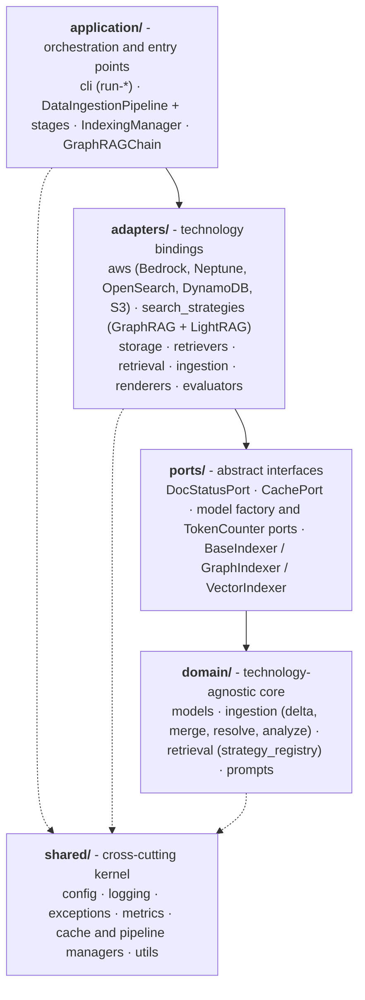
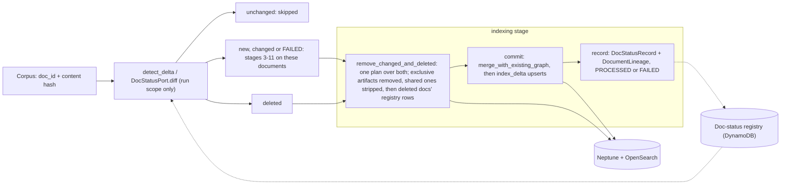
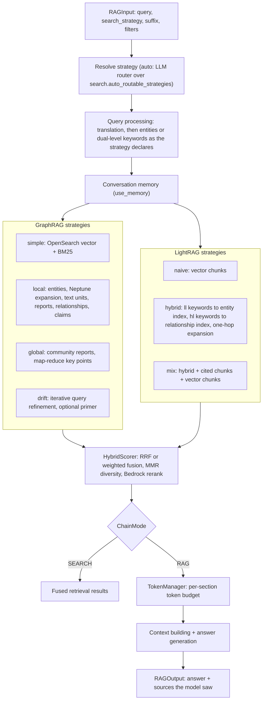

# Unified Knowledge Graph RAG on AWS — Technical Documentation

> 🇰🇷 한국어판: [docs/design.ko.md](./design.ko.md)

This document is a **design reference for contributors and advanced users**, covering the architecture, algorithms, data model, and operational aspects of the `unified-kg-rag-on-aws` library. For the "what/why" and a quick start, see [README.md](../README.md); for "how to use it," see the [User Guide](user-guide.md); for the contribution workflow, see [CONTRIBUTING.md](../CONTRIBUTING.md). Extension recipes are in [§15](#15-extension-guide).

## Table of Contents

1. [Overview and Design Philosophy](#1-overview-and-design-philosophy)
2. [Hexagonal Architecture (Ports & Adapters)](#2-hexagonal-architecture-ports--adapters)
3. [Domain Model](#3-domain-model)
4. [Ingestion Pipeline](#4-ingestion-pipeline)
5. [Incremental Indexing](#5-incremental-indexing)
6. [Retrieval: Two Methodologies](#6-retrieval-two-methodologies)
7. [Hybrid Scoring and Token Management](#7-hybrid-scoring-and-token-management)
8. [AWS Service Integration](#8-aws-service-integration)
9. [Evaluation Framework](#9-evaluation-framework)
10. [Visualization & Analytics](#10-visualization--analytics)
11. [Prompts and Prompt Tuning](#11-prompts-and-prompt-tuning)
12. [Configuration System](#12-configuration-system)
13. [Testing Strategy](#13-testing-strategy)
14. [CI/CD and Security](#14-cicd-and-security)
15. [Extension Guide](#15-extension-guide)
16. [Further Reading](#16-further-reading)

---

## 1. Overview and Design Philosophy

`unified-kg-rag-on-aws` is a library that reimplements the Microsoft GraphRAG and LightRAG methodologies on top of an AWS-native stack (Bedrock + Neptune + OpenSearch + S3 + DynamoDB). The core design principles are as follows.

- **Two methodologies, one infrastructure**: GraphRAG (community-summary) and LightRAG (dual-level keyword) share the same ingestion, indexing, caching, multilingual, and hybrid-search infrastructure, and **only the retrieval algorithm layer is swapped**.
- **Generalization first**: We avoid hardcoding, regex heuristics, and overfitting. Semantic judgments are delegated to the LLM or to authoritative data, token counting uses the Bedrock `count_tokens` API, and thresholds/weights are config-driven.
- **Hexagonal boundaries**: Domain/algorithm code depends on abstract ports, with concrete AWS adapters placed behind them.
- **Registry-based extension**: Search strategies and renderers are registered via decorator registries, so they can be extended without modifying dispatch code. Evaluators are mapped from `EvaluatorType` in one method (`EvaluationManager._resolve_evaluator_class`), so a new evaluator adds one branch there.

---

## 2. Hexagonal Architecture (Ports & Adapters)

### 2.0 Dependency Rule and Layer Map

Imports point **inward** (left imports right, never the reverse). `shared/` is a cross-cutting kernel any layer may use, so the package roots it imports stay dependency-light: importing any `domain/` module must not load LangChain, LangSmith, boto3/botocore, lxml, opensearch-py or gremlin-python, even transitively. LangChain-coupled helpers are imported from their own submodules (`shared.utils.langchain`, `shared.utils.document_converter`; the rich console helpers from `shared.utils.display`), never re-exported from `shared.utils`. `tests/unit/test_domain_purity.py` checks this in a clean interpreter. The two RAG methodologies (GraphRAG community-summary, LightRAG dual-level keyword) share one ingestion/indexing/caching/hybrid-search infrastructure and diverge only at the algorithm layer.



Solid arrows are the dependency rule (a layer imports only the layers it points to); dotted arrows show that any layer may import `shared/`. Search strategies are adapters: the domain only holds their registry, so both methodologies plug into the same ports.

```
unified_kg_rag/
├─ domain/              # technology-agnostic core (no boto3/LangChain/backend imports)
│  ├─ models/           #   Pydantic domain models
│  ├─ ingestion/        #   pure algorithms: delta_detector, graph_analyzer/
│  │  └─ merge/         #   builder/resolver, claim_resolver, merge/merger
│                       #   (IncrementalIndexer is orchestration, so it lives in application/)
│  ├─ retrieval/        #   strategy_registry, MetricsMixin
│  └─ prompts/          #   version-controlled prompt templates
├─ ports/               # abstract interfaces the domain depends on (DocStatusPort,
│                       #   BaseIndexer/GraphIndexer/VectorIndexer, CachePort,
│                       #   ModelFactoryPort — ports/__init__ is the port catalog)
├─ adapters/            # concrete technology bindings
│  ├─ aws/              #   Bedrock, Neptune, OpenSearch, DynamoDB, S3 clients
│  ├─ storage/          #   Neptune/OpenSearch indexers (write-side port implementations)
│  ├─ retrievers/       #   Neptune/OpenSearch retrievers
│  ├─ search_strategies/#   simple/local/global/drift + lightrag(mix/hybrid/naive)
│  ├─ retrieval/        #   abstract retriever/strategy bases, hybrid scorer, token/memory managers
│  ├─ ingestion/        #   LLM/IO coupled: chunker, *_extractor, loader, parser,
│  │                    #   translator, gleaner, community_detector
│  ├─ renderers/        #   graph visualization renderers
│  └─ evaluators/       #   langchain/ragas evaluators (the LLM-free graph_aware,
│                       #   retrieval and answer_match evaluators live in evaluation/)
├─ application/         # orchestration + entry points
│  ├─ cli/              #   run-ingestion/rag/eval/visualization/prompt-tuning
│  ├─ ingestion/        #   DataIngestionPipeline + pipeline_stages
│  ├─ storage/          #   IndexingManager (indexer fan-out)
│  ├─ retrieval/        #   rag_chain (GraphRAGChain, RAGInput/Output)
│  └─ prompts/          #   PromptTuner (LLM-based corpus profiling)
├─ shared/              # cross-cutting kernel (config, logging, exceptions, metrics,
│                       #   cache/pipeline manager, utils)
├─ evaluation/          # real logic package: evaluation_manager / base / graph_aware /
│                       #   retrieval / answer_match
└─ visualization/       # real logic package: render loop + embeddings/exporters/renderers
```

> Layout note: `evaluation/` and `visualization/` are **real logic packages** —
> `evaluation/` holds `evaluation_manager` / `base` and the LLM-free
> `graph_aware_evaluator` / `retrieval_evaluator` / `answer_match_evaluator`;
> `visualization/` holds the render loop plus the `embeddings/`, `exporters/`,
> and `renderers/` subpackages. Everything else is imported from its real
> location (`application.retrieval.rag_chain`,
> `application.storage.indexing_manager`, `application.ingestion.pipeline`,
> `adapters.*`, `domain.*`).

### 2.1 Ports (Abstract Interfaces)

| Port | Location | Adapter | Notes |
|---|---|---|---|
| `DocStatusPort` | `ports/doc_status.py` | `adapters/aws/dynamodb.py` (`DynamoDBDocStatusStore`), `FakeDocStatusStore` for tests | Persists incremental-indexing document status/lineage |
| `CachePort` | `ports/cache.py` (`Protocol`) | `shared/cache_manager.py` (local) + `adapters/aws/s3_cache.py` (S3) | Stage-result persistence boundary |
| `GraphIndexer` (write-side) | `ports/indexer.py` | `adapters/storage/neptune_indexer.py` | Single contract for full + delta (`upsert_*`/`delete_by_id`) |
| `VectorIndexer` (write-side) | `ports/indexer.py` | `adapters/storage/opensearch_indexer.py` | Same |
| `BaseGraphRAGRetriever` (read-side) | `adapters/retrieval/base.py` | `adapters/retrievers/{neptune,opensearch}_retriever.py` | Retrieval adapters |
| LLM/Embedding/Rerank factories, token counter | `ports/model_factory.py` (`ModelFactoryPort`, `TokenCounterPort`) | `adapters/aws/bedrock.py`, `adapters/aws/bedrock_models.py`, `adapters/aws/token_counter.py` | Carried by one `Providers` bundle (`adapters/providers.py`) that each orchestrator builds once and passes to every component (default Bedrock) |

> Design note: Pure ports (`DocStatusPort`, the write-side indexer ABCs) are gathered in `ports/`. The read-side abstract bases (`BaseGraphRAGRetriever`/`BaseSearchStrategy`) are "adapter bases" that construct infrastructure (HybridScorer/TokenManager) in `__init__`, so they live in `adapters/retrieval/base.py` and are imported from there; `ports/__init__` does not export them and only names them in its catalog docstring (no duplicate Protocol definition is kept). `BaseGraphRAGEvaluator` (`evaluation/base.py`) is an adapter base of the same kind.

### 2.2 Role-Based Retriever Injection

Search strategies are injected with retrievers **by abstract role, not by concrete backend name**.

- `RetrieverRole.GRAPH` → graph traversal/expansion (currently Neptune)
- `RetrieverRole.DOCUMENT` → vector/lexical lookup (currently OpenSearch)

Strategies access retrievers only via `self.graph_retriever` / `self.document_retriever` (base-class properties), and the role→adapter builder map in `rag_chain` binds the actual implementation. As a result, swapping the graph backend requires no changes to the strategy code.

```python
# domain/retrieval/strategy_registry.py
@register_strategy(SearchStrategy.LOCAL, required_roles=(RetrieverRole.DOCUMENT, RetrieverRole.GRAPH))
class LocalSearchStrategy(BaseSearchStrategy): ...
```

### 2.3 Registries

- **Search strategies**: `domain/retrieval/strategy_registry.py` — `@register_strategy(...)` registers a class, its required roles, and its query inputs against the `SearchStrategy` enum.
- **Evaluators**: `EvaluationManager._resolve_evaluator_class` — one explicit branch per `EvaluatorType` → evaluator class (lazy, import-on-use). Not a decorator registry: a new evaluator adds an enum member and a branch.
- **Renderers**: `adapters/renderers/base.py` — `@register_renderer("name")`.

This pattern follows the same philosophy as the existing `ParserFactory._loader_configs` (declarative parser registration).

> Write-path note: the registries cover the **read / evaluation / render / parse**
> paths. On the write path, `IndexingManager` deliberately composes **two fixed
> backends** (Neptune + OpenSearch) rather than iterating a registry — those two
> stores (graph DB + vector/lexical search) are constitutive of the framework,
> not runtime-swappable choices, and the per-backend fan-out (entities to both
> stores, entities-before-edges phasing, the orphan-edge cascade) is deliberate
> domain knowledge rather than arbitrary dispatch. So a new search strategy or
> renderer is added by registration alone (an evaluator by one branch in
> `_resolve_evaluator_class`), while replacing a
> write-side store means implementing the `GraphIndexer` / `VectorIndexer` port
> and injecting it (`IndexingManager(vector_indexer=…, graph_indexer=…)`). The
> read path is already generalized through the `RetrieverRole` → builder map.

### 2.4 Dependency Rule Verification Status

`domain/` does not import `adapters`/`application` at runtime, and neither does `ports/`. One compile-time-only exception exists — `domain/retrieval/strategy_registry.py` references `adapters.retrieval.base.BaseSearchStrategy` under `TYPE_CHECKING` (because the registry stores strategy subclasses). Extracting pure strategy/retriever ports would also remove this type-level reference; it is left in place as a deliberate boundary (see "Deliberate Design Boundaries" at the end of this document).

Code imports from real layer locations (`application.retrieval.rag_chain`, `application.storage.indexing_manager`, `application.ingestion.pipeline`, and the `adapters.*` / `domain.*` modules). `evaluation/` and `visualization/` are real logic packages (see the layout note in §2).

---

## 3. Domain Model

The `domain/models/` package contains pure Pydantic models with no infrastructure dependencies.

- `Entity` (`name`, `description`, `type`, `text_unit_ids`, `community_ids`, `rank`, `frequency`, `confidence`, embedding fields)
- `Relationship` (`source_id`/`target_id`, `description`, `weight`, `text_unit_ids`, `description_embedding`)
- `Community` / `CommunityReport`, `TextUnit`, `Covariate` (claim)
- `DocStatus` (state machine: PENDING→PARSING→PROCESSING→PROCESSED|FAILED), `DocStatusRecord` (content hash + artifact lineage + suffix), `DocumentDelta` (new/changed/unchanged/deleted), `DocumentLineage` (per-document artifact attribution)
- `SearchQuery`/`SearchResult`/`RetrievalResult`, `SearchStrategy`/`SearchType`/`RetrieverRole`

**Lineage is the core data.** Entities/relationships record the `text_unit_ids` they appeared in at extraction time, and this lineage, rather than a token-overlap heuristic, decides "is this entity related to this text unit?" accurately and language-independently.

**Index suffix**: every OpenSearch index and Neptune label is named `<prefix>-<suffix>[-<additional_suffix>]`. The suffix is written at ingestion from `processing.document_parsing.index_value` and selected at query time by `RAGInput.suffix` (`--suffix` on `run-rag`/`run-eval`); both default to `default`, and `indexing.additional_suffix` appends the same second segment on both sides. This document calls the resulting value the *index suffix*; one per tenant or corpus version is the intended use.

**Entity names, IDs, and multilingual support**: `Entity.name` (and relationship `source_name`/`target_name`) keeps the *display form* the source used, only trimmed and whitespace-collapsed (`clean_display_name`), so retrieval context and community reports can quote "$1,000 penalty", "Section 4.2", or "C++" verbatim. Identity is a separate key: entity/relationship IDs are hashes of `entity_key(name)` (`shared/utils/common.py`), which applies NFKC + casefold, treats `_`/`-` as spaces, drops quote marks and commas, collapses whitespace, and strips trailing sentence punctuation, but **keeps every other symbol and the letters/digits of all scripts**. Case, whitespace, and quote variants of one name ("ACME  Corp." / "Acme Corp") therefore share an ID, while "C++" and "C#" stay distinct, and Korean, CJK, and accented names get unique IDs. A non-empty name never yields an empty key. Exact-name matching (extraction endpoint lookup, gleaner merges, claim resolution, incremental `merge_entities`) and the fuzzy matcher's shingles use the same key; the punctuation-stripping `normalize_name` is kept only for token-level similarity. **Changing the key changes every ID, so a graph indexed under a different key must be fully re-indexed** (incremental indexing would otherwise add new-ID duplicates next to the old entities).

---

## 4. Ingestion Pipeline

The `DataIngestionPipeline` in `application/ingestion/pipeline.py` runs 12 stages in order (`application/ingestion/pipeline_stages.py`).


| # | Stage | Module | Notes |
|---|---|---|---|
| 1 | Document parsing | `parser.py` (`ParserFactory`) | PDF/TXT/CSV/JSON out of the box (+MD/HTML via the optional `unstructured` extra) |
| 2 | Document loading | `loader.py` (`DirectoryLoader`) | MinHash deduplication |
| 3 | Chunking | `chunker.py` (`ChunkerFactory`) | simple / intelligent (LLM semantic) |
| 4 | Translation (optional) | `translator.py` | multilingual → target language |
| 5 | Graph extraction | `graph_extractor.py` | LLM entity/relationship extraction |
| 6 | Gleaning (optional) | `gleaner.py` | iterative refinement: up to `max_rounds` per text unit, re-gleaning only units whose last answer added something new |
| 7 | Graph resolution | `graph_resolver.py` + `description_summarizer.py` | fuzzy-matching merge, `text_unit_ids` union, **LLM re-summarization of merged descriptions** |
| 8 | Claim extraction (optional) | `claim_extractor.py` | factual assertions (covariate) |
| 9 | Claim resolution (optional) | `claim_resolver.py` | |
| 10 | Graph analysis | `graph_analyzer.py` | centrality (degree/betweenness/PageRank/eigenvector), statistics |
| 11 | Community detection | `community_detector.py` | hierarchical Leiden, community report generation (degree-sort + token-budget pack) |
| 12 | Indexing | `application/storage/indexing_manager.py` | OpenSearch + Neptune |

> The stage order is single-sourced in `DataIngestionPipeline.STAGE_CLASSES` (`application/ingestion/pipeline.py`). Stages that require Bedrock are declared in `DataIngestionPipeline.BOTO_REQUIRED_STAGES`; **graph resolution (7) is in this set** because it re-summarizes merged descriptions with an LLM.

**Merged-description re-summarization (stage 7)**: Graph resolution merges descriptions of the same entity/relationship by simple concatenation, so the description of a popular entity that appears in many chunks grows without bound. `DescriptionSummarizer` (run in `GraphResolutionStage`) re-summarizes only descriptions that exceed a token budget into a single coherent description using a cheap LLM (parity with MS GraphRAG `summarize_descriptions` / LightRAG `_handle_entity_relation_summary`, controlled by `DescriptionSummarizationConfig`). The goal is to prevent embedding/prompt bloat.

**Fuzzy-merge guards (stage 7 and incremental merge)**: Character-shingle similarity cannot distinguish identifiers that share a long prefix ("purchase order 1001" vs "purchase order 1002" score ~0.96 under MinHash; "vendor a" vs "vendor b" ~0.73). Two names are therefore fuzzy-linked only when their *discriminator tokens* are identical (`base_resolver.discriminator_tokens`: tokens containing a digit, single ASCII letters/digits, and multi-letter Roman numerals), and only when their entity types are compatible (same normalized type, or one side empty/`unknown`). For names ending in Han, Hangul, or Kana, the final character is usually the head noun, so such names are also linked only when their final characters are equal (`base_resolver.head_character`): "가나다연구원" (institute) and "가나다연구소" (lab) share every shingle but the head. Conversely, names whose `compact_name_key` is equal are linked with score 1.0: it strips a short, fixed list of legal-form designators at the start or end of the name (`(주)`, `주식회사`, `(유)`, `유한회사`, `(株)`, `株式会社`, `(有)`, `有限会社`, `有限公司`, and a trailing `Inc`/`Ltd`/`LLC`/`Co`/`Corp`) and drops spaces next to Han, Hangul, or Kana letters, so "(주)가나다", "가나다 상사"/"가나다상사", and "Acme Inc"/"Acme" merge. Designators are also removed before discriminator tokens are computed, so the "주" of "(주)" is not an identifier. These are matching rules only; entity ids still hash `entity_key`. `FuzzyMatcher.find_all_matches` applies the guards, so the full-build resolver and the incremental `merge_entities` path share them. The full-build resolver builds groups with a type-aware union-find (strongest links first, deterministic tie-break) that refuses any union which would place two differently typed names in one group, so an untyped name cannot bridge an `organization` and a `person`. Entities sharing an exact surface name always stay together. Relationship resolution groups by exact `(source_id, target_id, type)` after the entity remap and needs no separate guard.

**Community report context pack (stage 11)**: The report-generation input **sorts entities within a community by graph degree in descending order** (ties broken by stable id sort), caps them at `max_entities_per_report`, and packs them to fit the `max_report_context_tokens` token budget (relationships are sorted/packed identically by the sum of both endpoints' degree, with weight as the tiebreak). The top-degree entity is always included (at least one) even if it alone exceeds the budget, so a report never ends up with empty context (`community_detector._prepare_report_input`).

**Sub-community roll-up (MS GraphRAG parity)**: When a coarse parent community's raw entity/relationship context would overflow `max_report_context_tokens`, rather than simply truncating, the report generator substitutes summaries of that community's already-generated child sub-community reports for the lowest-priority raw context. This requires bottom-up per-level generation: `generate_reports` groups communities by `level` and processes them finest-first (level 0 = leaf), accumulating each level's reports so a parent (`enable_sub_community_rollup`, default on) can fold in its children's summaries (`_generate_reports_with_rollup` / `_build_sub_community_context`, packed biggest-child-first within the same budget). Setting the flag false restores the flat, truncate-on-overflow path (`_generate_reports_flat`). On the roll-up path, a parent whose only child has the same entities and relationships reuses that child's report (re-keyed to the parent, `attributes.reused_from_community_id`) instead of a second LLM call over identical context (`_reuse_single_child_report`); the flat path generates every report.

**Structured community reports (MS GraphRAG parity)**: The report prompt emits a structured result — an executive `summary`, an importance `rating` (0-10) with a one-sentence `rating_explanation`, and a list of `findings`, each a one-line `summary` plus a multi-sentence `explanation` (`CommunityReport.findings`/`rating`, `CommunityFinding`). The free-text `full_content` used for embeddings, global-search map-reduce, and display is **rendered deterministically** from these structured fields (`CommunityReport.render_full_content`), so the structure adds no second LLM call and the embedding/search path is unchanged. The `rating` is also indexed on the community-reports OpenSearch document for importance-aware ranking.

**Community report lineage (stage 11)**: Each report carries `text_unit_ids` and `document_ids`, indexed as keyword fields on the community-reports document (`CommunityDetector._attach_report_lineage`). These are **community membership provenance**: the union of the member entities' `text_unit_ids`, and the documents those units came from. They are not report-input provenance — `max_entities_per_report` and the token budget may keep a member out of the prompt while its sources stay in the lineage — and they do not establish sentence-level citation support. They exist so a consumer can filter reports by source document or re-summarize a community per reader.

**Pipeline infrastructure**: Stage-checkpoint-based resumption (`shared/pipeline_manager.py`), S3 cache sync (`adapters/aws/s3_cache.py`), a `continue_on_error` toggle, per-stage caching (`shared/cache_manager.py`). The translation stage is skipped at no cost when `TranslationConfig.is_noop` (source == target & no additional languages). LLM output parsing consistently uses a `FixingConfig`-based output-fixing parser. The pipeline releases indexer/client resources via `close()`, which the `run-ingestion` CLI calls in `finally` (§8.6).

**Generalization in practice**:
- The relevance gate (which entities to include in the prompt for claim/gleaning) is decided by `text_unit_ids` lineage membership rather than a token-Jaccard regex heuristic → accurate and language-independent.
- Gleaning stops per text unit on observed output, not on scores: a unit is re-sent (up to `max_rounds`) only while its previous answer added an entity or relationship the graph did not have. An empty answer is the model saying nothing more is missing, the signal MS GraphRAG asks for with a separate Y/N loop prompt, so no extra call is spent on it.

---

## 5. Incremental Indexing

When documents are added/changed/deleted, only the delta is processed instead of a full re-index.



The names are `IncrementalIndexer` methods (`application/ingestion/incremental.py`) unless noted. A document recorded `FAILED` is classified as changed on the next run until it reaches `indexing.max_document_failures`; registry records are written only when the delta's writes pass the indexing failure gate.

1. **Delta detection** (`domain/ingestion/delta_detector.py`): Builds `{doc_id: content_hash}` from a stable `doc_id` + content SHA-256 hash, and `DocStatusPort.diff(incoming, scope)` classifies them as new/changed/unchanged/deleted. `doc_id` hashes the document's index suffix (`index_value` + `indexing.additional_suffix`), its corpus source scope and its path relative to the corpus root, so two tenants' identically named files staged in the same directory, and two corpora on one suffix that share a relative path, stay distinct; a record keyed the legacy way (suffix + path) is adopted under the new key by the first run of its scope. When the source scope defaults to the source directory and a local corpus moved, a new document whose only other-scope record lies under a local source directory that no longer exists is re-keyed to the run's scope the same way (a directory that still exists is a separate corpus; URI scopes and other suffixes are never adopted). Deletion is **scoped**: only registry records of the run's scope (index suffix + corpus source, `document_parsing.source_scope` or the resolved source directory) are deletion candidates, and records written before scopes existed never are. Files that failed to parse or load this run are reported as `failed` and excluded from `deleted`.
2. **Stale cleanup** (`IncrementalIndexer.remove_changed_and_deleted`): Before the delta is written, removes the existing artifacts of changed documents (so entities that disappear after re-extraction do not linger in the graph) and of deleted documents (step 4) that no *surviving* document references. The removal is planned once over changed + deleted, so an artifact that only a changed and a deleted document reference is removed too; planning the two sets separately would treat each as a survivor of the other and leave it behind with no text units.
3. **Delta upsert** (`IncrementalIndexer.commit`): With `indexing.cross_run_merge` (default on), `IndexingManager.merge_with_existing_graph` first reads back the existing entities/relationships the delta touches, per index suffix, and merges the delta into them (merge semantics below), so an entity shared with unchanged documents keeps their descriptions and `text_unit_ids`. A delta item that merged into a stored one under another id (a fuzzy entity match, or an edge whose endpoint was remapped) is recorded in the lineage by the stored id. `IndexingManager.index_delta` then writes the result as is: Neptune uses a Gremlin `coalesce(unfold, addV)` idempotent upsert; OpenSearch upserts by id into the live alias index. The relationship vector index is updated the same way.
4. **Deletion propagation** (in step 2's removal): Removes only the *exclusive* artifacts of deleted documents via `delete_by_id` (preserving shared entities), then their registry records. Targets the text-unit, entity, and relationship indices alike. Entities and relationships shared with surviving documents (in the same suffix) are kept but stripped of the removed documents' text units, with `frequency`/weight recomputed, in Neptune and OpenSearch alike (`IndexingManager.remove_text_units_from_shared`); changed documents get the same treatment before their re-extraction is merged back in. If any removal fails, the deleted documents' registry records are kept for a retry and the indexing stage fails, so the run (and the `IndexingFailures` alarm) reports it: before the commit when the delta has changed documents (committing would replace their lineage and orphan the stale artifacts), after it otherwise.

   **Limitation**: a shared artifact's description keeps the text a changed or deleted document contributed. Removing it would mean re-summarizing the description from the remaining sources, an LLM call per affected artifact, so it is left until a full rebuild (`indexing.reset`). The same holds for shared communities and their reports (below).
5. **Registry update**: Records processed documents into `DocStatusRecord` as `DocumentLineage` (per-document artifact ids + suffix), with the run's scope and the relative path. A document that translation, graph extraction, gleaning or claim extraction failed on for any of its text units is recorded `FAILED` (with the lineage of what was written), and `diff` classifies a `FAILED` record as changed even when its hash is unchanged, so the next run prunes and re-extracts it. The record counts consecutive failures of the same content (`failure_count`); after `indexing.max_document_failures` of them `detect_delta` classifies the document unchanged instead, so a deterministic failure is not re-extracted on every run.

`indexing.reset` skips the diff: the stores and the registry are cleared, the whole corpus is rebuilt with the full-index path, and every document is recorded again (only when the rebuild's writes pass the same failure gate as a delta commit).

**Document identity** (`shared/utils/document_identity.py`): a document version's `document_id` (from which text-unit ids derive) hashes the path relative to the corpus root plus the full text. The parsing and loading stages re-derive it against the root (`delta_detector.assign_document_identity`), so the same corpus yields the same ids wherever it is checked out or synced, and same-named files in different folders never collide. The registry `doc_id` (step 1) follows the same relative-path rule. Changing either rule changes ids and requires a re-index.

**Merge semantics** (`domain/ingestion/merge/merger.py`, ported from MS GraphRAG `update/*`): Entities merge by id, else by identity key (`entity_key`; description lines unioned without duplicates, union of `text_unit_ids` and `community_ids`, `frequency` = number of text units, max confidence/rank, attributes unioned with the delta winning, existing ids preserved + a remap for entities that merged under a different id); relationships merge by id, else by (source, target, type) (same description and attribute rules; weight = sum of the extracted strengths per supporting text unit, kept on the edge as `attributes.text_unit_weights` so a delta replaces its text units' entries and the result equals a full build over the union — the same rule the full-build extractor and resolver apply, after MS GraphRAG's summed instance strength); communities append by id-offset. Matching the id first keeps a stored item that a gleaning correction renamed, retyped or reversed (its id still derives from the old form) as the one item a later delta of the old form folds into. Every rule is idempotent: re-applying a delta changes nothing. The cross-run merge runs per index suffix and reads the stored items back through `neptune_codec`, the exact inverse of the Neptune write encoding.

**Communities on delta runs**: a delta run clusters only the delta subgraph (MS GraphRAG's update path also appends rather than re-clustering). Community ids are therefore **content-derived** — a hash of the level and the sorted member entity ids (`community_detector.community_content_id`); the positional `L{level}_C{i}` label survives only as `short_id`/`name`. A delta community gets an id distinct from every corpus community unless its membership is identical (then the upsert rewrites the same community), so the delta's communities and reports (whose ids hash the community id) are appended next to the existing ones instead of overwriting `L0_C0…` of the full corpus. The upsert path then needs no read-back or id-offset merge (`merge_communities` stays available for callers that hold both sets in memory). Corpus communities that contained a changed or deleted document's entities are removed through lineage only when exclusive to that document; shared ones keep their pre-change report until a full rebuild, which is also the only path that re-partitions the whole graph. Leiden's partition depends on node/edge insertion order even with a fixed seed, so the detector sorts nodes and edges before partitioning (`_canonical_graph`); the same graph always yields the same communities and ids. Re-detecting over the full graph on every delta run was rejected: it would regenerate every community report (an LLM call each) per delta run, defeating incremental indexing.

Enable with: `config.aws.dynamodb.enabled = true`.

---

## 6. Retrieval: Two Methodologies

The `GraphRAGChain` (an LCEL Runnable) in `application/retrieval/rag_chain.py` performs strategy resolution → query processing (translation, entity/keyword extraction) → memory → retrieval → (RAG) context build + answer generation. The methodology is selected via `RAGInput.search_strategy`.



Neptune graph expansion is part of `local` and `drift`; for `mix`/`hybrid` it is opt-in (`search.lightrag_search.enable_graph_expansion`).

### 6.1 GraphRAG Methodology (`adapters/search_strategies/`)

- **simple**: OpenSearch-only vector/lexical, no graph. If claim extraction is enabled, the claims index is also automatically swept; if disabled, `_apply_claim_gate` explicitly excludes the claims index so a claims-off run never queries that index.
- **local**: Entity-centric — candidate entities → Neptune graph expansion → frequency filter → text-unit combination, enriched with a **community-report section** and a **relationship section** (like MS GraphRAG local search, which assembles entities + their community reports + in-network relationships + text units). `_retrieve_community_reports` and `_retrieve_relationships` query those indices with the entity focus (falling back to the raw query); the relationship section is gated on `build_relationship_vector_index` so a GraphRAG-only deployment that skips the relationship vector index issues no relationship lookup. If claim extraction is enabled, it **injects claims (covariates) into the context** like MS GraphRAG (`_retrieve_claims` queries the claims index separately and adds them as `all_results["claims"]`, folded into the token budget at `SectionType.CLAIM` priority). The default claims-off path performs no additional lookups at all. The community-report, relationship and claim lookups run concurrently with the entity → expansion → text-unit chain. With `search.local_search.include_bridge_relationships` (default on, needs the relationship index), the relationships incident to the expanded entities are fetched as well (`_fetch_incident_relationships`, shared with LightRAG's incident expansion), edges whose both endpoints were retrieved first — MS GraphRAG local's in-network relationships, which carry the hops of a multi-hop chain that the relationship vector query rarely matches.
- **global**: Community report search → selection by indexed rank/rating (per-report LLM relevance scoring is opt-in via `use_dynamic_selection`, default off because the map step already rates the reports for the query) → fusion with the selected communities' text units, reserving `max_communities` slots for the reports and `text_unit_slots` (default `top_k`) for the chunks (`reserve_report_slots`) → **map-reduce synthesis** (see §6.1.1 below).
- **drift**: Iterative query evolution (community seeding → iteration 0 searches with the original query → later iterations refine the query / expand keywords from what was found → stop on low unique-result gain or `max_iterations`; an LLM convergence check is opt-in via `search.drift_search.enable_llm_convergence`). The accumulated results are fused with the same per-section-type quota as local search (`search.local_search.type_quota`), reranking text chunks only. Optionally (`search.drift_search.enable_primer`, default off) runs MS GraphRAG's **primer → follow-up** flow instead: a HyDE primer drafts a hypothetical answer from the seed community reports and decomposes the query into `primer_follow_ups` specific sub-queries, each run as its own search iteration (`_primer_search`/`_run_primer`), rather than carrying one mutating query forward. Falls back to the iterative loop if the primer yields no follow-ups, and skips the primer entirely when no candidate communities were found (there is nothing to ground it in). The hypothetical answer only steers the follow-up queries; it is never added to the answer context or the reported sources, because it is an LLM guess rather than retrieved evidence.
- **auto**: LLM routing via `StrategySelectionPrompt` among `search.auto_routable_strategies` (default local, mix, global, drift; simple is left out); the prompt's strategy guide is built from that list, so it describes exactly the strategies the router may pick. The response is parsed by word token, first routable name wins; unrecognised output falls back to local.

#### 6.1.1 Global search map-reduce (`global_search.py`)

When `enable_map_reduce` is set and results are at least `map_reduce_min_results`, it follows MS GraphRAG's canonical map-reduce. Below `map_reduce_min_results` the retrieved results **pass through unchanged** — no synthesis stage runs at all, because a handful of community reports do not need a map-reduce to be summarized.

1. **MAP** — Community reports are batched in groups of `map_batch_size` (default 5, near MS GraphRAG's 12K-token map context), and for each batch `GlobalMapPrompt` asks the LLM to extract key points and score query relevance from **0-100**. Batches are run concurrently via `BatchProcessor`, with per-item graceful fallback.
2. **FILTER+RANK** — Drops points at or below `map_relevance_threshold` and sorts by score in descending order (`_filter_and_rank_points`).
3. **PACK** — Packs the top points up to the `max_map_reduce_tokens` token budget (based on `token_manager.count_tokens`, `_pack_points_within_budget`).
4. **REDUCE** — By default (`reduce_with_llm: false`) the packed points, with their relevance annotations, are prepended to the results as one `synthesized_key_points` `RetrievalResult` and the answer model does the synthesis itself: a separate reduce LLM only added a call and a second rewrite that could drop facts or assert that the summaries lack them. With `reduce_with_llm: true`, `MapReduceSummaryPrompt` first synthesizes a summary from the packed points (`_reduce_from_points`), prepended as `synthesized_summary`. Either item is flagged `metadata.synthesized`: the answer model reads it as context, but it is LLM output rather than retrieved evidence, so it is never reported in `RAGOutput.sources`.

Robustness: Even if the map response comes wrapped in code fences or prose, `_parse_map_points` extracts the JSON, and a batch whose map call failed or returned unparseable output is tracked as *unrated*. `_concat_reduce` is the degradation path when no point passes the threshold but some reports were never rated — over just the unrated reports (all of them when every batch failed), which pass through unchanged unless `reduce_with_llm` summarizes them — so global search still answers instead of hard-failing or declaring no data for reports nobody judged. When the map stage rated *every* batch but every point scored at or below `map_relevance_threshold`, the reports were judged irrelevant: global search returns no results (flagged as `map_reduce_no_relevant_points` in the search metadata), matching MS GraphRAG's no-data answer, and the chain's empty-context guard replies "cannot answer" instead of synthesizing from rejected reports. `MapReduceSummaryPrompt` likewise restricts the reduce step to the provided points and tells it to say so when they do not answer the query.

### 6.2 LightRAG Methodology (`lightrag_search.py`)

Runs dual-level keyword retrieval (hl/ll extraction via `KeywordsExtractionPrompt`) on top of the shared hybrid infrastructure.

Modes (`RAGInput.search_strategy`):
- **naive** — vector chunk retrieval only, no graph.
- **hybrid** — ll → entity index + hl → relationship index + one-hop cross-type expansion (entity hits → incident relationships, relationship hits → endpoint entities) + the chunks those items cite.
- **mix** — hybrid graph search, plus the **source chunks cited by the matched entities/relationships** (`text_unit_ids` lineage), plus a naive vector chunk retrieval, all blended in.

Per-source behavior:
- **Low-level keywords (ll)** → entity index (lexical + semantic, `entities_index_prefix`)
- **High-level keywords (hl)** → **relationship index** (corresponds to LightRAG's `relationships_vdb`; `relationships_index_prefix`, `Relationship.description` embedding)
- **Retrieval rounds** — the independent entity / relationship / (mix) vector-chunk queries run concurrently; the incident-relationship and endpoint-entity expansions then run concurrently; the cited chunks are fetched last (they depend on both). Upstream LightRAG has no multi-hop traversal, so the Neptune neighbourhood expansion (= GRAPH role, `indexing.neptune.max_hops`) is opt-in via `search.lightrag_search.enable_graph_expansion` (default `false`).
- **mix linked chunks** — entities and relationships are indexed with their `text_unit_ids` chunk lineage, so `mix` follows the matched entities/relationships back to the chunks that support them (`_collect_linked_chunk_ids` ranks chunk ids by how many matched items cite each, mirroring LightRAG's `_find_related_text_unit_from_entities`/`_from_relationships`), fetches those chunks by id, and blends them alongside the naive vector chunks. Degrades to the naive-only blend when an index predates the lineage field.
- If keyword extraction yields nothing, short queries fall back to using the raw query as ll keywords (config `search.lightrag_search.raw_query_fallback_max_len`)
- All sources are fused through the shared `HybridScorer`

> The two methodologies share the same ingestion outputs (entities/relationships/communities/chunks + embeddings) and branch only at the retrieval layer — so a single indexed corpus answers both GraphRAG and LightRAG queries with no re-indexing. This is a deliberate extension over the source papers: stock MS GraphRAG does not build a relationship vector index, and stock LightRAG does not do community detection/reports; here the ingestion builds the *union* so either methodology can run.
>
> The trade-off: a full ingestion pays GraphRAG's community-detection + report-generation cost even if you only query with LightRAG. For a LightRAG-only deployment, set `graph.community_detection.enabled: false` to skip the Leiden pass and all community-report LLM calls — `mix`/`hybrid`/`naive` need only entities, relationships, and the relationship vector index. (Leave it on if you want `global`/`drift` available.)

---

## 7. Hybrid Scoring and Token Management

- **HybridScorer** (`adapters/retrieval/hybrid_scorer.py`): Combines per-source results via RRF (`rrf_k`) or weighted fusion, diversity filtering (`diversity_lambda`), and Bedrock reranking. Weights/method come from `config.search.fusion`/`hybrid`. Reranking is only active when `search.reranking.enabled`, and `compress_documents` temporarily adjusts `top_n` to the document count before restoring it. On initialization failure, the reranker degrades to disabled (`None`).
  - **IAM caveat**: the Rerank API authorizes `bedrock:Rerank` against a different resource shape than `InvokeModel`, so a statement scoped to foundation-model or inference-profile ARNs denies it. The IaC task role grants `bedrock:Rerank` on `Resource: "*"` in its own statement (`ComputeStack._build_task_role` in `iac/stacks/compute_stack.py`). Without it the scorer logs `Reranking failed: ...` at ERROR and returns the fused results unreranked.
- **TokenManager** (`adapters/retrieval/token_manager.py`): Optimizes context within model limits. Weights by per-section-type priority multiplier (`PRIORITY_MULTIPLIERS`: TEXT 1.3 / ENTITY 1.2 / RELATIONSHIP 1.1 / CLAIM 1.1 / COMMUNITY 1.0 / GENERAL 0.8) and selects sections within budget in descending priority order. `SectionType.CLAIM` is the type used to fold query-time claims injection (§6.1) into the token budget. The chain keeps this selection (`OptimizedContext`) in state and builds `RAGOutput.sources` from it, so sources list only what the answer model saw, in retrieval-rank order: sections cut for budget are not reported, a section truncated to fit carries its truncated text and `metadata.truncated: true`, and each source's metadata keeps `truncated` / `source_id` / `document_ids` / `chunk_id` / `section_type` / `score` with `*_embedding` vectors removed. When the answer step short-circuits on an empty context, `sources` is empty.
- **Token counting** (`adapters/aws/token_counter.py`): The Bedrock `count_tokens` API is the single source of truth. It degrades to a script-aware estimate only on failure (no third-party tokenizer). A non-transient failure (e.g. `AccessDeniedException`, or a `ValidationException` whose message says the model does not support the operation) marks the model unsupported process-wide so later counts skip the API; throttling, timeouts, and input-level `ValidationException`s do not. Blank or whitespace-only text never calls the API. Embedding and rerank counters are built without a client, so they never call the API (it does not accept those models); language models that CountTokens rejects (Claude 4.7+/5.x, OpenAI GPT) skip it by capability flag (`supports_count_tokens`). Truncation uses a convergence loop that estimates candidates by char ratio and validates them via the API.

---

## 8. AWS Service Integration

| Service | Module | Purpose |
|---|---|---|
| **Bedrock** | `adapters/aws/bedrock.py`, `adapters/aws/bedrock_models.py` (capability catalog) | LLM/embedding/reranking. Automatic cross-region inference profile resolution, provider-aware request shaping (Anthropic adaptive thinking + `effort` on Claude 4.6+, `budget_tokens` on older Claude; `reasoning.effort` on OpenAI GPT via Converse), 1M context, prompt caching where the model supports explicit cache points, capability table (curated rows, then provider-family defaults by id prefix, then a conservative unknown default; `aws.bedrock.model_overrides` on top) so any Bedrock model id is accepted |
| **Neptune** | `adapters/aws/neptune.py` | Gremlin over `wss://` (`ws://` to a local Gremlin Server with `aws.neptune.use_ssl: false`), SigV4 IAM, batch upsert/delete. Write batches submit concurrently via a thread pool when `indexing.neptune.index_concurrency` > 1 (per-batch independent `IndexingStats` → merged on the main thread, no shared mutation), multiplexed over the Gremlin connection pool (`aws.neptune.pool_size`, raised to at least `index_concurrency`). Default 1 = sequential |
| **OpenSearch** | `adapters/aws/opensearch.py` | Vector (kNN/HNSW, default engine **lucene**, which supports `cosinesimil` on OpenSearch 2.13 as deployed by `iac/`; faiss rejects `cosinesimil` before 2.19, so use it only with `innerproduct` for >1024-dim models — see the engine note in `config-template.yaml`) + BM25, async SigV4, sync/async clients, hybrid search pipeline, alias management, bulk upsert/delete, per-language analyzers (en→english, ko→nori, etc.) |
| **S3** | `adapters/aws/s3_cache.py` | Pipeline cache sync (encryption defaults to `BUCKET_DEFAULT` — the bucket's default encryption, e.g. a CMK; `AES256`/`aws:kms` force per-object SSE) |
| **DynamoDB** | `adapters/aws/dynamodb.py` | Incremental-indexing document-status registry |

All adapters can be injected with a `boto_session` (by default created from `config.aws.profile_name`), so a fake/moto session can be injected during testing.

### 8.5 Retrieval Error Visibility

The retrievers (`opensearch_retriever`/`neptune_retriever`) do not disguise authentication/configuration/connection failures as "no results." `is_fatal_retrieval_error()` (`adapters/retrieval/base.py`) re-raises fatal errors with `exc_info` and degrades to `[]` only for transient errors, so an incorrect IAM permission or an endpoint typo surfaces instead of being buried as "0 search hits." Neptune's per-query `_execute_traversal` re-raises fatal errors too, so they reach that top-level guard. The search strategies apply the same rule to every sub-retrieval through one helper, `BaseSearchStrategy._safe_aretrieve`, so a section-level handler cannot re-swallow a fatal error the retriever raised; a transient failure still degrades only that section.

### 8.6 Client Lifecycle / Resource Release

Each retriever build opens a Neptune WebSocket + thread pool and OpenSearch (a)sync HTTP pools. These resources leak until GC unless explicitly closed. Therefore every layer exposes best-effort `close()`/`aclose()` (never raising):

- **OpenSearchClient**: `close()`/`aclose()` + sync/async context managers (mirroring NeptuneClient). When the event loop changes, the previous `AsyncOpenSearch` is closed: awaited on its own loop while that loop runs, otherwise by running the aiohttp connector's close coroutine to completion without a loop, so per-loop aiohttp pools do not leak. `aclose()` awaits the transport close to prevent the "Unclosed client session" warning.
- **NeptuneClient**: Closes the Gremlin connection pool.
- **Chain wiring**: Retrievers/indexers delegate up to `IndexingManager.close()` / `GraphRAGChain.close()`·`aclose()` (iterating the cached retrievers). Whoever builds a chain must close it when done: a GC finalizer releases a dropped chain's retrievers and loop as a safety net, but only once the garbage collector reaches it (the chain is in a reference cycle, so that can be much later). The `run-rag` and `run-eval` CLIs call `await rag_chain.aclose()` in `finally`, and the `run-ingestion` CLI calls `pipeline.close()` in `finally`, releasing sockets at process exit.
- **Event loops**: `GraphRAGChain` caches retrievers and strategy instances per event loop (tracked by reference, not `id()`). Its sync entry points (`invoke`, `batch`, `stream`) run on one chain-owned loop thread, started lazily and stopped by `close()`/`aclose()`, so repeated sync calls reuse one set of loop-bound clients and also work from a thread that already runs a loop. When the loop does change, the evicted retrievers are closed — awaited on their own loop while it still runs. Blocking backend calls stay off the loop thread: the Neptune connect/close and the fusion + rerank step run via `asyncio.to_thread`, and the rerank `top_n` is applied to a per-call copy of the shared model. LangChain runs `ChatBedrockConverse.ainvoke` in the loop's default executor too, so that executor bounds concurrent Bedrock calls; the CLIs and the chain-owned loop size it to `processing.io_workers` (`shared/utils/event_loop.py`), and an async host does the same with `configure_event_loop`.

### 8.7 Multilingual Processing

- **OpenSearch analyzers**: The language→analyzer mapping is exposed via config (`indexing.opensearch.language_analyzers`, default `{"en": "english", "ko": "nori"}`) so it can be extended without code changes. nori (the Korean morphological analyzer) is built into OpenSearch Service. Languages without a mapping fall back to `default_analyzer`.
- **Entity ID normalization**: IDs hash `entity_key` (`shared/utils/common.py`): NFKC + casefold, symbols and letters/digits of all scripts preserved, only quotes/commas/trailing punctuation dropped → Korean, CJK, and accented names get unique IDs and "C++"/"C#" stay distinct, while `Entity.name` keeps the display form (§3). Non-empty input is not collapsed to an empty ID.
- **Translation skip**: When `TranslationConfig.is_noop` (source_language == target_language and no additional target languages), the translation stage is skipped in its entirety at no cost (`TranslationStage._should_skip` in `application/ingestion/pipeline_stages.py`).
- **Encoding auto-detection**: When the text parser hits a `UnicodeDecodeError` on a non-UTF-8 file, it detects the encoding via `charset-normalizer` and retries with an explicit `encoding=` (`FileParser._detect_encoding` in `adapters/ingestion/parser.py`). LangChain's `autodetect_encoding=True` (which pulls in the extra `chardet` dependency) is intentionally not used.

---

## 9. Evaluation Framework

`evaluation/` — `EvaluationManager` dispatches evaluators via `_resolve_evaluator_class` (one lazy-import branch per `EvaluatorType`).

- **LangChain evaluators**: correctness / partial_correctness (LLM-based rubric)
- **RAGAS evaluators**: answer_correctness/relevancy, context_precision/recall, faithfulness
- **Retrieval evaluator** (`retrieval_evaluator.py`): `hit_at_k`, `recall_at_k` (k = `evaluation.retrieval_k`) and `mrr` of the rank-ordered reported sources against the dataset's `reference_sources`, matched by case-insensitive file-name stem or document id. Deterministic, no LLM; skipped for queries without references or source provenance.
- **Answer-match evaluator** (`answer_match_evaluator.py`): SQuAD-style normalized `exact_match` and `token_f1` against `answer` plus optional `metadata.answer_aliases` (max over references). Deterministic, no LLM; whitespace tokens, so for scripts without spaces token F1 degrades to exact match.
- **Graph-aware evaluator** (`graph_aware_evaluator.py`): Computes the rate at which the ground truth's `expected_entities`/`expected_relationships` appear in the generated answer (= coverage = recall) as `ENTITY_COVERAGE`/`RELATIONSHIP_COVERAGE`. Deterministic, no LLM required. Precision/F1 are not produced because they would require enumerating the entities in the answer (impossible from free text) — to avoid exaggerating the signal as a duplicate of recall. Latin characters use word-boundary contiguous token matching ("AI" does not match inside "airport"); CJK without whitespace falls back to substring matching. The manager injects the expectations via `result.metadata`, so the abstract signature is unchanged.

CLI: `run-eval --eval-data-path <json> [--search-strategy ...]`.

---

## 10. Visualization & Analytics

`visualization/` — `BaseRenderer` ABC + `@register_renderer` registry + `RenderContext`.

- `InteractiveRenderer` (pyvis network + community hierarchy), `StaticRenderer` (Bokeh degree/centrality/community-size)
- Layout: Bedrock Node2Vec embeddings + UMAP dimensionality reduction (spring layout on failure)
- **Standalone execution** (`application/cli/run_visualization.py`): Reads exported graph JSON without ingestion (`export_visualization_data` output format: `nodes`/`edges`/`layout`/`communities.hierarchy`), rehydrates it into typed objects, and renders with the registered renderers.

---

## 11. Prompts and Prompt Tuning

- **Prompts** (`prompts/`): Classes based on `BasePrompt` (frozen dataclass). System/human templates are version-controlled as `.py`. Every prompt can be overridden from config via `CustomPromptConfig` (e.g., medical/legal/financial domains).
- **Prompt tuning** (`application/prompts/tuner.py`, ported from MS `prompt_tune`): Corpus sample → profile domain/language/persona/entity-types via a Bedrock LLM (`CorpusProfilePrompt`) → generate a domain-adapted `custom_prompts` YAML fragment. CLI: `run-prompt-tuning`. This is an explicit step where the user reviews and applies it to config, not automatic runtime application. The tuned `graph_extraction_system` / `community_report_system` replace only the persona preamble (`system_preamble`): the prompt's built-in `output_rules` (XML schema, verbatim `source_text` grounding) are embedded verbatim, so the parser and grounding guard keep working.

---

## 12. Configuration System

The nested Pydantic tree in `domain/models/config.py` (root `Config`), loaded by `shared/config.py` (`get_config`); the schema example is `config-template.yaml`.

- Sections: `aws` (bedrock/neptune/opensearch/s3/dynamodb), `fixing`, `processing` (chunking/translation/graph_extraction/gleaning/claim_extraction), `graph` (analysis/community_detection/visualization), `indexing` (opensearch/neptune), `search` (hybrid/fusion/reranking/global_search/drift_search/lightrag_search/token_manager), `memory`, `cache`, `logging`, `evaluation`, `custom_prompts`.
- **Config-based generalization**: The language→analyzer mapping (`language_analyzers`), OpenSearch clause budget (`max_total_clauses`, etc.), LightRAG fallback length, and eigenvector convergence parameters are all exposed via config.
- Adding a new config section: Define a Pydantic `BaseModel` → attach to its parent via `Field(default_factory=...)` → document in `config-template.yaml`.

---

## 13. Testing Strategy

`tests/{unit,integration,property,fixtures/fakes}/` — **AWS-free by default**.

- **Port-based fake adapters** (`fixtures/fakes/`): In-memory implementations of GraphStore/VectorStore/DocStatus verify domain logic without real AWS (the test-side benefit of hexagonal architecture).
- **moto**: Verifies the DynamoDB/S3 adapters against the boto3 surface.
- Layers: unit (models/registry/merge/dual-keyword/evaluation/token-counter/clause budget/lineage relevance), property (hypothesis: hashing determinism, diff partition completeness, merge laws), integration (incremental add/change/delete cycles), regression.
- Markers: `unit`, `integration`, `property`, `aws` (real AWS, excluded in CI), `slow`. `asyncio_mode = "auto"`.

Run: `uv run pytest -m "not aws" --cov=unified_kg_rag`.

---

## 14. CI/CD and Security

- **CI** (`.github/workflows/`): the `quality` workflow runs on pull requests and pushes to `main` — ruff/black/isort/mypy + pytest with the coverage gate (one `-m "not aws"` run covering the unit, property and integration suites), the suite on the oldest supported Python (3.10), the optional-parser security checks, and `cdk synth` with cdk-nag plus the IaC assertion tests. The `security` workflow runs a non-blocking, report-only ASH scan on pushes to `main`.
- **Dependabot** (`.github/dependabot.yml`): weekly version updates for the `uv` lock (`/`), the IaC `pip` requirements (`/iac`), and the SHA-pinned GitHub Actions. Known-breaking bumps are held back with an `ignore` entry that records the reason.
- **pre-commit** (`.pre-commit-config.yaml`): Mirrors the CI gates. `pre-commit install`.
- **Security hardening**: Content hashes use SHA-256 exclusively (CWE-327-safe). Dependency-scan CVEs are addressed through the Dependabot pull requests above. Tokens are injected via environment/config (no hardcoding in code).

---

## 15. Extension Guide

This section is the single reference for extending the framework; the README, user guide and CONTRIBUTING.md link here. Strategies, renderers and parsers extend through registries, evaluators through one branch in their type map, and backends through constructor injection; none needs a change to dispatch code.

- **New search strategy**: Add a `SearchStrategy` enum member (`domain/models/retrieval.py`; strategies are keyed by this closed enum, and the CLI choices follow it) + subclass `BaseSearchStrategy` + `@register_strategy(SearchStrategy.X, required_roles=(...), query_inputs=frozenset({QueryInput.ENTITIES}))` + export from `adapters/search_strategies/__init__.py`. `query_inputs` declares the query-side LLM extractions the strategy reads (`ENTITIES` for `entity_focus`, `DUAL_KEYWORDS` for `hl_keywords`/`ll_keywords`); the chain skips the rest. No edit to `rag_chain` is needed; add the strategy to `search.auto_routable_strategies` if `auto` may pick it.
- **New storage/LLM backend**: Implement the relevant port and pass it to the constructor that uses it (see "Custom backends" below); there is no backend registry. Do not hardcode it into a manager's `__init__`.
- **New evaluator**: Subclass `BaseGraphRAGEvaluator` + add a branch in `EvaluationManager._resolve_evaluator_class` + an `EvaluatorType` enum.
- **New renderer**: Subclass `BaseRenderer` + `@register_renderer("name")`. Registration happens on import: `GraphVisualizationManager` sees any renderer imported in the process, `run-visualization` only those that `adapters/renderers/__init__.py` imports.
- **New parser / file format**: `ParserFactory.register_loader(".ext", MyLangChainLoader, loader_kwargs=..., file_type_name=...)` — any LangChain `BaseLoader` subclass; no edit to the factory, and the extension is then auto-discovered + parseable. Override a built-in by registering its extension.
- **New config section**: Define a Pydantic `BaseModel` → attach it to its parent via `Field(default_factory=...)` → document it in `config-template.yaml` (see §12).

### Custom backends (run without AWS)

Every cross-service dependency is behind a port, and the orchestrators accept the
port via **constructor injection** — so a non-AWS or custom backend is wired in
without subclassing or editing dispatch code. The ports and their default
(Bedrock/Neptune/OpenSearch/DynamoDB) adapters:

| Port | Contract | Default adapter | Inject via |
|---|---|---|---|
| `LLMFactoryPort` / `EmbeddingFactoryPort` / `RerankFactoryPort` (`ports/model_factory.py`, `Protocol`) | `get_model()` / `get_model_info()` returning a LangChain-compatible model | `BedrockLanguageModelFactory` / `BedrockEmbeddingModelFactory` / `BedrockRerankModelFactory` | a `Providers` bundle (see below): `GraphRAGChain(providers=...)`, `DataIngestionPipeline(..., providers=...)`, `EvaluationManager(..., providers=...)`; `GraphRAGChain(model_factory=...)` is shorthand for an LLM-only bundle |
| `TokenCounterPort` (`ports/model_factory.py`, `Protocol`) | `count_tokens()` / `truncate_to_token_limit()` | `BedrockTokenCounter` | `Providers(token_counter_factory=...)` |
| `VectorIndexer` / `GraphIndexer` (`ports/indexer.py`, ABC) | `index_*` / `upsert_*` / `delete_by_id` | `OpenSearchIndexer` / `NeptuneIndexer` | `DataIngestionPipeline(..., vector_indexer=..., graph_indexer=...)` or `IndexingManager(vector_indexer=..., graph_indexer=...)` |
| retriever (role-keyed builder) | `BaseGraphRAGRetriever.aretrieve` | `OpenSearchRetriever` / `NeptuneRetriever` | `GraphRAGChain(retriever_builders={RetrieverRole.GRAPH: lambda: MyGraphRetriever(...)})` |
| `DocStatusPort` (`ports/doc_status.py`, `Protocol`) | `get` / `put` / `list_all` / `diff` | `DynamoDBDocStatusStore` | `DataIngestionPipeline(..., doc_status=...)` (turns incremental indexing on); conform structurally |
| `CachePort` (`ports/cache.py`, `Protocol`) | get/set pipeline state | filesystem `CacheManager` | structural — no AWS needed by default |

Because the model-factory and doc-status/cache ports are `runtime_checkable`
`Protocol`s, a custom class only needs the right **method shapes** — no base
class to import. Example (a local LLM provider):

```python
class OllamaModelFactory:                 # structurally an LLMFactoryPort
    def get_model(self, model_id, **kwargs): ...   # returns a LangChain model
    def get_model_info(self, model_id): ...        # returns ModelInfo | None

chain = GraphRAGChain(config=cfg, model_factory=OllamaModelFactory())
```

**One bundle, every component.** `Providers` (`adapters/providers.py`) is a
plain value object holding the boto3 session and the LLM, embedding, rerank and
token-counter providers. It is the framework's composition root: each
orchestrator builds one (or receives one) and passes it explicitly to what it
constructs, so an injected provider reaches all of them:

- `GraphRAGChain`: its own prompts, every search strategy (including the
  global map/reduce and DRIFT chains), the hybrid scorer's reranker, both token
  managers, conversation memory, and the default OpenSearch retriever's
  embeddings. Conversation memory is process-wide by default (so history
  survives a chain built per request) and is created from the first chain's
  config and providers; a later chain with a different memory config keeps the
  shared manager and logs a warning once. Pass
  `GraphRAGChain(memory_manager=MemoryManager(cfg, providers=...))` to isolate a
  chain's conversations.
- `DataIngestionPipeline`: the chunker, translator, graph/claim extraction,
  gleaning, description summarization, community reports, the default
  OpenSearch indexer's embeddings and the visualization embedder.
- `EvaluationManager`: the LangChain and RAGAS judges (LLM, embeddings, token
  counter). By default it reuses the chain's bundle.

```python
providers = Providers(
    cfg,
    llm_factory=OllamaModelFactory(),
    embedding_factory=MyEmbeddingFactory(),
    # Reranking is on by default (search.reranking.enabled) and would otherwise
    # call Bedrock; pass a factory or set search.reranking.enabled: false.
    rerank_factory=MyRerankFactory(),
    token_counter_factory=lambda model_id, **_: MyTokenCounter(model_id),
)
chain = GraphRAGChain(config=cfg, providers=providers)
pipeline = DataIngestionPipeline(cfg, pipeline_config, providers=providers)
```

Models are only half of it: without `retriever_builders` the chain still reads
Neptune and OpenSearch, and without `doc_status`/`vector_indexer`/
`graph_indexer` the pipeline still writes to them (see the table above).

Anything not supplied is built lazily with the Bedrock default, and at most once
per bundle, so a chain constructs its Bedrock clients once rather than per
component or per query (strategy instances are also reused per event loop). A
component constructed directly, without a bundle, still builds a default one,
so existing direct constructors keep working. There is deliberately no DI
container: the bundle covers exactly the providers the framework consumes.

> **Accept and ignore unknown kwargs.** Callers pass framework-specific keyword
> arguments through `get_model(model_id, **kwargs)` — for example
> `model_purpose=ModelPurpose.QUERY | INGESTION | EVALUATION`, which the Bedrock
> factory uses to scope guardrails. New ones may be added in later releases. A
> custom factory must keep the `**kwargs` catch-all and ignore keys it does not
> understand (and must not forward them blindly to a model constructor that
> rejects unknown arguments); a strict signature such as
> `get_model(self, model_id, temperature=0.0)` raises `TypeError` on the first
> call that passes `model_purpose`.

The in-memory fakes in `tests/fixtures/fakes/` (e.g. `FakeGraphStore`,
`FakeVectorStore`) are working reference implementations of the indexer ports —
the whole ingestion+indexing pipeline runs against them with no AWS
(`DataIngestionPipeline(cfg, pipeline_config, providers=..., doc_status=...,
vector_indexer=..., graph_indexer=...)`, exercised in
`tests/integration/test_ingestion_stages.py`). They are
the recommended starting point for a custom store. This framework ships only the
AWS adapters; community/local adapters (e.g. NetworkX graph, a local vector DB,
Ollama) are intended as add-on packages that implement these ports.

### Deliberate Design Boundaries

The codebase makes three boundary calls worth stating explicitly, so they read as
intentional decisions rather than oversights:

- **`SearchQuery` carries adapter vocabulary (label/index prefixes) by design.**
  The domain query model exposes index/label prefixes that the search strategies
  and both retrievers read and write (~120 references). Hoisting these behind a
  fully backend-neutral abstraction would be a large, behavior-risking churn that
  buys nothing while there is exactly one storage backend pairing (Neptune +
  OpenSearch). The hexagonal boundary that matters — the write-side indexer ports
  and the model-factory ports — *is* abstracted and dependency-injected (see
  §2.1 and the `IndexingManager` / `ModelFactoryPort` DI seams). The query-model
  vocabulary is the pragmatic place to stop: it is revisited if and when a second
  backend pairing actually lands, at which point the refactor pays for itself.

- **Incremental `diff()` still scans the full DynamoDB table per run.**
  `DynamoDBDocStatusStore.diff()` scans the whole doc-status table to classify
  new/changed/unchanged *and* to compute `deleted` (deletion detection genuinely
  needs the full set of stored ids), so cost is O(total docs across all
  suffixes), not O(delta). The per-row payload is already minimized — the scan
  uses a `ProjectionExpression` to fetch only `doc_id` + `content_hash` (not the
  full record with its six artifact-id lists) — but the scan itself remains.
  This is fine for a single-corpus deployment; with tens of thousands of
  index suffixes (tenants or corpus versions) in one table it is still a real per-run
  cost. Eliminating the scan requires either a GSI keyed by index suffix (so a run
  scopes its query to its own partition) or a corpus manifest — both a
  schema/redeploy change, deferred until that scale is real. Pairs with the
  per-index-suffix OpenSearch index multiplication noted below.

- **One physical OpenSearch index per index suffix per artifact type.**
  Multi-tenant/versioned isolation uses a real index per index suffix
  (`{prefix}-{suffix}`). With a handful of tenants this is fine; with tens of
  thousands of index suffixes it multiplies the cluster's index/shard count and
  the cluster-state overhead. The scale-out fix is a single index per artifact
  type with a `tenant` filter field + routing (delete-by-query instead of index
  drop) — a behavior-affecting change across the index/search/delete paths,
  deferred as a dedicated migration. That design would
  need the tenant filter enforced on every index and Neptune label, unlike
  today's metadata filters: those apply only to the stores that declare a key
  (relationships, claims and community vertices pass unfiltered) and graph
  expansion and community reports cross documents, so they are relevance
  filters, not access control. Isolation comes from separate index suffixes
  (user guide §4, attribute filters).

---

## 16. Further Reading

Microsoft Research posts on GraphRAG and its follow-up methods, useful background for §6:

- [GraphRAG: Unlocking LLM Discovery on Narrative Private Data](https://www.microsoft.com/en-us/research/blog/graphrag-unlocking-llm-discovery-on-narrative-private-data/)
- [GraphRAG: New Tool for Complex Data Discovery Now on GitHub](https://www.microsoft.com/en-us/research/blog/graphrag-new-tool-for-complex-data-discovery-now-on-github/)
- [GraphRAG Auto-Tuning Provides Rapid Adaptation to New Domains](https://www.microsoft.com/en-us/research/blog/graphrag-auto-tuning-provides-rapid-adaptation-to-new-domains/)
- [Introducing DRIFT Search: Combining Global and Local Search Methods to Improve Quality and Efficiency](https://www.microsoft.com/en-us/research/blog/introducing-drift-search-combining-global-and-local-search-methods-to-improve-quality-and-efficiency/)
- [GraphRAG: Improving Global Search via Dynamic Community Selection](https://www.microsoft.com/en-us/research/blog/graphrag-improving-global-search-via-dynamic-community-selection/)
- [LazyGraphRAG: Setting a New Standard for Quality and Cost](https://www.microsoft.com/en-us/research/blog/lazygraphrag-setting-a-new-standard-for-quality-and-cost/)
- [Introducing GraphRAG 1.0](https://www.microsoft.com/en-us/research/blog/moving-to-graphrag-1-0-streamlining-ergonomics-for-developers-and-users/)
