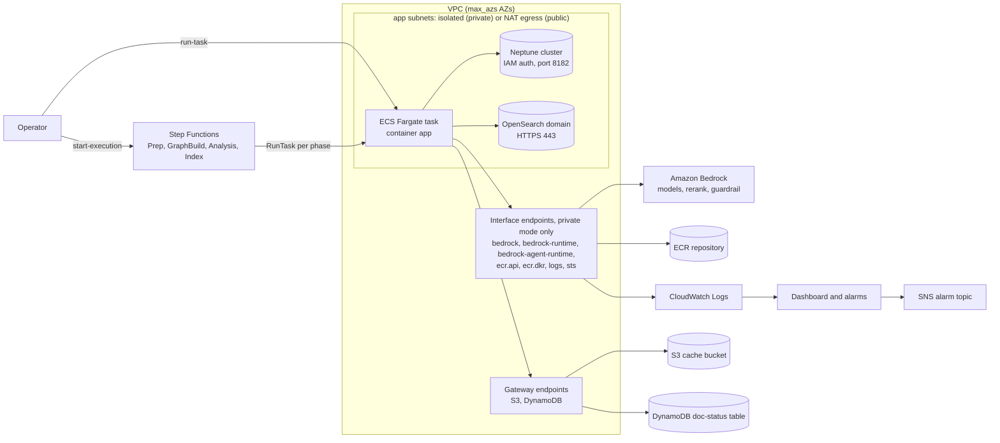

# unified-kg-rag-on-aws — Infrastructure (AWS CDK, Python)

Modular CDK app that provisions the AWS-native stack the library targets:
Bedrock + Neptune + OpenSearch + DynamoDB + S3, an ECS Fargate data plane, and a
Step Functions ingestion pipeline, with CloudWatch observability and an optional
Bedrock Guardrail.

## Stacks

Stack ids are PascalCase with a `GraphRag` prefix. The default `dev` env keeps
the bare ids below (`GraphRagNetwork`, …); any other `env_name` adds an env
segment (`-c env_name=prod` → `GraphRagProdNetwork`, …) so several environments
can coexist in one account/region. Every resource also carries an `env` tag.

| Stack | Resources |
|---|---|
| `GraphRagNetwork` | VPC (reuse or create), subnets, data-plane security group, VPC endpoints for a created VPC: S3/DynamoDB gateways always; in `private` mode also interface endpoints (own security group, 443 from the data plane only) for Bedrock (`bedrock`, `bedrock-runtime`, `bedrock-agent-runtime`), ECR (`ecr.api`, `ecr.dkr`), CloudWatch Logs and STS |
| `GraphRagStorage` | Neptune cluster (IAM auth), OpenSearch domain (VPC, encrypted), DynamoDB doc-status table, S3 cache bucket |
| `GraphRagCompute` | ECR repo, ECS cluster, Fargate task definition + least-privilege task role |
| `GraphRagOrchestration` | Step Functions state machine — 4 resumable phases on Fargate + retries + SNS alarm topic. The topic is encrypted with its own customer-managed key whose policy lets CloudWatch alarms publish (the AWS-managed `alias/aws/sns` key cannot, so alarm notifications would be dropped) |
| `GraphRagObservability` | CloudWatch dashboard + alarms: pipeline-failure, silent indexing-failure and extraction-failure (EMF), and store health (OpenSearch cluster-red / free-storage / JVM pressure, DynamoDB write throttling) → SNS. Synth warns if `alarm_email` is unset (alarms would have no subscriber) |
| `GraphRagSecurity` | Shared customer-managed KMS key (optional, `use_cmk`) |
| `GraphRagGuardrail` | Bedrock Guardrail, **pinned to `bedrock_region`** (creates and keeps a baseline PII/prompt-attack guardrail; empty with `create_guardrail=false`). It anonymizes email, phone and card numbers but not `NAME`: names are corpus content, and anonymizing them on the query path puts `{NAME}` in answers and removes entity-search seeds. The app applies the guardrail's `DRAFT` version |

### Resource naming

Physical resources share a single lowercase `<prefix>-<purpose>` scheme,
following a common `<app>-<purpose>-…` convention. The prefix is `graphrag` in
the default `dev` env and `<env>-graphrag` otherwise (e.g. `prod-graphrag-doc-status`),
so physical names do not collide across environments. Names below are for `dev`:

| Resource | Name |
|---|---|
| S3 cache bucket | `graphrag-cache-<account>-<region>` |
| DynamoDB doc-status | `graphrag-doc-status` |
| ECR repository | `graphrag-app` |
| ECS cluster | `graphrag-cluster` |
| Step Functions | `graphrag-ingestion` |
| SNS alarm topic | `graphrag-pipeline-alarms` |
| CloudWatch dashboard | `graphrag-dashboard` |
| KMS alias | `alias/graphrag-data` |
| Bedrock guardrail | `graphrag-guardrail-<region>` |
| Log groups | `/graphrag/tasks`, `/graphrag/pipeline` |

Neptune/OpenSearch/ECS task-def names are CloudFormation-generated (stack-id
derived) to avoid replace-on-rename conflicts.

> **Guardrail is region-pinned.** A guardrail must live in the Bedrock *runtime*
> region (`bedrock_region`), which can differ from the deploy region that hosts
> Neptune/OpenSearch. It is therefore its own stack. Because it lives in another
> region, the two-step flow avoids cross-region CloudFormation references
> (which churn every deploy-region stack's exports):
>
> ```bash
> # 1) create the guardrail in bedrock_region, note its id from the output
> cdk deploy GraphRagGuardrail -c bedrock_region=us-west-2 …
> # 2) pass that id so compute injects BEDROCK_GUARDRAIL_IDENTIFIER
> cdk deploy --all -c guardrail_identifier=<id> -c bedrock_region=us-west-2 …
> ```
>
> Keep passing `-c guardrail_identifier=<id>` on every later deploy, or compute
> stops injecting it. The guardrail stack keeps owning the guardrail in step 2
> and afterwards: `guardrail_identifier` only selects the id compute **uses**,
> and creation is controlled separately by `create_guardrail`. To use an
> externally managed guardrail instead, pass
> `-c create_guardrail=false -c guardrail_identifier=<id>`; the stack then
> creates nothing.
>
> Setting only `-c guardrail_identifier=<id>` still creates the baseline
> guardrail, because `create_guardrail` defaults to `true`. Synth warns when
> `guardrail_identifier` is set without an explicit `create_guardrail`; pass
> `-c create_guardrail=false` for an external guardrail (or
> `-c create_guardrail=true` to acknowledge the warning in the two-step flow).
>
> The created guardrail follows `removal_destroy`: `DESTROY` in dev (default), so
> deploy → destroy → deploy cycles work, and `RETAIN` otherwise because its id
> reaches compute outside CloudFormation. After `cdk destroy` of a retained
> guardrail, delete it manually
> (`aws bedrock delete-guardrail --guardrail-identifier <id> --region <bedrock_region>`);
> otherwise the next deploy fails on the duplicate `<prefix>-guardrail-<region>` name.
>
> Always pass `-c key=value` flags as **individual arguments** — collapsing them
> into one shell variable corrupts context parsing (vpc_id is silently dropped →
> `Vpc.from_lookup` falls back to a dummy VPC).

The orchestration runs the ingestion CLI as four phases sharing one
`--pipeline-id` (the app's S3 stage checkpoints hand off between phases):

```
Prep (parse/load/chunk/translate) → GraphBuild (extract/glean/resolve/claims)
  → Analysis (graph_analysis/community_detection) → Index (indexing)
```

## Configuration (cdk.json context / `-c key=value`)

| Key | Default | Meaning |
|---|---|---|
| `env_name` | `dev` | stack/resource name prefix. `dev` keeps bare `GraphRag*`/`graphrag-*` names; a non-dev env (e.g. `prod`) scopes them (`GraphRagProd*`, `prod-graphrag-*`) so environments don't collide in one account/region |
| `network_mode` | `private` | `private` = isolated subnets + VPC endpoints, **no NAT** (no internet egress); `public` = private subnets with NAT egress |
| `vpc_id` | _(none)_ | **reuse** an existing VPC instead of creating one. The stack adds **no** VPC endpoints or subnets to it (synth warns with the list): in `private` mode it needs `PRIVATE_ISOLATED` subnets (no NAT or internet gateway route), S3/DynamoDB gateway endpoints, and private-DNS interface endpoints for `bedrock`, `bedrock-runtime`, `bedrock-agent-runtime`, `ecr.api`, `ecr.dkr`, `logs` and `sts`; in `public` mode it needs `PRIVATE_WITH_EGRESS` subnets (NAT route) |
| `max_azs` | `2` | AZs for a newly-created VPC |
| `cache_bucket_name` | _(none)_ | **reuse** an existing S3 cache bucket instead of creating one |
| `corpus_bucket_name` | _(none)_ | S3 bucket the corpus is read from when it is not in the cache bucket: the task role gets read-only access and, in `private` mode, the S3 gateway endpoint policy allows it |
| `neptune_instance` | `db.r6g.large` | Neptune instance class (Graviton) |
| `neptune_instances` | `1` (dev) / `2` (non-dev) | Neptune instances; `>=2` ⇒ Multi-AZ HA (reader in another AZ). dev defaults to 1 (no failover) for cost |
| `opensearch_instance` | `r6g.large.search` | OpenSearch data node type (Graviton) |
| `opensearch_master_instance` | `m6g.large.search` | dedicated master node type, used only when `opensearch_count > 1`. 8 GiB Graviton, which AWS sizes for up to 10 nodes / 10K shards on OpenSearch 2.13; raise it for larger domains |
| `opensearch_count` | `1` (dev) / `2` (non-dev) | OpenSearch data node count (`>1` ⇒ 3 dedicated masters + zone awareness = 5 nodes; dev runs a single node for cost) |
| `backup_retention_days` | `7` | Neptune automated backup retention |
| `fargate_cpu` | `2048` | Fargate task vCPU units (in-task ProcessPool extractors scale with vCPU) |
| `fargate_memory` | `8192` | Fargate task memory (MiB) |
| `image_tag` | `latest` | container image tag the task pulls; pin a version tag to make ECR tags immutable |
| `create_guardrail` | `true` | `GraphRagGuardrail` creates and keeps a baseline PII/prompt-attack guardrail in `bedrock_region` (retained on stack deletion unless `removal_destroy`). `false` = bring your own guardrail; nothing is created |
| `guardrail_identifier` | _(none)_ | guardrail id the compute task **uses**, injected as `BEDROCK_GUARDRAIL_IDENTIFIER`. The created guardrail's id is **not** injected automatically: pass the `GuardrailIdentifier` output of `GraphRagGuardrail` here (two-step flow above), or an external id with `create_guardrail=false`. Unset = no guardrail on the task |
| `use_cmk` | `false` | customer-managed KMS key for at-rest encryption (S3/Neptune/OpenSearch/DDB/ECR and every log group; the key policy lets CloudWatch Logs use it for this account's log groups, and principals in this account may use it through CloudWatch Logs (`kms:ViaService`), so log writers and readers need no KMS permissions of their own). Choose it before the first deploy: ECR sets a repository's encryption only at creation, and CloudFormation cannot replace the fixed-name repository, so turning `use_cmk` on (or off) for a deployed environment fails until the compute stack is destroyed and redeployed. The SNS alarm topic always uses its own customer-managed key (see below) |
| `vpc_flow_logs` | `false` (dev) / `true` (non-dev) | enable VPC flow logs (created VPC only) |
| `flow_log_retention_days` | `731` | flow-log log group retention; must be a CloudWatch Logs retention value (e.g. `30`, `90`, `365`, `731`) |
| `deletion_protection` | `false` (dev) / `true` (non-dev) | deletion protection on the Neptune cluster and the DynamoDB doc-status table (blocks a direct delete API/console call). OpenSearch domains have no deletion-protection setting; outside dev the domain is only kept by `removal_destroy=false` (CloudFormation `Retain`), which does not stop a direct `DeleteDomain` call |
| `bedrock_model_arns` | _(none)_ | scope Bedrock IAM to specific model ARNs (list) |
| `alarm_email` | _(none)_ | subscribe an email to the pipeline alarm topic |
| `enable_cdk_nag` | `false` | run cdk-nag AwsSolutions (Well-Architected) checks at synth |
| `owner` | `aws-proserve` | `owner` tag applied to every resource |
| `cost_center` | `unified-kg-rag-on-aws` | `cost-center` tag applied to every resource |
| `removal_destroy` | `true` (dev) / `false` (non-dev) | `DESTROY` vs `RETAIN` on stack deletion for the stateful stores, the KMS keys, the guardrail, the OpenSearch domain log groups, and the fixed-name ECR repository (emptied first) and log groups (`/<prefix>/tasks`, `/<prefix>/pipeline`). Retained fixed-name resources make the next deploy fail on the duplicate name, so delete them by hand after a `cdk destroy` with `removal_destroy=false` |

> Every resource is tagged `project=unified-kg-rag-on-aws`, `env=<env_name>`,
> `managed-by=cdk`, `owner`, and `cost-center` for cost allocation and ownership.

### Well-Architected

The stacks apply WAF defaults out of the box — least-privilege IAM
(`bedrock:InvokeModel` scoped to model/inference-profile ARNs, `neptune-db:connect`,
domain-scoped `es:ESHttp*`), encryption in transit + at rest, Graviton instances,
S3 cache
lifecycle (checkpoint prefixes only) + access logs, Step Functions X-Ray tracing + execution logging,
CloudWatch dashboard + failure alarm, and an SSL-only alarm topic. Production
hardening is opt-in via the flags above. Validate with:

```bash
cdk synth -c enable_cdk_nag=true                       # dev
cdk synth -c enable_cdk_nag=true -c use_cmk=true \
  -c vpc_flow_logs=true -c neptune_instances=2 -c opensearch_count=2 \
  -c deletion_protection=true -c removal_destroy=false  # prod-hardened
```
Both report zero AwsSolutions findings, and CI runs both. These CI synths have
no account, so account ids stay `<AWS::AccountId>` tokens; the IaC test
`iac/tests/test_app_nag.py` repeats both shapes with a dummy concrete account,
as a real deploy renders them. Accepted findings are
documented in `iac/nag_suppressions.py`: `AwsSolutions-IAM5` is suppressed per
role for the listed wildcards only (`appliesTo`), so a new wildcard fails the
synth, and the OpenSearch HA findings (OS4/OS7) are accepted only for a
single-node domain.

> **A few Bedrock read actions use `Resource: "*"` by necessity**, not oversight:
> `bedrock:Rerank` (authorizes against a different resource shape than
> `InvokeModel` — scoping it to the model ARNs denies the call) and
> `bedrock:ListInferenceProfiles` / `GetInferenceProfile` (account-level reads
> with no resource scoping). These are read/inference-only actions; the
> mutating/data path (`InvokeModel`) stays ARN-scoped. Each is documented inline
> in `compute_stack.py` and in the cdk-nag suppressions.

## Deployment topology



- One VPC holds the data plane. The Fargate task, the Neptune cluster and the
  OpenSearch domain run in the `app` subnets and share one security group that
  allows Neptune (8182) and OpenSearch (443) traffic between its members, so
  both stores are reachable only from inside the VPC.
- In `private` mode (default) the `app` subnets have no route to the internet.
  The task reaches AWS services only through the interface endpoints and the
  S3/DynamoDB gateway endpoints shown, so Bedrock calls must go to the deploy
  region (leave `bedrock_region` at the deploy region). In `public` mode the
  `app` subnets route through one NAT gateway per AZ, no interface endpoints are
  created, and Bedrock may be in another region.
- Step Functions runs the four ingestion phases as separate Fargate tasks of
  one task definition; they hand off through the S3 stage checkpoints.
  Querying (`run-rag`, `run-eval`) runs as a one-off task of the same task
  definition ([After deploy](#after-deploy)).
- The optional guardrail stack lives in `bedrock_region`, outside the deploy
  region's stacks.

## Cost drivers

No prices are listed here; use the [AWS Pricing Calculator](https://calculator.aws/)
for your region and sizes. What scales each service's cost:

| Service | Cost grows with | Levers in this stack or the app config |
|---|---|---|
| Amazon Bedrock models | Tokens per ingestion (one or more extraction calls per chunk, up to `max_rounds` gleaning calls, one report per community, optional claim extraction) and per query (routing, query processing, map steps, answer) | Fast tier for light roles, `aws.bedrock.ingestion_effort`, `processing.gleaning.max_rounds`, keep claim extraction off, incremental indexing |
| Bedrock embeddings and rerank | Embedded text units, entities, relationships and reports; one rerank call per query over up to `search.reranking.top_k` candidates | `indexing.opensearch.persist_embedding_cache`, `search.reranking.top_k` |
| Amazon Neptune | Instance-hours × `neptune_instances`, storage and I/O, backup retention | `neptune_instance`, `neptune_instances` (1 in dev), `backup_retention_days`, tear down dev |
| Amazon OpenSearch Service | Data node-hours × `opensearch_count`, plus three dedicated masters when `opensearch_count > 1`, and 50 GiB gp3 storage per data node | `opensearch_instance`, `opensearch_master_instance`, `opensearch_count` (1 in dev) |
| AWS Fargate | vCPU and memory per task for the run time of each phase and query task | `fargate_cpu`, `fargate_memory` |
| VPC interface endpoints (`private`) | Seven endpoints × `max_azs`, billed per AZ-hour, plus data processed | `max_azs`, or reuse a VPC's endpoints (`vpc_id`) |
| NAT gateways (`public`) | One per AZ, billed per hour, plus data processed | `max_azs`, or use `private` mode |
| Amazon S3 | Stage checkpoints, embedding cache, corpus, access logs | 30-day expiry on `pipeline-runs/` and `embedding-cache/` |
| Amazon DynamoDB | On-demand reads and writes: one full-table diff scan per ingestion plus one record per processed document; point-in-time recovery | Fewer, larger runs |
| Amazon CloudWatch | Log ingestion and retention (task, pipeline and, with `vpc_flow_logs`, flow logs), alarms, dashboard | `vpc_flow_logs`, `flow_log_retention_days` |
| AWS KMS | Customer-managed keys per month and requests: the alarm-topic key always, the data key with `use_cmk` | `use_cmk` |
| AWS Step Functions | State transitions per ingestion run (a few per phase) | — |

Neptune, OpenSearch, interface endpoints and NAT gateways bill while the stack
exists, whether or not anything runs. `cdk destroy --all` removes them in the
default `dev` environment.

## Prerequisites

- Python 3.10+ (CI synthesizes with 3.12).
- Node.js 20+ and the AWS CDK CLI v2, 2.1143.0 or later
  (`npm install -g aws-cdk@2.1143.0` is the version CI pins). An older CLI
  can reject the cloud assembly that the `aws-cdk-lib` release in
  `requirements.txt` produces; check with `cdk --version`.
- For `cdk bootstrap`/`cdk deploy`: AWS credentials for the target account
  and region. To push the app image after deploy: Docker.

## Usage

```bash
cd iac
python -m venv .venv && . .venv/bin/activate
pip install -r requirements.txt

# Synthesize (no AWS changes)
cdk synth

# Reuse existing VPC + S3, fully private data plane (recommended for prod):
cdk synth -c vpc_id=vpc-0abc... -c cache_bucket_name=my-cache -c network_mode=private

# Public egress (simpler dev):
cdk synth -c network_mode=public

# Deploy (creates billable resources)
cdk bootstrap            # once per account/region
cdk deploy --all
```

> **Cost:** deploying creates Neptune + OpenSearch (hourly billed) and
> NAT gateways in `public` mode (see [Cost drivers](#cost-drivers)). `removal_destroy=true` (dev default) tears
> everything down on `cdk destroy --all`; non-dev envs default to
> `removal_destroy=false` and `deletion_protection=true`.

## After deploy

The commands below assume the default `dev` environment (stack and resource
names as in [Resource naming](#resource-naming)), a shell in the repository
root, and the AWS CLI v2, Docker and `jq`. For another `env_name`, use its
stack names (for example `GraphRagProdStorage`) and resource prefix
(`prod-graphrag`).

### 1. Read the stack outputs

```bash
REGION=<deploy region>
output() {
  aws cloudformation describe-stacks --region "$REGION" --stack-name "$1" \
    --query "Stacks[0].Outputs[?OutputKey=='$2'].OutputValue" --output text
}
STATE_MACHINE_ARN=$(output GraphRagOrchestration StateMachineArn)
CACHE_BUCKET=$(output GraphRagStorage CacheBucketName)
NEPTUNE_ENDPOINT=$(output GraphRagStorage NeptuneEndpoint)
OPENSEARCH_ENDPOINT=$(output GraphRagStorage OpenSearchEndpoint)
```

| Stack | Output | Value |
|---|---|---|
| `GraphRagStorage` | `NeptuneEndpoint`, `OpenSearchEndpoint` | Bare hostnames (no `https://`), the form `aws.neptune.endpoint` / `aws.opensearch.endpoint` and `NEPTUNE_ENDPOINT` / `OPENSEARCH_ENDPOINT` expect |
| `GraphRagStorage` | `CacheBucketName`, `DocStatusTableName` | S3 cache bucket and doc-status table |
| `GraphRagOrchestration` | `StateMachineArn` | Ingestion state machine |
| `GraphRagSecurity` | `KmsKeyArn` | Shared CMK, only with `use_cmk=true` |
| `GraphRagGuardrail` | `GuardrailIdentifier` | Created guardrail, in `bedrock_region` |

The task already receives the endpoints, bucket, table and regions as
environment variables, so these outputs are needed only for tools that run
elsewhere in the VPC.

### 2. Build and push the app image

```bash
ACCOUNT=$(aws sts get-caller-identity --query Account --output text)
REGISTRY="$ACCOUNT.dkr.ecr.$REGION.amazonaws.com"
aws ecr get-login-password --region "$REGION" \
  | docker login --username AWS --password-stdin "$REGISTRY"
docker build --platform linux/amd64 -f docker/Dockerfile -t "$REGISTRY/graphrag-app:latest" .
docker push "$REGISTRY/graphrag-app:latest"
```

The build context is the repository root, and the task runs on the default
Fargate architecture (x86_64). Outside dev, push a unique version tag instead
and deploy with `-c image_tag=<tag>`: any tag other than `latest` makes the
repository's tags immutable, so a pushed image cannot be swapped under the
running task definition. To parse `.md`/`.html` files, build with
`--build-arg UV_EXTRAS="--extra unstructured"`.

The image bakes in the tracked, endpoint-free `docker/config.yaml` as
`/app/config.yaml`; the deployed values come from the environment variables the
task injects: `NEPTUNE_ENDPOINT`, `OPENSEARCH_ENDPOINT`, `S3_BUCKET_NAME`,
`AWS_REGION`, `BEDROCK_REGION`, `LOG_FORMAT`, `GRAPHRAG_DOC_STATUS_TABLE`
(the table this stack created) and `GRAPHRAG_DOC_STATUS_CREATE_TABLE=false`,
plus `BEDROCK_GUARDRAIL_IDENTIFIER` when `guardrail_identifier` is set. The
image config sets `aws.dynamodb.enabled: true`, so ingestion runs
incrementally. S3 cache uploads default to the bucket's own encryption
(`aws.s3.encryption.encryption_type: BUCKET_DEFAULT`), so with `use_cmk=true`
objects are encrypted with the CMK.

### 3. Upload the corpus and start an ingestion run

```bash
aws s3 sync ./source "s3://$CACHE_BUCKET/corpus/" --region "$REGION"

# Run one ingestion at a time: check that none is in progress first.
aws stepfunctions list-executions --region "$REGION" \
  --state-machine-arn "$STATE_MACHINE_ARN" --status-filter RUNNING

EXECUTION_ARN=$(aws stepfunctions start-execution --region "$REGION" \
  --state-machine-arn "$STATE_MACHINE_ARN" \
  --input "{\"source_directory\":\"s3://$CACHE_BUCKET/corpus/\",\"pipeline_id\":\"run-001\"}" \
  --query executionArn --output text)

aws stepfunctions describe-execution --region "$REGION" \
  --execution-arn "$EXECUTION_ARN" --query status --output text
aws logs tail /graphrag/tasks --region "$REGION" --follow
```

- The input takes exactly two keys, passed to every phase as
  `GRAPHRAG_SOURCE_DIRECTORY` / `GRAPHRAG_PIPELINE_ID`. Each phase runs in a
  fresh Fargate task, so `source_directory` must be an `s3://` URI: the
  container entrypoint (`docker/entrypoint.sh`) syncs it to local scratch
  before running the CLI. `pipeline_id` accepts lowercase letters, digits,
  hyphens and underscores; reuse an id to resume a failed run from its S3
  checkpoints.
- The task role can read and write the cache bucket only. To read a corpus
  from another bucket, deploy with `-c corpus_bucket_name=<bucket>`. In
  `private` mode the S3 and DynamoDB gateway endpoints only allow this
  deployment's cache and corpus buckets, its doc-status table and the ECR
  image-layer bucket, so a bucket granted to the role by hand is still
  unreachable from the tasks.
- The bucket's 30-day expiry applies only to the prefixes the app writes,
  `pipeline-runs/` (stage checkpoints) and `embedding-cache/`; any other
  prefix never expires. Do not put the corpus under those two prefixes: with
  incremental indexing an expired source file looks deleted, and the next run
  removes its graph and vector artifacts. A reused bucket
  (`cache_bucket_name`) keeps its own lifecycle rules, so check them the same
  way.
- **Run one ingestion at a time.** The state machine does not stop a second
  execution from starting while one is running, and two runs against the same
  stores race on the doc-status registry and on the graph and vector writes
  (both may index, merge or delete the same documents).

### 4. Query from inside the VPC

Both stores accept connections only from inside the VPC, so run `run-rag` as a
one-off task of the same task definition, in the subnets and
security group the state machine uses:

```bash
DEFINITION=$(aws stepfunctions describe-state-machine --region "$REGION" \
  --state-machine-arn "$STATE_MACHINE_ARN" --query definition --output text)
PHASE=$(echo "$DEFINITION" | jq '.States.PrepPhase.Parameters')
CLUSTER=$(echo "$PHASE" | jq -r '.Cluster')
TASK_DEFINITION=$(echo "$PHASE" | jq -r '.TaskDefinition')
SUBNETS=$(echo "$PHASE" | jq -r '.NetworkConfiguration.AwsvpcConfiguration.Subnets | join(",")')
SECURITY_GROUPS=$(echo "$PHASE" | jq -r '.NetworkConfiguration.AwsvpcConfiguration.SecurityGroups | join(",")')

TASK_ARN=$(aws ecs run-task --region "$REGION" --cluster "$CLUSTER" \
  --launch-type FARGATE --task-definition "$TASK_DEFINITION" \
  --network-configuration "awsvpcConfiguration={subnets=[$SUBNETS],securityGroups=[$SECURITY_GROUPS],assignPublicIp=DISABLED}" \
  --overrides '{"containerOverrides":[{"name":"app","command":["run-rag","--config-path","/app/config.yaml","--query","What are the main themes?","--search-strategy","global"]}]}' \
  --query 'tasks[0].taskArn' --output text)

aws ecs wait tasks-stopped --region "$REGION" --cluster "$CLUSTER" --tasks "$TASK_ARN"
aws logs tail /graphrag/tasks --region "$REGION" --since 30m
```

The command override must name the CLI explicitly (`run-rag ...`). The answer
is written to the task's log stream (`app/app/<task id>` in
`/graphrag/tasks`). `run-eval` reads its dataset from a local
path, and the image holds none, so evaluate from a machine inside the VPC or
from an image that includes the dataset.

Operational procedures (re-ingesting, failed documents, alarms, caches) are in
the [Operator Runbook](../docs/operations.md).
